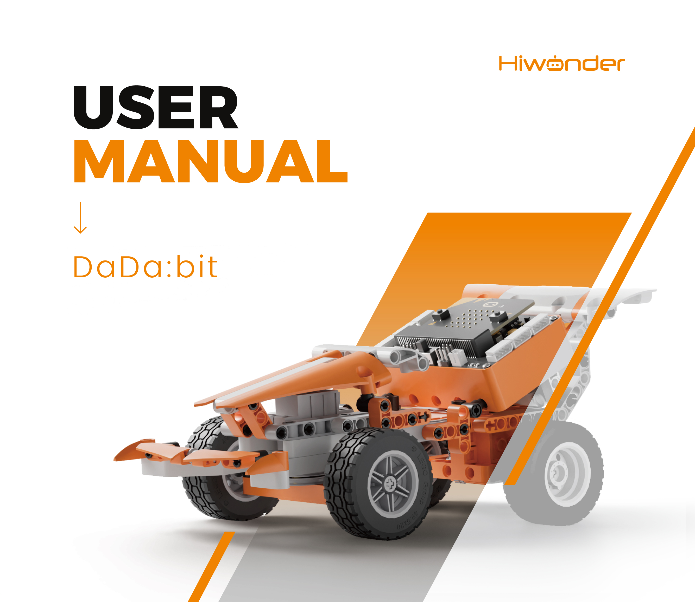
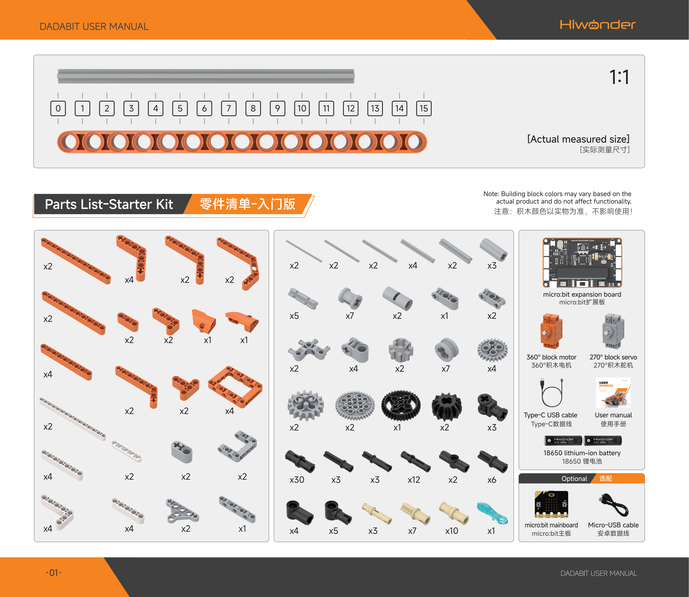
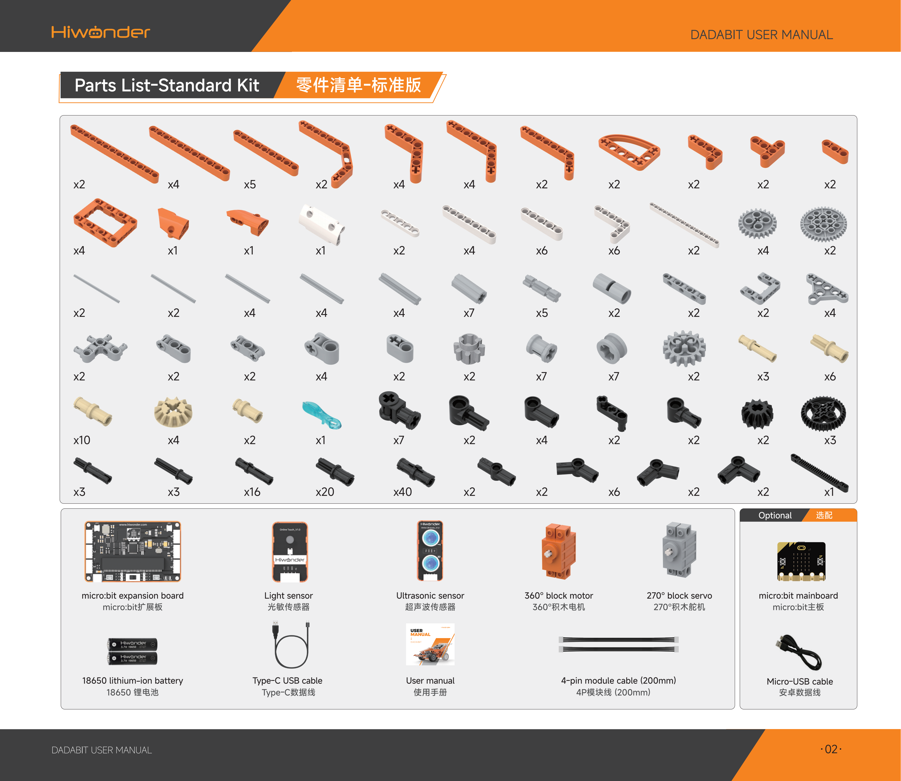
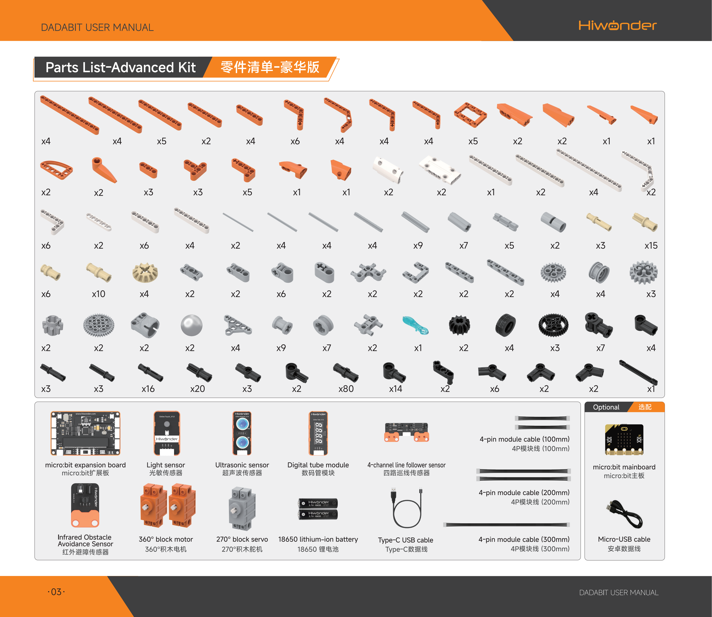

# 1. Kit Overview{#DadaBit}

[TOC]

## 1.1 Product Introduction

DaDa:bit is a versatile, programmable building block kit designed by Hiwonder for programming beginners. Equipped with a micro:bit board, a multi-functional expansion board, and over ten electronic modules, this kit establishes a powerful hardware interaction system. It supports MakeCode programming, guiding beginners in building a creative scientific world.

## 1.2 Packing List

## 1.3 Disclaimer

- The products described in this manual, including hardware and software, are provided on an **as-is** basis. Every effort has been made to ensure the accuracy of the content at the time of writing, but the manual may still contain errors or omissions. The tutorials are reviewed regularly, and suggestions for improvement are welcome.
- Product content may change as product versions are updated. It is recommended to contact customer service for the latest product information when ordering.
- In addition, unless Hiwonder explicitly states that the product is intended for a specific use, no liability is assumed for losses caused by malfunction or damage when the product is used under extreme conditions.
