# 2. Preparation

## 2.1 Get to Know the micro:bit Board

### 2.1.1 What is micro:bit?

The micro:bit is a microcomputer designed for youth programming education, led by the British BBC and jointly developed by Microsoft, Samsung, ARM, and others. It is only half the size of a credit card. However, it integrates Bluetooth, an accelerometer, a compass, three buttons, a 5x5 LED dot matrix, and a microphone.

The micro:bit features many open-source libraries and interesting solutions, which can be viewed on the website:

[https://makecode.microbit.org/](https://makecode.microbit.org/)

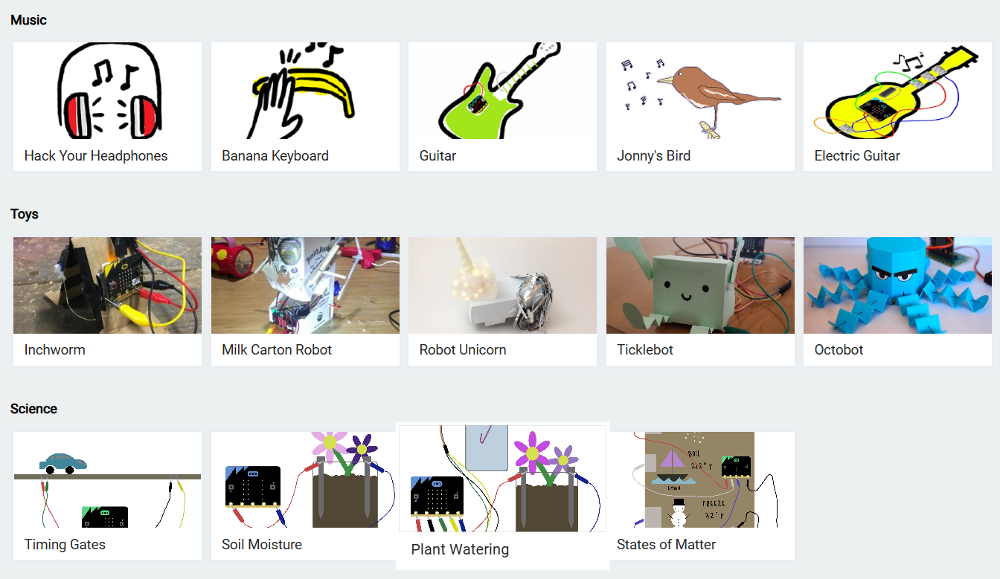

### 2.1.2 micro:bit Interface Overview

As shown in the following figure, it consists of onboard modules such as an acceleration sensor, programmable buttons, pins, an LED dot matrix, USB, Bluetooth, radio, and an electronic compass.

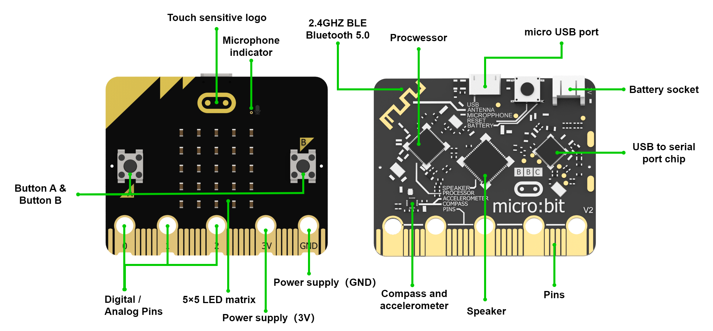

### 2.1.3 micro:bit Pinout

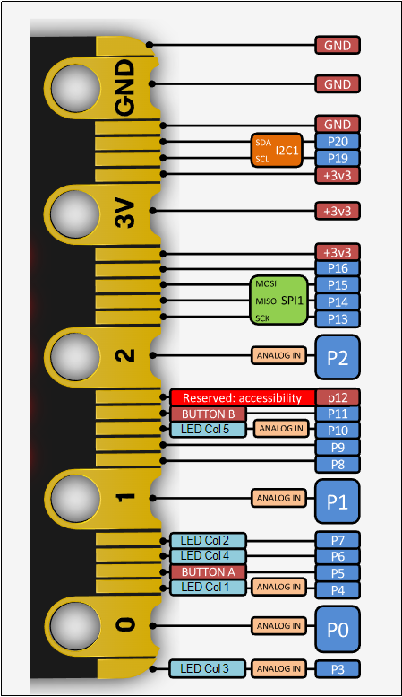

### 2.1.4 Specifications

| Item | Specification |
| :---: | :---: |
| Processor | Nordic nRF52833 |
| ARM | Cortex-M4 32-bit with FPU 64 MHz |
| RAM/Flash | 128 KB RAM / 512 KB Flash |
| Wireless | 2.4 GHz micro:bit Radio and BLE Bluetooth 5.0 |
| Power supply | 5 V via Micro USB port, 3 V via edge connector or battery pack |
| Operating current | 300 mA |
| Dimensions | 52 x 43.2 mm |

### 2.1.5 micro:bit Programming Environment

For the programming environment, the BBC provides an online programming website at https://microbit.org/code/, which includes the easy-to-use graphical programming tool MakeCode.

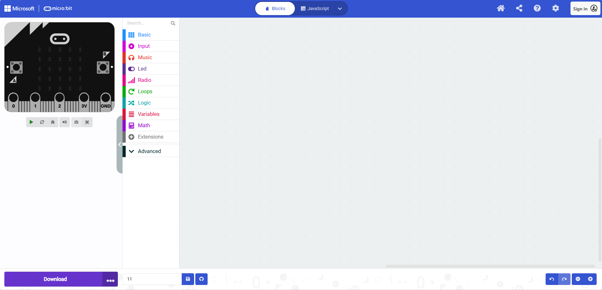

## 2.2 Introduction to the micro:bit Expansion Board

### 2.2.1 Introduction

This is an intelligent controller built around micro:bit and supporting both block-based programming and Python programming. It is enclosed in a PC plastic housing and integrates onboard PWM servo ports, motor ports, programmable buttons, a buzzer, and other electronic modules. Multiple sensor ports are also reserved for strong expandability. All ports use a unified 4-pin anti-reverse connector design, making it compatible with the full Hiwonder sensor lineup while remaining convenient and safe to use.

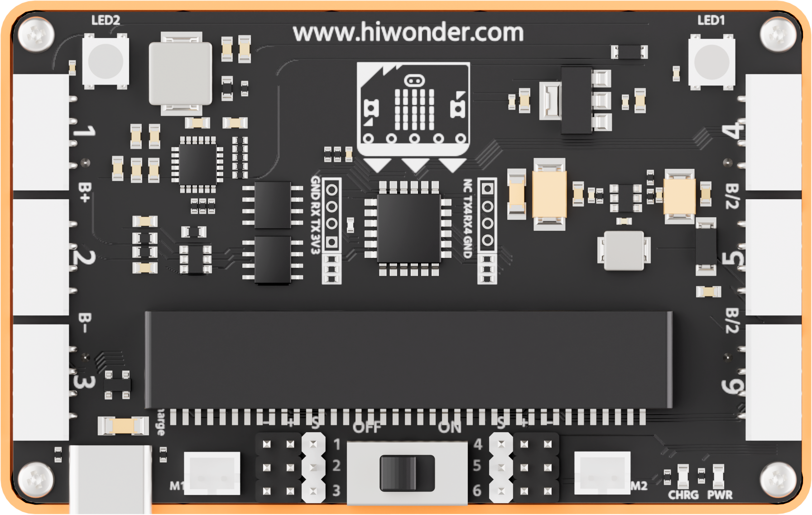

### 2.2.2 Port Overview

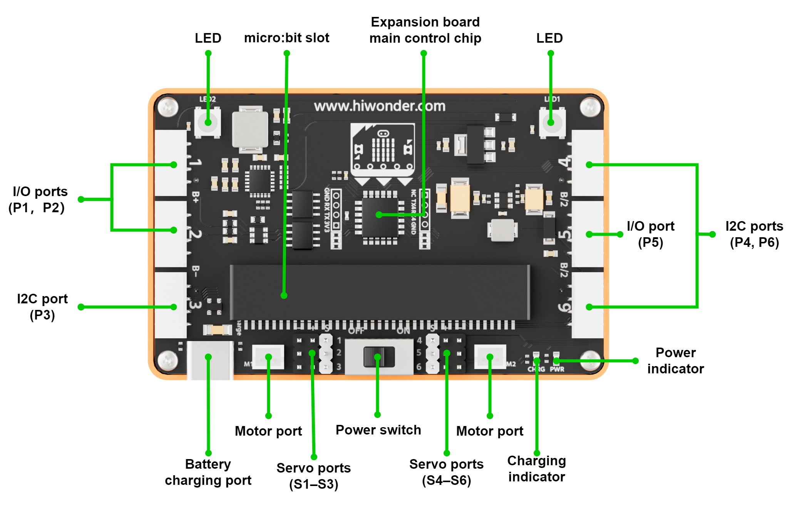

### 2.2.3 Specifications

| Item | Specification |
| :---: | :---: |
| Product name | micro:bit expansion board |
| Dimensions | 88.0 x 55.5 x 35.5 mm |
| Charging voltage | 5 V |
| Charging current | 1500 mA |
| Charging time | 1.5 h |
| Battery capacity | 2400 mAh |
| Maximum operating voltage | 8.4 V |
| Rated operating voltage | 7.4 V |

## 2.3 MakeCode Programming Environment

### 2.3.1 Platform Overview

The micro:bit does not require any IDE installation. Programming can be performed simply by opening the website https://makecode.microbit.org/ in a browser.

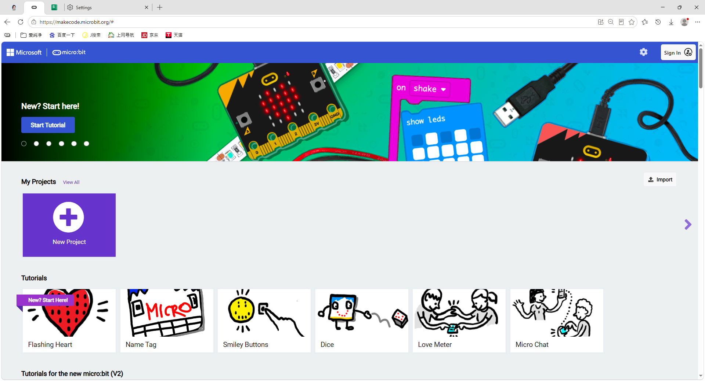

### 2.3.2 IDE Settings and Toolbar Overview

To create a project, click **New Project** and enter the project name.

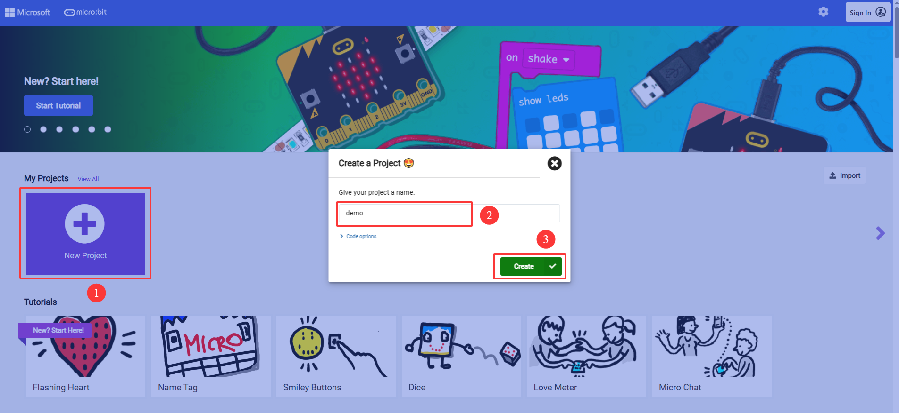

After entering the main interface, the layout can be divided into the following sections, as shown below:

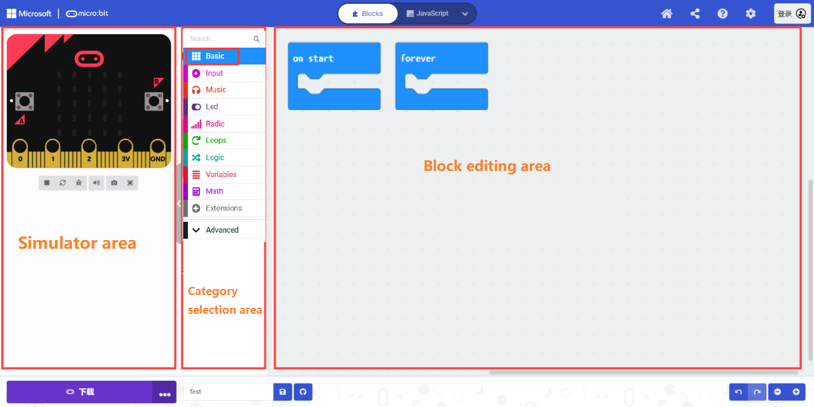

| Section | Function |
| :---: | :---: |
| Simulator area | Used to simulate programming blocks. |
| Category selection area | Allows using blocks from built-in categories or added extension packages. |
| Block editing area | Used for inserting, copying, pasting, deleting, and modifying programming blocks. |

### 2.3.3 Programming

First, create a simple program by dragging the **show icon** block from **Basic** into the **forever** block.

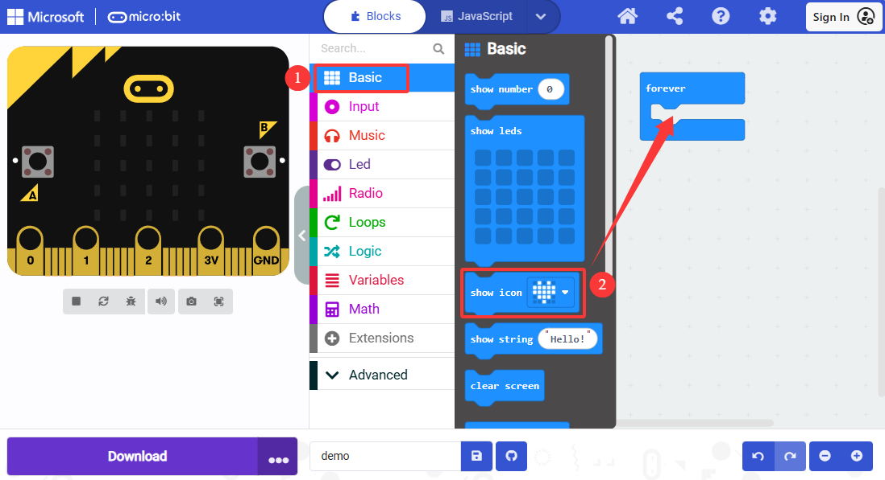

### 2.3.4 Downloading Programs

1. When connecting the device for the first time, pair the device. Once connected, the browser will remember the connected device. Click the **...** button next to **Download**, and select **Connect device** from the options.

   

2. Click **Next** in the pop-up window.

   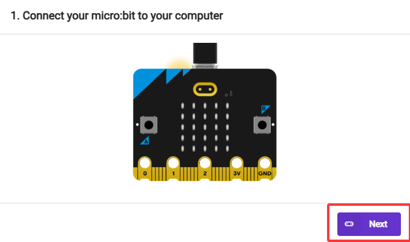

3. Click **Pair** and select the device shown in the pop-up window.

   

   

   

4. After the device is successfully connected, click **Download** to download the program. During the download process, the yellow indicator light near the USB port on the micro:bit board will flash rapidly. Do not disconnect or move the data cable at this time to prevent download failure.

   

5. Once the download is complete, the indicator light will stop flashing and remain on, and a completion prompt will appear on the main programming interface.

   

6. The micro:bit automatically runs the program when powered on.

## 2.4 Introduction to the DaDabitv2 Extension Library

### 2.4.1 Importing Library Files

For DaDabit V2.0, add the extension via https://github.com/HiwonderK12/DaDabitV2.

Enter the link and click the search icon or press **Enter** to search for the DaDabitV2 package. Finally, click **dadabitv2** to add the extension.

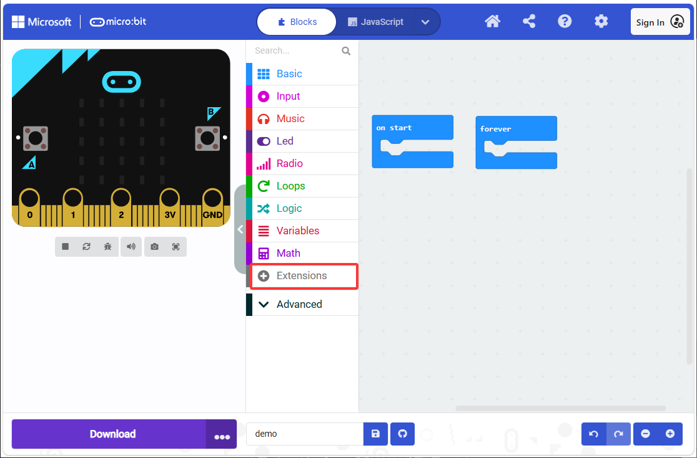

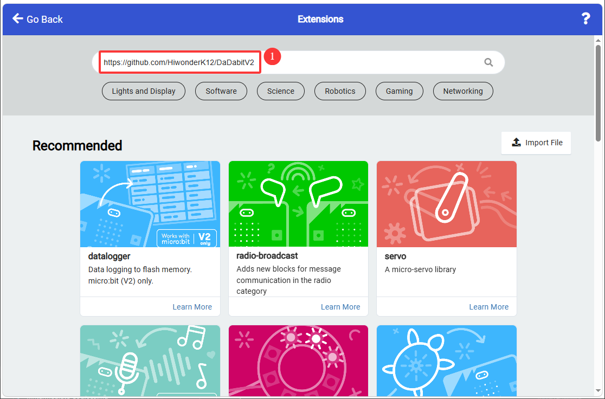

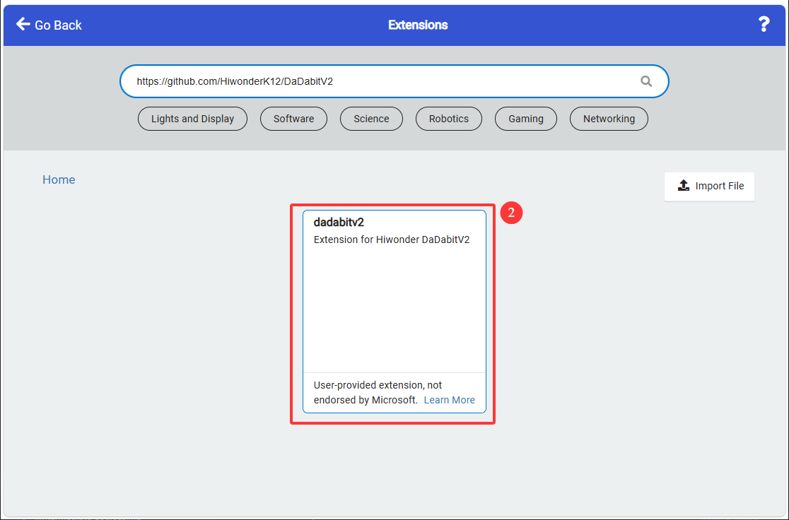

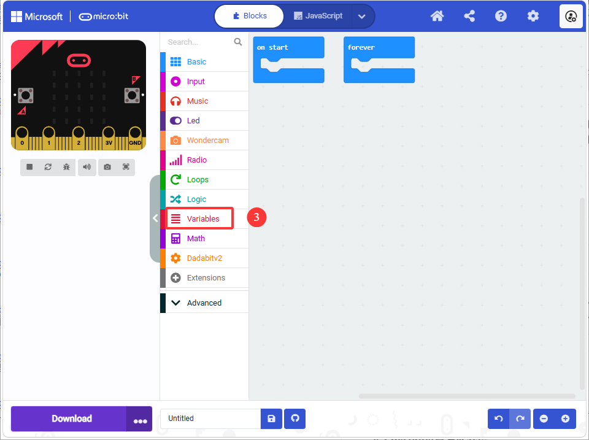

### 2.4.2 micro:bit Official Library Blocks

| Block | Category | Description |
| :---: | :---: | :---: |
|  |  | Displays the specified number on the micro:bit LED dot matrix screen. |
| 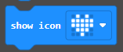 |  | Displays a preset icon on the micro:bit LED dot matrix screen. |
|  |  | Scrolls the specified text on the micro:bit LED dot matrix screen. |
| 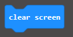 |  | Clears all content on the micro:bit LED dot matrix screen. |
|  |  | Runs the nested blocks repeatedly in a loop. |
| 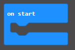 |  | The program's entrance, which occurs once when the device is powered on or restarted. |
| 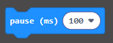 |  | Pauses the program for a specified number of milliseconds. |
|  |  | Detects when button A is pressed to trigger actions. |
|  |  | Gets the pressed state of button A, returning a boolean result. |
| 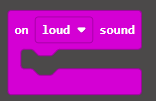 |  | Detects whether the ambient sound level reaches a loud threshold. |
|  |  | Detects whether the touch logo on the front of the micro:bit is pressed. |
|  |  | Gets the ambient sound level. |
|  |  | Reads the temperature from the built-in temperature sensor in degrees Celsius. |
|  |  | Plays a note at a specified pitch and duration. |
|  |  | Stops all playing sounds. |
|  |  | Plays a preset sound effect such as giggling. |
| 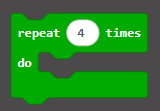 |  | Repeats the nested blocks a specified number of times. |
|  |  | Runs the nested blocks while the specified condition is false. |
|  |  | A conditional block that executes nested blocks if the condition is true. |
|  |  | A conditional block that executes different branches of program logic depending on whether the condition is true or false. |
|  |  | Compares two numbers for equality and returns a Boolean result. |
|  |  | Performs a logical AND operation on two boolean conditions, returning true only if both conditions are true. |
|  |  | Performs a logical OR operation on two boolean conditions, returning true if at least one condition is true. |
|  |  | Performs a logical NOT operation on the input condition to invert its Boolean value. |
| 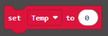 |  | Sets a variable to a specified value. |
|  |  | Changes the value of a variable by a specified amount. |
| 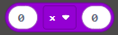 |  | Multiplies two numbers and returns the product. |

### 2.4.3 DaDabitv2 Library Blocks

| Block | Category | Description |
| :---: | :---: | :---: |
|  |  | Initializes the hardware resources of the DaDa:bit expansion board. |
| 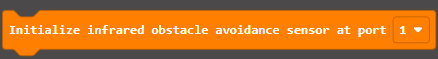 |  | Initializes the infrared obstacle avoidance sensor connected to the specified port. |
| 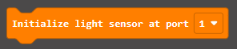 |  | Initializes the light sensor connected to the specified port. |
| 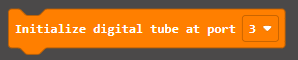 |  | Initializes the digital tube module connected to the specified port. |
| 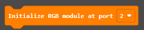 |  | Initializes the RGB light module connected to the specified port. |
| 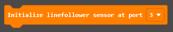 |  | Initializes the 4-channel line follower sensor connected to the specified port. |
| 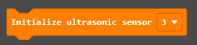 |  | Initializes the ultrasonic sensor connected to the specified port. |
| 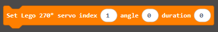 |  | Controls the specified Lego-compatible servo to rotate to the target angle within a set time. |
|  |  | Controls the specified Lego-compatible motor to run in the set direction and speed. |
|  |  | Displays the specified number on the digital tube module. |
|  |  | Reads the light intensity from the light sensor within a range of 0 to 100. |
|  |  | Gets the detection state of the infrared obstacle avoidance sensor. |
|  |  | Gets the detection state of the 4-channel line follower sensor. |
|  |  | Reads the distance data from the ultrasonic sensor in centimeters. |
| 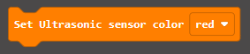 |  | Sets the indicator lights on the glowy ultrasonic sensor to the specified color. |
|  |  | Sets the onboard RGB lights of the expansion board to the specified color. |
|  |  | Sets the onboard RGB lights of the expansion board to the color corresponding to the specified value. |
|  |  | Applies and displays the configured onboard RGB light effects. |
| 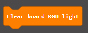 |  | Turns off all onboard RGB lights of the expansion board. |

## 2.5 Powering On and Charging Instructions

### 2.5.1 Powering On

- Install the battery into the battery compartment at the bottom of the micro:bit expansion board.

> [!NOTE]
>
> **Ensure that the positive and negative terminals are not reversed.**

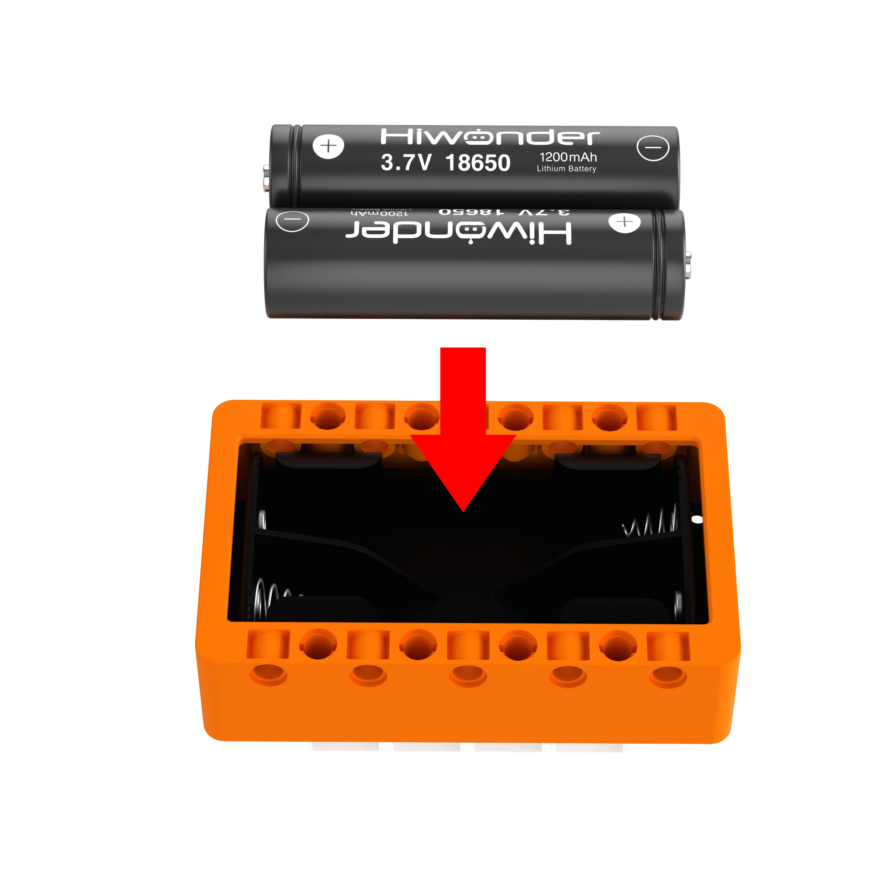

- Turn on the power switch. The power indicator light on the expansion board will turn red, indicating that the board is powered on successfully.

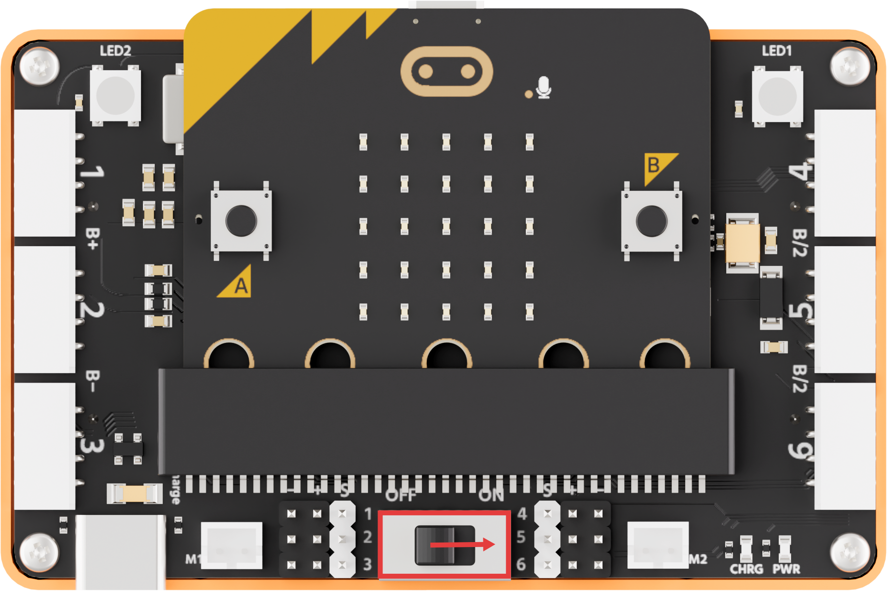

> [!NOTE]
>
> **When powering on for the first time, charge the board through the charging port for approximately 5 seconds according to the instructions in Section 2.5.2 to activate the built-in battery protection chip. Once activated, there is no need to repeat this step unless the battery is removed.**

### 2.5.2 Charging

Connect a 5 V 2 A charger to the charging port on the micro:bit expansion board using the supplied Type-C data cable:

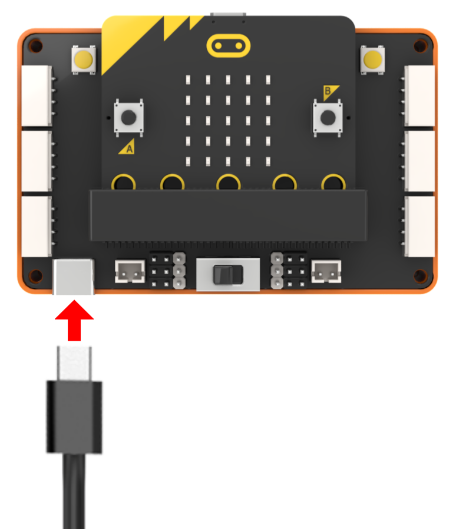

### 2.5.3 Notes

- During charging, the blue indicator light on the expansion board will turn on and will go off once charging is complete. Disconnect the charger and power source promptly after charging to avoid overcharging and damaging the battery. Do not leave the battery charging unattended.
- The power switch must be turned off during charging, otherwise the battery cannot be fully charged.
