# 3. Starter Kit Projects

## 3.1 micro:bit Board Basic Courses

### 3.1.1 Logo Control

The location of the logo on the micro:bit board is shown below.

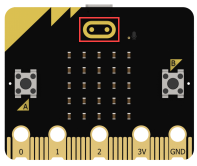

#### 3.1.1.1 Learning Objectives

To switch the displayed icon by touching the logo on the micro:bit board.

#### 3.1.1.2 Programming

1. Principles:

   * On the micro:bit V2.0 board, the front logo functions as a metallic capacitive touch sensor. This sensor can be compared to a button, returning a digital signal when touched.
   * The program determines the touch status based on this return value. When the logo is touched, a sound is played and an icon scrolls on the LED dot matrix.

2. Programming:

- Block Overview

| Block | Category | Description |
| :---: | :---: | :---: |
| 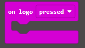 |  | Sets the trigger status of the logo. |
|  |  | Selects and plays a designated sound. |
| 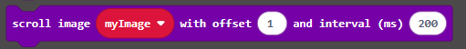 |  | Scrolls an image from one side of the LED screen to the other. |

- Block Combination

     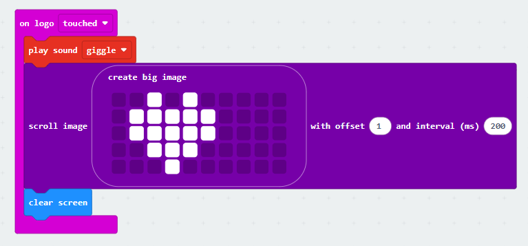

#### 3.1.1.3 Device Pairing and Program Downloading

1. **Wiring**: Connect the micro:bit board to the computer USB port using a data cable.

2. **Device Pairing**:

   - When connecting the device for the first time, pair the device. Once connected, the browser will remember the connected device. Click the **...** button next to **Download**, and select **Connect Device** from the options.

     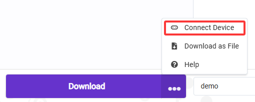

   - Click **Next** in the pop-up window.

     

   - Click **Pair** and select the device shown in the pop-up window.

     

     

     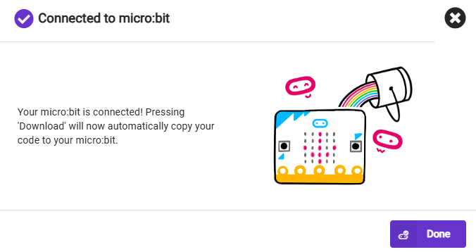

3. **Download**:

   - After the device is successfully connected, click **Download** to download the program. During the download process, the yellow indicator light near the USB port on the micro:bit board will flash rapidly. Do not disconnect or move the data cable at this time to prevent download failure.

     

   - Once the download is complete, the indicator light will stop flashing and remain on, and a completion prompt will appear on the main programming interface.

     

4. **Powering On**: The micro:bit automatically runs the program when powered on to test the functionality.

#### 3.1.1.4 Program Outcome

Once the program is downloaded, touching the logo on the micro:bit board will trigger the preset sound and scroll a heart icon on the LED dot matrix.

### 3.1.2 Smart Thermometer

The location of the main chip on the micro:bit board is shown below.

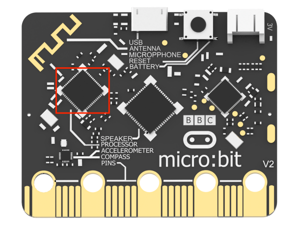

#### 3.1.2.1 Learning Objectives

1. Get to know the micro:bit main chip and learn the corresponding programming blocks.
2. Perform temperature detection using the micro:bit main chip.

#### 3.1.2.2 Programming

1. Principles:

   * The micro:bit V2.0 board uses the nRF52833 main chip, which enables it to measure temperature in degrees Celsius or Fahrenheit.
   * In this section, temperature detection is performed first. A temperature threshold is set, and a sound prompt is triggered when this threshold is exceeded.

2. Programming:

- Block Overview

| Block | Category | Description |
| :---: | :---: | :---: |
| 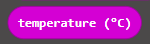 |  | Reads the temperature in degrees Celsius. |
|  |  | Plays the designated sound until complete. |

- Block Combination

     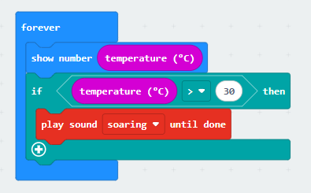

#### 3.1.2.3 Device Pairing and Program Downloading

1. **Wiring**: Connect the micro:bit board to the computer USB port using a data cable.

2. **Device Pairing**:

   - When connecting the device for the first time, pair the device. Once connected, the browser will remember the connected device. Click the **...** button next to **Download**, and select **Connect Device** from the options.

     

   - Click **Next** in the pop-up window.

     

   - Click **Pair** and select the device shown in the pop-up window.

     

     

     

3. **Download**:

   - After the device is successfully connected, click **Download** to download the program. During the download process, the yellow indicator light near the USB port on the micro:bit board will flash rapidly. Do not disconnect or move the data cable at this time to prevent download failure.

     

   - Once the download is complete, the indicator light will stop flashing and remain on, and a completion prompt will appear on the main programming interface.

     

4. **Powering On**: The micro:bit automatically runs the program when powered on to test the functionality.

#### 3.1.2.4 Program Outcome

Lightly press the micro:bit main chip with a finger. When the detected temperature exceeds 30 degrees Celsius, the speaker plays a sound prompt.

### 3.1.3 Timer

The location of the buttons on the micro:bit board is shown below.

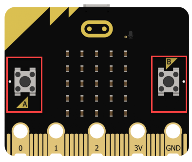

#### 3.1.3.1 Learning Objectives

To program the micro:bit buttons to perform as a timer.

#### 3.1.3.2 Programming

1. Principles:

   * There are two buttons labeled A and B on the front of the micro:bit board. Code execution is triggered by pressing these buttons, and the press duration can also be detected.
   * In this section, a variable is created to store the number of presses of button A, which is used to set the time. Button B is used to confirm the setting, and a sound prompt is triggered based on the condition.

2. Programming:

- Block Overview

| Block | Category | Description |
| :---: | :---: | :---: |
|  |  | Displays the set number on the LED dot matrix. If it is multi-digit, it scrolls. |
|  |  | Executes nested statements when button A, B, or A+B is pressed. |

- Block Combination

     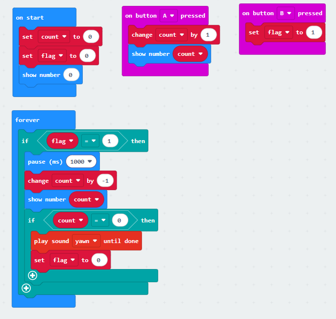

#### 3.1.3.3 Device Pairing and Program Downloading

1. **Wiring**: Connect the micro:bit board to the computer USB port using a data cable.

2. **Device Pairing**:

   - When connecting the device for the first time, pair the device. Once connected, the browser will remember the connected device. Click the **...** button next to **Download**, and select **Connect Device** from the options.

     

   - Click **Next** in the pop-up window.

     

   - Click **Pair** and select the device shown in the pop-up window.

     

     

     

3. **Download**:

   - After the device is successfully connected, click **Download** to download the program. During the download process, the yellow indicator light near the USB port on the micro:bit board will flash rapidly. Do not disconnect or move the data cable at this time to prevent download failure.

     

   - Once the download is complete, the indicator light will stop flashing and remain on, and a completion prompt will appear on the main programming interface.

     

4. **Powering On**: The micro:bit automatically runs the program when powered on to test the functionality.

#### 3.1.3.4 Program Outcome

Once the program is downloaded, press button A three times, and then press button B to confirm. After 3 seconds, the speaker will play music.

### 3.1.4 Music Player

* The location of the buzzer on the micro:bit board is shown below.

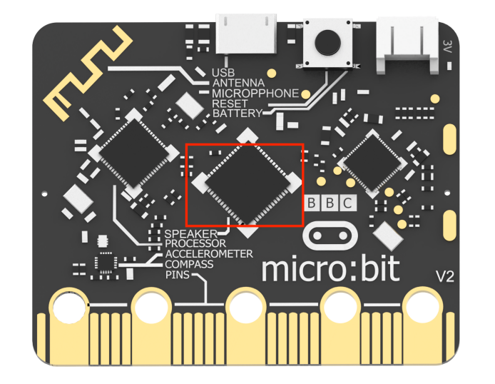

- The location of the buttons on the micro:bit board is shown below.

#### 3.1.4.1 Learning Objectives

To program the micro:bit buttons to perform as a music player.

#### 3.1.4.2 Programming

1. Principles:

   * The micro:bit V2.0 board features a built-in speaker, which is a buzzer, capable of outputting sound through programming.
   * In this section, different melodies are configured. These melodies are triggered by button A and button B to play music.

2. Programming:

   - Block Combination

     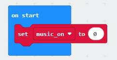

     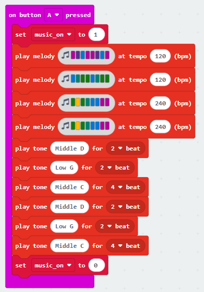

     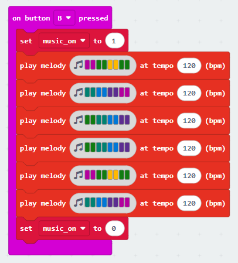

     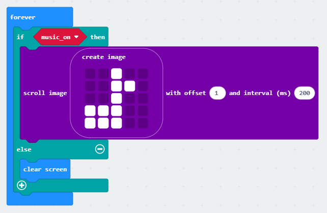

#### 3.1.4.3 Device Pairing and Program Downloading

1. **Wiring**: Connect the micro:bit board to the computer USB port using a data cable.

2. **Device Pairing**:

   - When connecting the device for the first time, pair the device. Once connected, the browser will remember the connected device. Click the **...** button next to **Download**, and select **Connect Device** from the options.

     

   - Click **Next** in the pop-up window.

     

   - Click **Pair** and select the device shown in the pop-up window.

     

     

     

3. **Download**:

   - After the device is successfully connected, click **Download** to download the program. During the download process, the yellow indicator light near the USB port on the micro:bit board will flash rapidly. Do not disconnect or move the data cable at this time to prevent download failure.

     

   - Once the download is complete, the indicator light will stop flashing and remain on, and a completion prompt will appear on the main programming interface.

     

4. **Powering On**: The micro:bit automatically runs the program when powered on to test the functionality.

#### 3.1.4.4 Program Outcome

Once the program is downloaded, pressing button A plays the melody of **Two Tigers** and pressing button B plays the melody of **Twinkle Twinkle Little Star**.

### 3.1.5 Noise Detector

* The location of the buzzer on the micro:bit board is shown below.

* The location of the microphone on the micro:bit board is shown below.

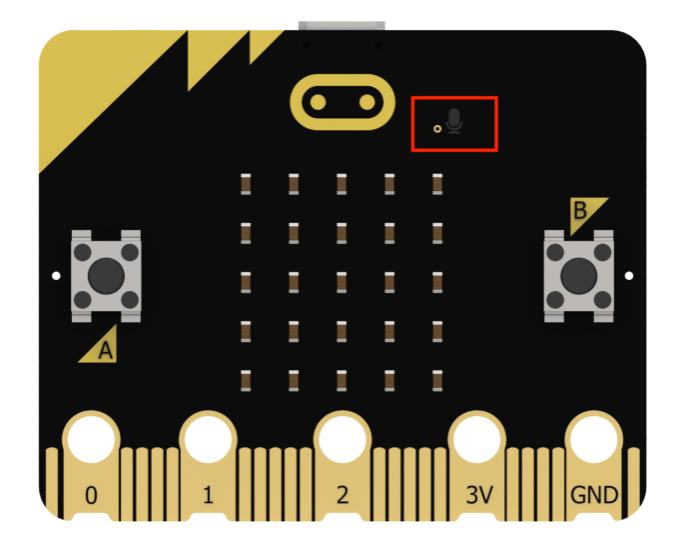

#### 3.1.5.1 Learning Objectives

1. Get to know the micro:bit board microphone and learn the corresponding programming blocks.
2. Program sound detection and trigger feedback.

#### 3.1.5.2 Programming

1. Principles:

   * The micro:bit V2.0 board features a microphone that provides sound input. When the microphone is active, a red LED lights up on the front of the board.
   * Ambient information received by the micro:bit, such as sound levels, light intensity, and magnetic field strength, cannot be observed directly. It is difficult to analyze this information during use, but printing the values to the serial port provides a clear visualization.
   * For ease of operation, the serial port is redirected to USB In this section. A variable is created to represent the sound level, and the sound data is mapped to display different icons. When the sound level reaches a specified threshold, an alarm is triggered.

2. Programming:

- Block Overview

| Block | Category | Description |
| :---: | :---: | :---: |
|  |  | Directs serial input and output to use the USB connection. |
| 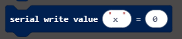 |  | Writes values and newlines to the serial port. |
|  |  | Drops the last few digits of the original value. |

- Block Combination

     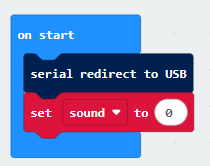

     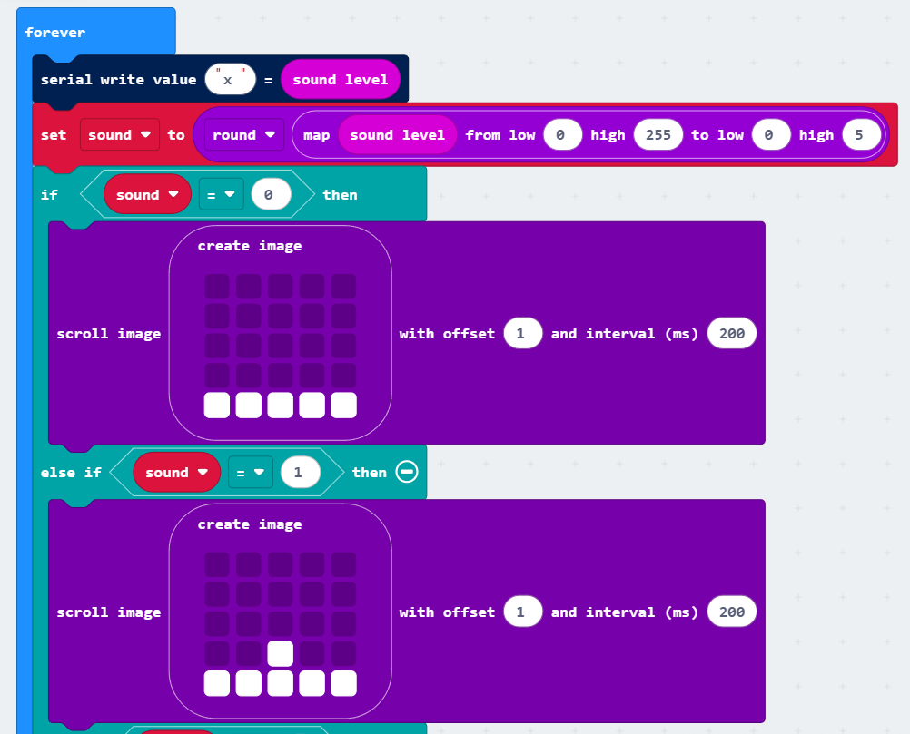

#### 3.1.5.3 Device Pairing and Program Downloading

1. **Wiring**: Connect the micro:bit board to the computer USB port using a data cable.

2. **Device Pairing**:

   - When connecting the device for the first time, pair the device. Once connected, the browser will remember the connected device. Click the **...** button next to **Download**, and select **Connect Device** from the options.

     

   - Click **Next** in the pop-up window.

     

   - Click **Pair** and select the device shown in the pop-up window.

     

     

     

3. **Download**:

   - After the device is successfully connected, click **Download** to download the program. During the download process, the yellow indicator light near the USB port on the micro:bit board will flash rapidly. Do not disconnect or move the data cable at this time to prevent download failure.

     

   - Once the download is complete, the indicator light will stop flashing and remain on, and a completion prompt will appear on the main programming interface.

     

4. **Powering On**: The micro:bit automatically runs the program when powered on to test the functionality.

#### 3.1.5.4 Program Outcome

Once the program is downloaded, speak toward the microphone on the micro:bit board. The LED dot matrix displays LED bars of varying heights to represent the detected sound intensity.

### 3.1.6 Dark Alarm

- The location of the LED dot matrix on the micro:bit board is shown below.

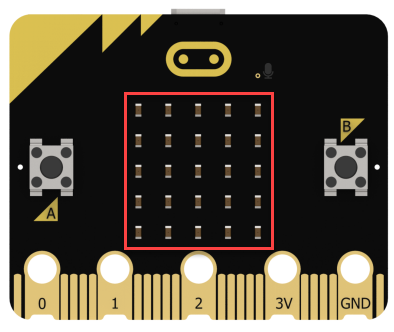

- The location of the speaker on the micro:bit board is shown below.

#### 3.1.6.1 Learning Objectives

1. Understand that the micro:bit board LED dot matrix functions as a light sensor.
2. Program light detection and trigger feedback.

#### 3.1.6.2 Programming

1. Principles:

   * The micro:bit board can enter input mode by reversing the LED screen. The LED screen acts as a basic light sensor, which can detect ambient light.
   * To easily monitor the ambient data received by the micro:bit, the light value is printed to the serial port by redirecting the serial output to USB. A threshold is set based on the light range from 0 to 255. When the light falls below this threshold, a sound prompt is played.

2. Programming:

- Block Overview

| Block | Category | Description |
| :---: | :---: | :---: |
|  |  | Directs serial input and output to use the USB connection. |
|  |  | Writes values and newlines to the serial port. |

- Block Combination

     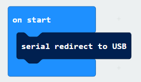

     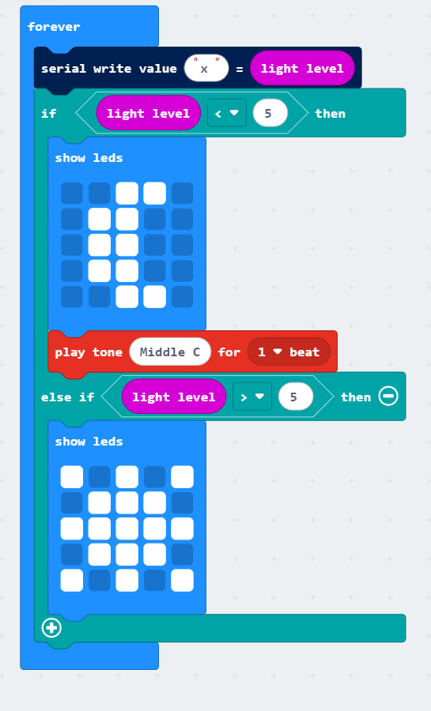

#### 3.1.6.3 Device Pairing and Program Downloading

1. **Wiring**: Connect the micro:bit board to the computer USB port using a data cable.

2. **Device Pairing**:

   - When connecting the device for the first time, pair the device. Once connected, the browser will remember the connected device. Click the **...** button next to **Download**, and select **Connect Device** from the options.

     

   - Click **Next** in the pop-up window.

     

   - Click **Pair** and select the device shown in the pop-up window.

     

     

     

3. **Download**:

   - After the device is successfully connected, click **Download** to download the program. During the download process, the yellow indicator light near the USB port on the micro:bit board will flash rapidly. Do not disconnect or move the data cable at this time to prevent download failure.

     

   - Once the download is complete, the indicator light will stop flashing and remain on, and a completion prompt will appear on the main programming interface.

     

4. **Powering On**: The micro:bit automatically runs the program when powered on to test the functionality.

#### 3.1.6.4 Program Outcome

Once the program is downloaded, move the micro:bit board into a dark place. The LED dot matrix displays a moon icon, and the speaker plays a prompt sound.

### 3.1.7 Compass

The location of the magnetometer on the micro:bit board is shown below.

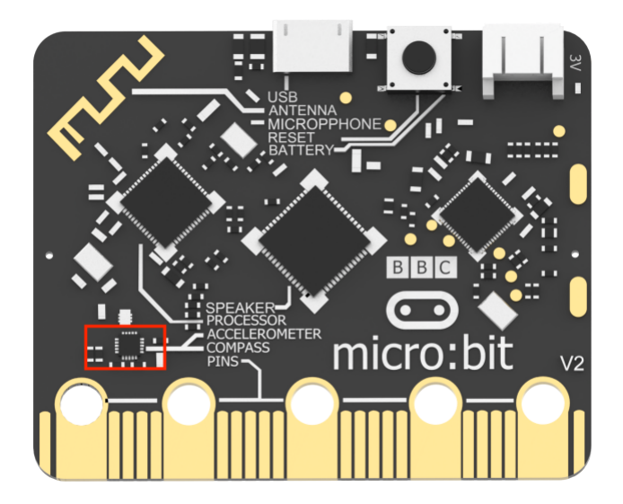

#### 3.1.7.1 Learning Objectives

1. Get to know the micro:bit magnetometer.
2. Program direction detection and display arrows.

#### 3.1.7.2 Programming

1. Principles:

   There is a magnetic sensor on the micro:bit board, which functions as an electronic compass. It measures magnetic field strength in multiple directions, and programming enables the detection of magnetic field strength.

2. Programming:

- Block Overview

| Block | Category | Description |
| :---: | :---: | :---: |
|  |  | Directs serial input and output to use the USB connection. |
|  |  | Writes values and newlines to the serial port. |

- Block Combination

     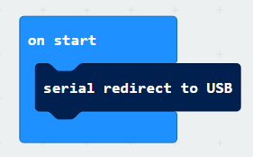

     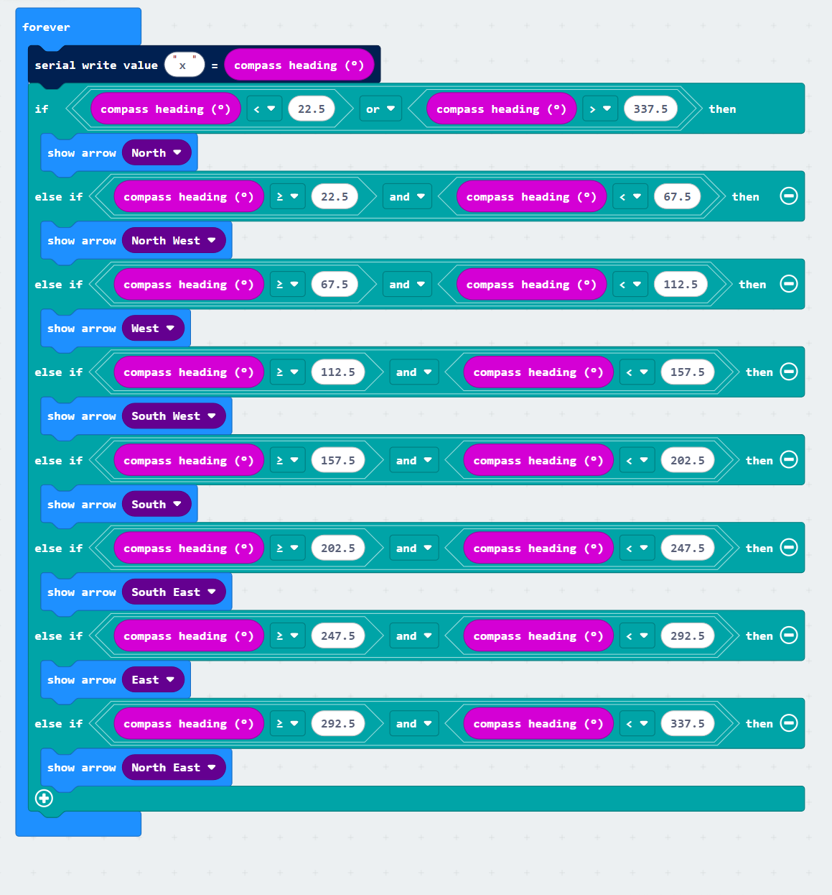

#### 3.1.7.3 Device Pairing and Program Downloading

1. **Wiring**: Connect the micro:bit board to the computer USB port using a data cable.

2. **Device Pairing**:

   - When connecting the device for the first time, pair the device. Once connected, the browser will remember the connected device. Click the **...** button next to **Download**, and select **Connect Device** from the options.

     

   - Click **Next** in the pop-up window.

     

   - Click **Pair** and select the device shown in the pop-up window.

     

     

     

3. **Download**:

   - After the device is successfully connected, click **Download** to download the program. During the download process, the yellow indicator light near the USB port on the micro:bit board will flash rapidly. Do not disconnect or move the data cable at this time to prevent download failure.

     

   - Once the download is complete, the indicator light will stop flashing and remain on, and a completion prompt will appear on the main programming interface.

     

4. **Powering On**: The micro:bit automatically runs the program when powered on to test the functionality.

#### 3.1.7.4 Program Outcome

- Once calibration is complete, move the board in different directions, and the LED dot matrix displays the corresponding direction arrow.
> [!NOTE]
  >
  > **After downloading the program, the prompt “TILT TO FILL SCREEN” will scroll across the micro:bit board, indicating that calibration must be performed. Move the micro:bit board in all directions until all the LEDs on the screen are lit.**

## 3.2 micro:bit Expansion Board Basic Courses

### 3.2.1 Sound-Controlled RGB Light

- The location of the sound module on the micro:bit expansion board is shown below.

- The location of the RGB lights on the micro:bit expansion board is shown below.

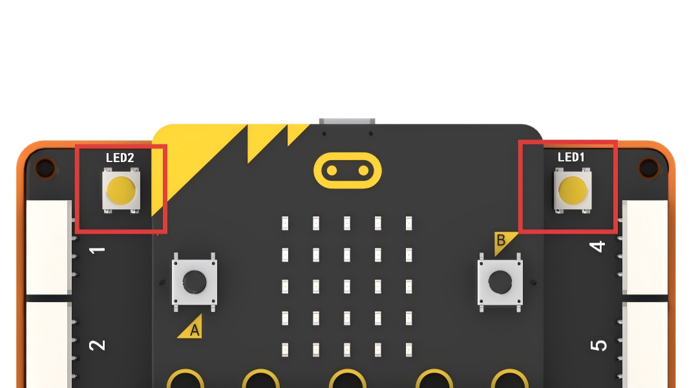

#### 3.2.1.1 Learning Objectives

1. Get to know the sound sensor and learn the corresponding programming blocks.
2. Program a smart sound-controlled RGB light.

#### 3.2.1.2 Programming

1. Add the Extension Library:

   - Click **Extensions**.

     

   - Search for **https://github.com/HiwonderK12/DaDabitV2** in **Extensions** and add **dadabitv2**.

     

2. Principles:

   There is a sound sensor on the micro:bit expansion board. The sound sensor functions as a microphone, which receives sound waves to detect the sound intensity. The range of the sound intensity is 0 to 255, where 0 represents no sound.

3. Programming:

- Block Overview

| Block | Category | Description |
| :---: | :---: | :---: |
|  |  | Draws the selected pattern on the LED screen. |
|  |  | Satisfies the condition when two inputs are equal to each other. |
| 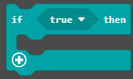 |  | Executes nested statements if the condition is satisfied. |
| 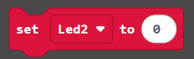 |  | Sets the variable equal to the input. |
|  |  | Changes the value of the variable by an increment of 1. |
| 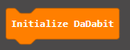 |  | Initializes the DaDabit module, which should be executed at startup. |
| 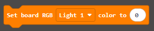 |  | Sets the color of the RGB lights. |
| 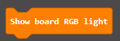 |  | Displays the RGB lights, used in conjunction with setting the light color. This must be executed after setting the color to apply to the display. |
|  |  | Gets the sound loudness from the sound sensor. |

- Block Combination

     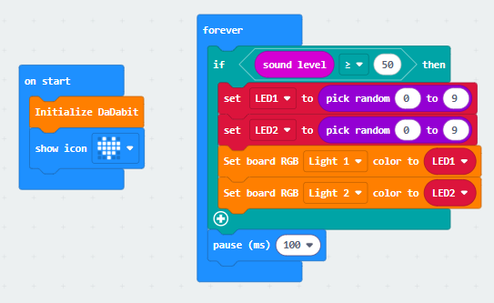

#### 3.2.1.3 Device Pairing and Program Downloading

1. **Wiring**: Connect the micro:bit board to the computer USB port using a data cable.

2. **Device Pairing**:

   - When connecting the device for the first time, pair the device. Once connected, the browser will remember the connected device. Click the **...** button next to **Download**, and select **Connect Device** from the options.

     

   - Click **Next** in the pop-up window.

     

   - Click **Pair** and select the device shown in the pop-up window.

     

     

     

3. **Download**:

   - After the device is successfully connected, click **Download** to download the program. During the download process, the yellow indicator light near the USB port on the micro:bit board will flash rapidly. Do not disconnect or move the data cable at this time to prevent download failure.

     

   - Once the download is complete, the indicator light will stop flashing and remain on, and a completion prompt will appear on the main programming interface.

     

4. **Powering On**: The micro:bit automatically runs the program when powered on to test the functionality.

#### 3.2.1.4 Program Outcome

Connect the micro:bit board to the computer using a USB data cable and download the program. Then, insert the micro:bit board into the expansion board and turn on the switch. A candle icon is displayed on the LED dot matrix of the micro:bit board. Place the expansion board on a table and tap to make a sound. The blue LED on the sound sensor flashes once, and the color of the RGB lights on the expansion board changes randomly.

### 3.2.2 Servo Control

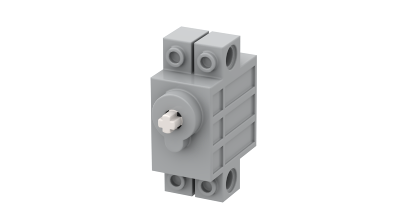

#### 3.2.2.1 Learning Objectives

1. Get to know the servo and learn the corresponding programming blocks.
2. Get familiar with the wiring method of the servo.
3. Program a back-and-forth rotation control effect for the servo.

#### 3.2.2.2 Programming

1. Add the Extension Library:

   - Click **Extensions**.

     

   - Search for **https://github.com/HiwonderK12/DaDabitV2** in **Extensions** and add **dadabitv2**.

     

2. Principles:

   The micro:bit expansion board sends control signals to control the rotation of the servo. The servo controller receives the signals from the signal line to drive the servo. The servo drives a series of gears, which transmit power to the output steering hub after deceleration. The potentiometer outputs a voltage feedback signal to the controller, which then determines the rotation direction and speed of the servo based on the current position to stop at the target position.

3. Programming:

- Block Overview

| Block | Category | Description |
| :---: | :---: | :---: |
|  |  | Satisfies the condition when two inputs are equal to each other. |
|  |  | Executes nested blocks if the condition is satisfied. |
| 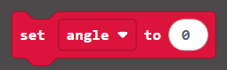 |  | Sets the variable equal to the input. |
|  |  | Changes the value of the variable by an increment of 1. |
|  |  | Initializes the DaDabit module, which should be executed at startup. |
|  |  | Configures the servo number, angle, and motion duration. |

- Block Combination

     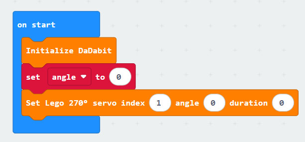

     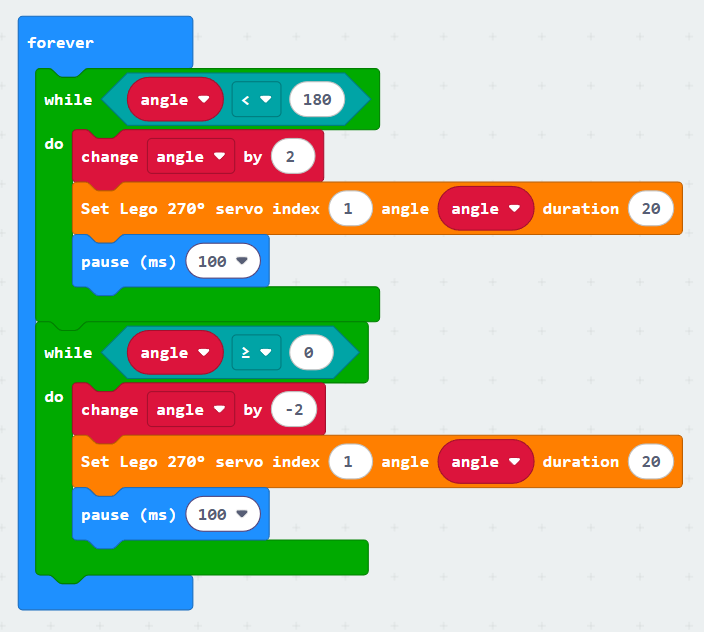

#### 3.2.2.3 Device Pairing and Program Downloading

1. **Wiring**: Connect the micro:bit board to the computer USB port using a data cable.

2. **Device Pairing**:

   - When connecting the device for the first time, pair the device. Once connected, the browser will remember the connected device. Click the **...** button next to **Download**, and select **Connect Device** from the options.

     

   - Click **Next** in the pop-up window.

     

   - Click **Pair** and select the device shown in the pop-up window.

     

     

     

3. **Download**:

   - After the device is successfully connected, click **Download** to download the program. During the download process, the yellow indicator light near the USB port on the micro:bit board will flash rapidly. Do not disconnect or move the data cable at this time to prevent download failure.

     

   - Once the download is complete, the indicator light will stop flashing and remain on, and a completion prompt will appear on the main programming interface.

     

4. **Powering On**: The micro:bit automatically runs the program when powered on to test the functionality.

#### 3.2.2.4 Program Outcome

Connect the micro:bit board to the computer using a USB data cable and download the program. Then, insert the micro:bit board into the expansion board and turn on the switch. The servo rotates back and forth.

### 3.2.3 Motor Control

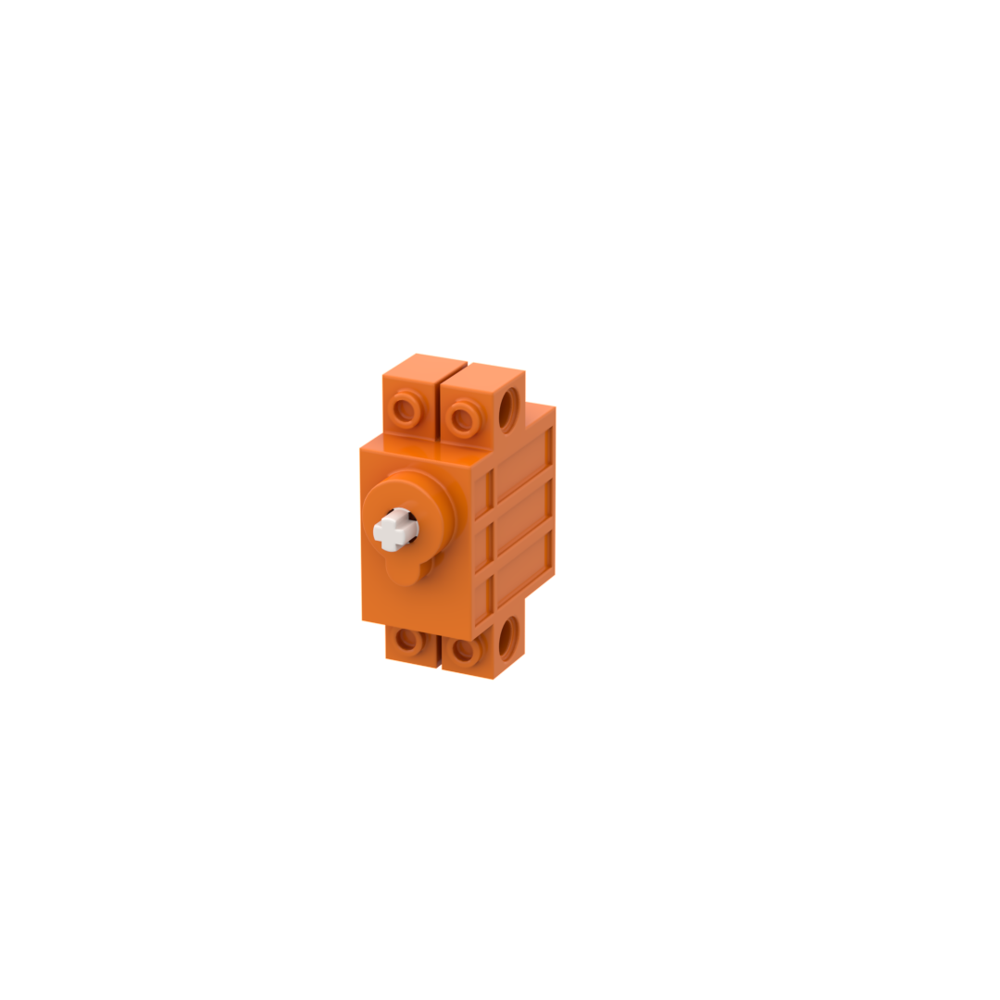

#### 3.2.3.1 Learning Objectives

1. Get to know the basic working principles of DC motors and master the programming blocks.
2. Get familiar with standard wiring methods and polarity rules for motors.
3. Program start, stop, rotation direction, and speed control for the motor.

#### 3.2.3.2 Programming

1. Add the Extension Library:

   - Click **Extensions**.

     

   - Search for **https://github.com/HiwonderK12/DaDabitV2** in **Extensions** and add **dadabitv2**.

     

2. Principles:

   The micro:bit expansion board sends control signals to control the output current of the motor drive circuit. This current drives the internal coil of the motor to generate a magnetic field, rotating the rotor. The motor rotation direction is controlled by changing the current direction, and the speed is adjusted by changing the current magnitude to start, stop, and regulate the speed of the motor.

3. Programming:

- Block Overview

| Block | Category | Description |
| :---: | :---: | :---: |
|  |  | Detects the button state, acting as a trigger for starting, stopping, or steering the motor. |
|  |  | Initializes the DaDabit module, which should be executed at startup. |
|  |  | Controls the specified motor to rotate in the set direction and speed. |

- Block Combination

     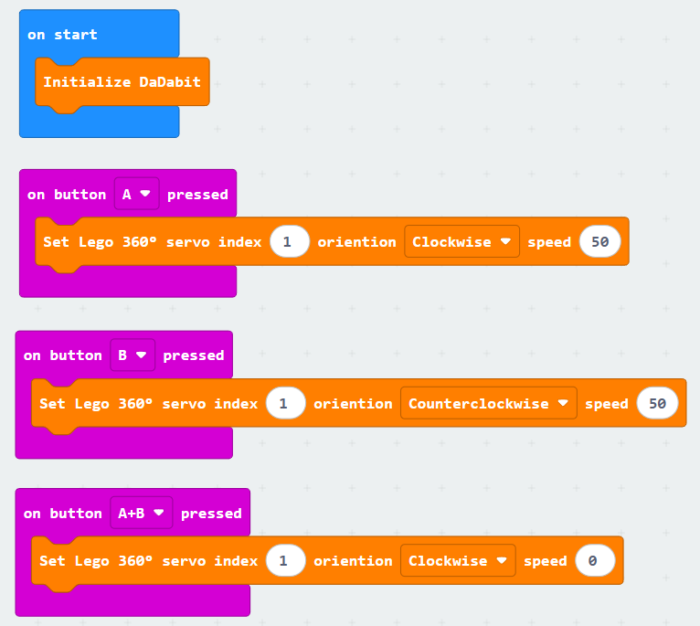

#### 3.2.3.3 Device Pairing and Program Downloading

1. **Wiring**: Connect the micro:bit board to the computer USB port using a data cable.

2. **Device Pairing**:

   - When connecting the device for the first time, pair the device. Once connected, the browser will remember the connected device. Click the **...** button next to **Download**, and select **Connect Device** from the options.

     

   - Click **Next** in the pop-up window.

     

   - Click **Pair** and select the device shown in the pop-up window.

     

     

     

3. **Download**:

   - After the device is successfully connected, click **Download** to download the program. During the download process, the yellow indicator light near the USB port on the micro:bit board will flash rapidly. Do not disconnect or move the data cable at this time to prevent download failure.

     

   - Once the download is complete, the indicator light will stop flashing and remain on, and a completion prompt will appear on the main programming interface.

     

4. **Powering On**: The micro:bit automatically runs the program when powered on to test the functionality.

#### 3.2.3.4 Program Outcome

Once the program is downloaded and the board is powered on, pressing the corresponding buttons will execute three actions: forward rotation, reverse rotation, and stop, completing the preset motion control effects.

## 3.3 Creative Builds

### 3.3.1 Smart Barrier

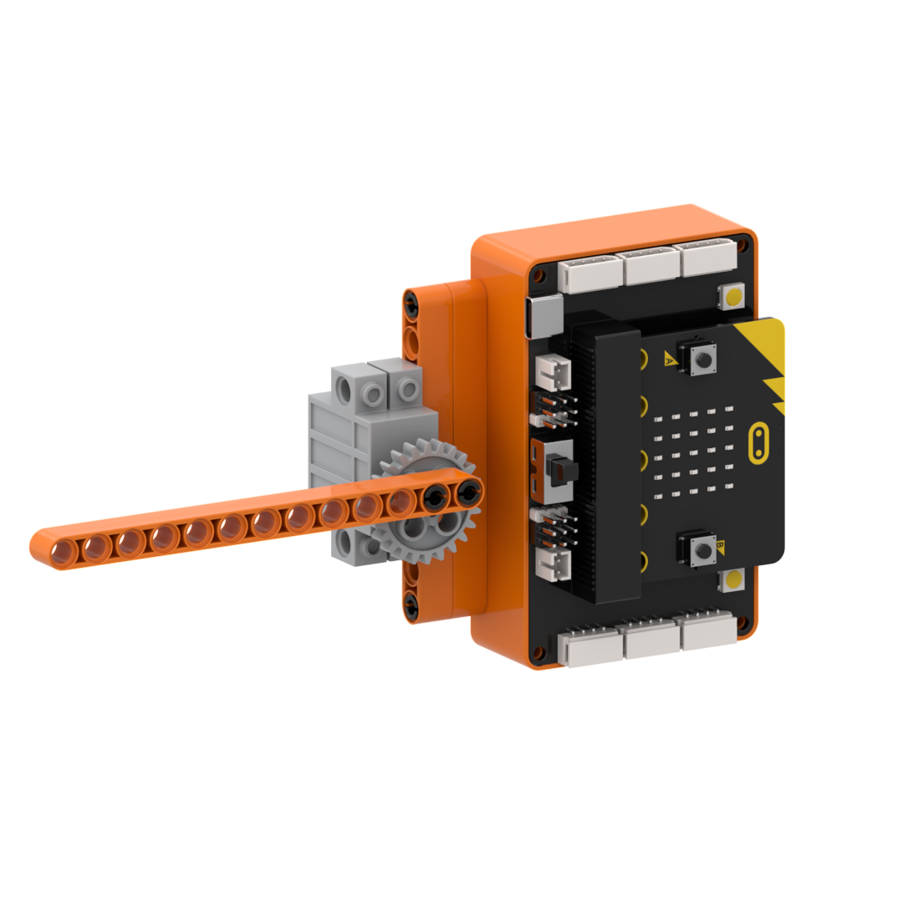

#### 3.3.1.1 Learning Objectives

1. Get to know the button input function of the micro:bit board and understand the basic working principles of servos.
2. Understand the sequential control logic of button trigger, action execution, and delay reset, and master the complete control process of the smart barrier.

#### 3.3.1.2 Assembly Guide

For the building steps of the smart barrier, refer to the building guide in [6. Creative Builds Assembly Guide](https://wiki.hiwonder.com/projects/DaDabitV2/en/latest/docs/6_Creative_Assembly_Guide.html#smart-barrier) for **Smart Barrier**.

#### 3.3.1.3 Wiring Guide

Connect the servo to port S2 on the micro:bit expansion board, ensuring the orange signal wire is connected to the white pin of S2.

As shown below:

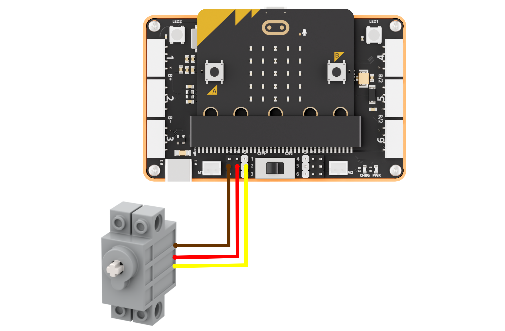

> [!NOTE]
>
> **When performing a program related to the servo for the first time, remove the parts from the servo, and upload the program to the micro:bit. Then, turn on the power switch of the expansion board, wait for the servo to rotate to the initial position of 0 degrees, and reinstall the parts. If the servo has already been reset, this step can be skipped.**

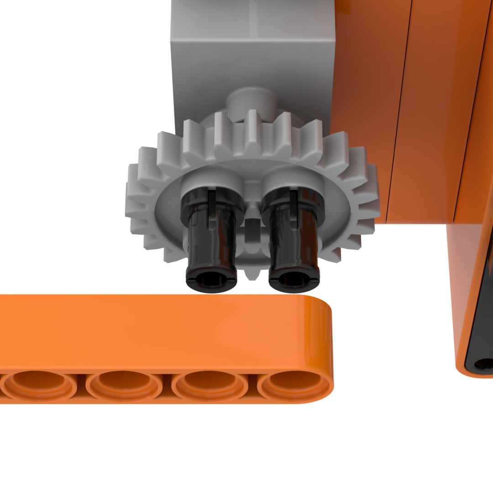

#### 3.3.1.4 Programming

1. Add the Extension Library:

   - Click **Extensions**.

     

   - Search for **https://github.com/HiwonderK12/DaDabitV2** in **Extensions** and add **dadabitv2**.

     

2. Principles:

   - The micro:bit expansion board sends control signals to control the rotation of the internal motor of the servo. The servo controller receives control signals from the signal line to drive the motor. The motor drives a series of gears to transmit power to the output shaft after deceleration, driving the gate to open.
   - The potentiometer inside the servo outputs a voltage feedback signal to the controller. The controller determines the motor's rotation direction and speed based on the current position, driving the gate to the target position and stopping. After the delay, the micro:bit expansion board sends a reset signal, and the servo controller drives the motor in reverse to return the gate to its initial closed state.

3. Programming:

- Block Overview

| Block | Category | Description |
| :---: | :---: | :---: |
|  |  | Detects when button A is pressed to trigger actions. |
|  |  | Controls the specified servo to rotate to the target angle within a set time. |

- Block Combination

     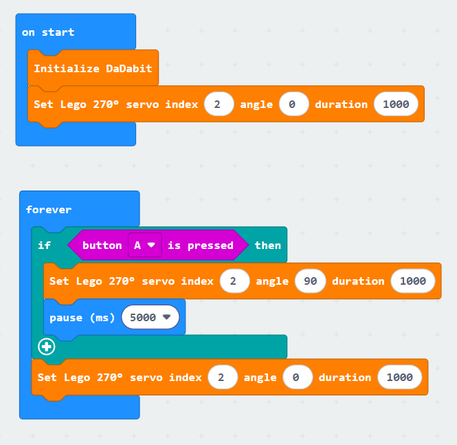

4. Device Pairing and Program Downloading

   1. **Wiring**: Connect the micro:bit board to the computer USB port using a data cable.

   2. **Device Pairing**:

      - When connecting the device for the first time, pair the device. Once connected, the browser will remember the connected device. Click the **...** button next to **Download**, and select **Connect Device** from the options.

        

      - Click **Next** in the pop-up window.

        

      - Click **Pair** and select the device shown in the pop-up window.

        

        

        

   3. **Download**:

      - After the device is successfully connected, click **Download** to download the program. During the download process, the yellow indicator light near the USB port on the micro:bit board will flash rapidly. Do not disconnect or move the data cable at this time to prevent download failure.

        

      - Once the download is complete, the indicator light will stop flashing and remain on, and a completion prompt will appear on the main programming interface.

        

   4. **Powering On**: The micro:bit automatically runs the program when powered on to test the functionality.

#### 3.3.1.5 Demo

---

### 3.3.2 Smart Fan

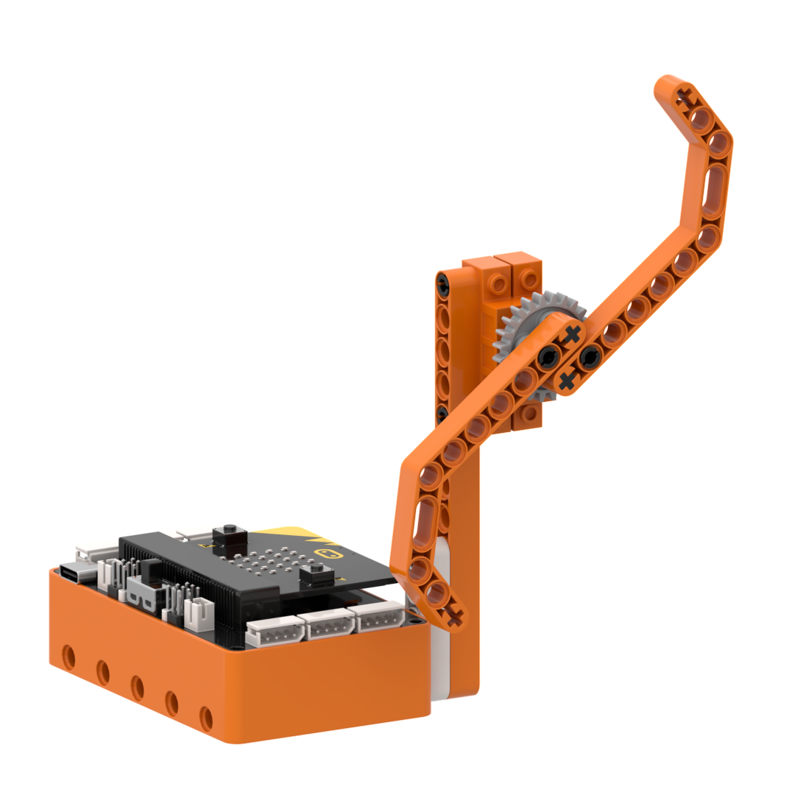

#### 3.3.2.1 Learning Objectives

1. Get to know the basic working principles of DC motors and master the button control logic for motor start and stop.
2. Understand the dual control logic of button A to start and button B to stop, and learn to control the motor state independently.

#### 3.3.2.2 Assembly Guide

For the building steps of the smart fan, refer to the building guide in [6. Creative Builds Assembly Guide](https://wiki.hiwonder.com/projects/DaDabitV2/en/latest/docs/6_Creative_Assembly_Guide.html#smart-fan) for **Smart Fan**.

#### 3.3.2.3 Wiring Guide

Connect the motor to port S1 on the micro:bit expansion board, ensuring the orange signal wire is connected to the white pin of S1.

As shown below:

#### 3.3.2.4 Programming

1. Add the Extension Library:

   - Click **Extensions**.

     

   - Search for **https://github.com/HiwonderK12/DaDabitV2** in **Extensions** and add **dadabitv2**.

     

2. Principles:

   - The micro:bit expansion board sends control signals to control the output current of the motor drive circuit to rotate the motor. The motor rotates the fan blades to create airflow.
   - When button A is pressed, the micro:bit sends a start signal, and the drive circuit provides continuous power to rotate the motor. When button B is pressed, the micro:bit sends a stop signal, and the drive circuit cuts off power to stop the motor for fan control.

3. Programming:

- Block Overview

| Block | Category | Description |
| :---: | :---: | :---: |
|  |  | Detects when button A or B is pressed to trigger actions. |
|  |  | Controls the specified motor to rotate continuously in the set direction and speed. |

- Block Combination

     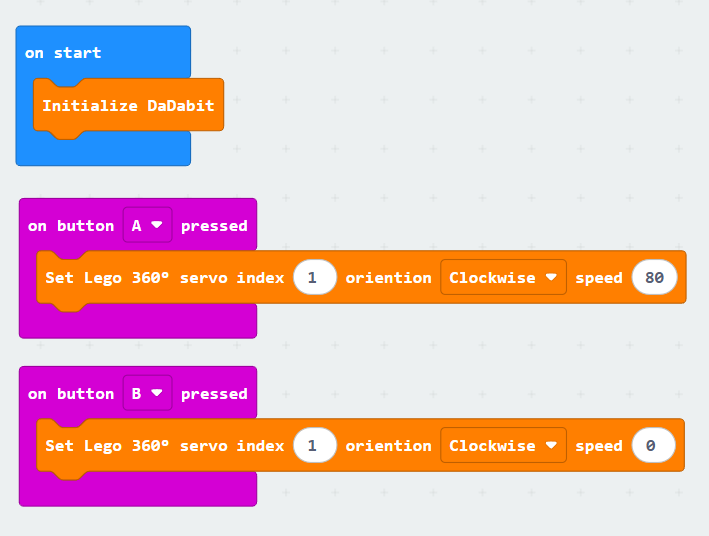

4. Device Pairing and Program Downloading

   1. **Wiring**: Connect the micro:bit board to the computer USB port using a data cable.

   2. **Device Pairing**:

      - When connecting the device for the first time, pair the device. Once connected, the browser will remember the connected device. Click the **...** button next to **Download**, and select **Connect Device** from the options.

        

      - Click **Next** in the pop-up window.

        

      - Click **Pair** and select the device shown in the pop-up window.

        

        

        

   3. **Download**:

      - After the device is successfully connected, click **Download** to download the program. During the download process, the yellow indicator light near the USB port on the micro:bit board will flash rapidly. Do not disconnect or move the data cable at this time to prevent download failure.

        

      - Once the download is complete, the indicator light will stop flashing and remain on, and a completion prompt will appear on the main programming interface.

        

   4. **Powering On**: The micro:bit automatically runs the program when powered on to test the functionality.

#### 3.3.2.5 Demo

---

### 3.3.3 Face-Changing Bot

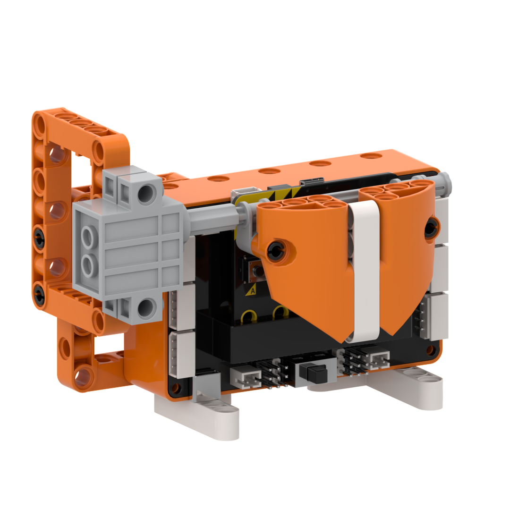

#### 3.3.3.1 Learning Objectives

1. Understand the angle control principles of servos and the press count trigger logic on the micro:bit board.
2. Master the control method of switching between different servo angles by pressing the button multiple times to change expressions.

#### 3.3.3.2 Assembly Guide

For the building steps of the face-changing bot, refer to the building guide in [6. Creative Builds Assembly Guide](https://wiki.hiwonder.com/projects/DaDabitV2/en/latest/docs/6_Creative_Assembly_Guide.html#face-changing-bot) for **Face-Changing Bot**.

#### 3.3.3.3 Wiring Guide

Connect the servo to port S1 on the micro:bit expansion board, ensuring the orange signal wire is connected to the white pin of S1.

As shown below:

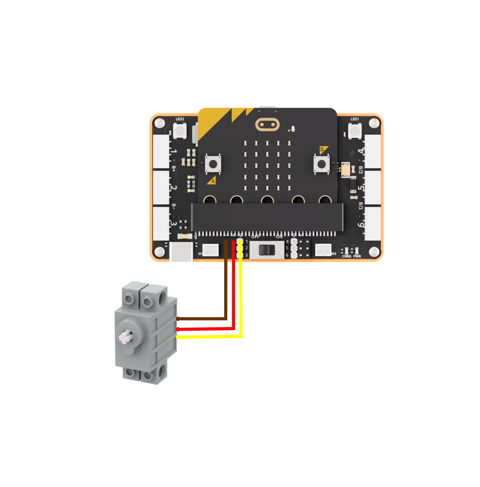

> [!NOTE]
>
> **When performing a program related to the servo for the first time, remove the parts from the servo, and upload the program to the micro:bit. Then, turn on the power switch of the expansion board, wait for the servo to rotate to the initial position of 0 degrees, and reinstall the parts. If the servo has already been reset, this step can be skipped.**

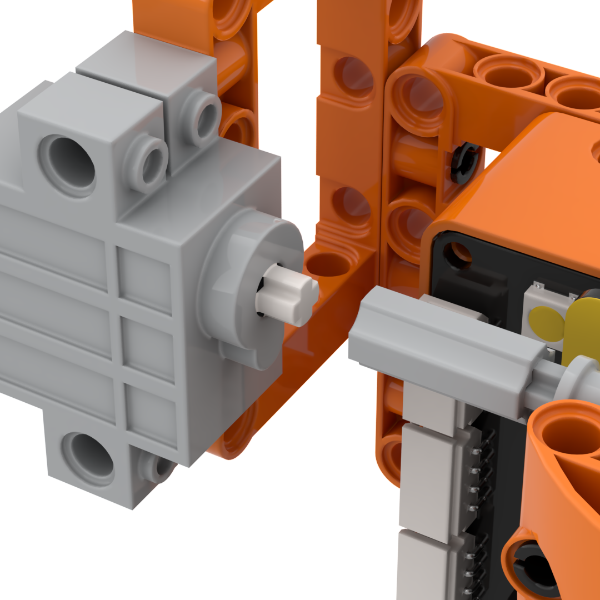

#### 3.3.3.4 Programming

1. Add the Extension Library:

   - Click **Extensions**.

     

   - Search for **https://github.com/HiwonderK12/DaDabitV2** in **Extensions** and add **dadabitv2**.

     

2. Principles:

   - The micro:bit expansion board sends control signals to control the rotation of the internal motor of the servo. The servo controller receives control signals from the signal line to drive the motor. The motor drives a series of gears to transmit power to the output shaft after deceleration, rotating the expression panel.
   - The potentiometer inside the servo outputs a voltage feedback signal to the controller. The controller determines the motor's rotation direction and speed based on the current position, driving the expression panel to the target angle and stopping. The micro:bit board records the number of presses of button A to send different angle control signals, switching among Happy, Sad, and Angry expressions.

3. Programming:

* Block Overview

| Block | Category | Description |
| :---: | :---: | :---: |
|  |  | Displays a preset icon on the controller screen. |
|  |  | Detects the ambient sound level as a trigger condition for actions. |
|  |  | Controls the specified servo to rotate to the target angle within a set time. |

* Block Combination

     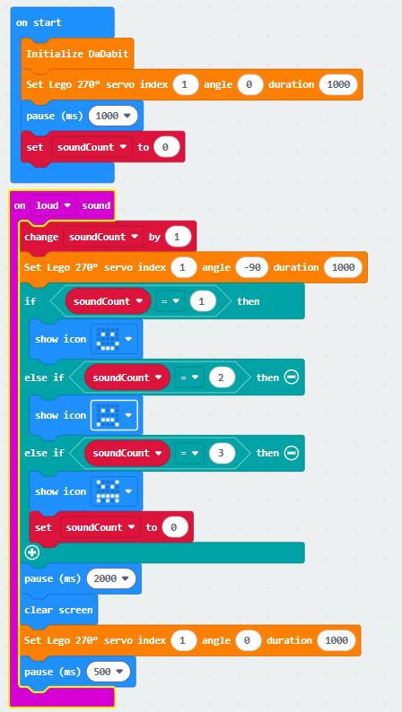

4. Device Pairing and Program Downloading

   1. **Wiring**: Connect the micro:bit board to the computer USB port using a data cable.

   2. **Device Pairing**:

      - When connecting the device for the first time, pair the device. Once connected, the browser will remember the connected device. Click the **...** button next to **Download**, and select **Connect Device** from the options.

        

      - Click **Next** in the pop-up window.

        

      - Click **Pair** and select the device shown in the pop-up window.

        

        

        

   3. **Download**:

      - After the device is successfully connected, click **Download** to download the program. During the download process, the yellow indicator light near the USB port on the micro:bit board will flash rapidly. Do not disconnect or move the data cable at this time to prevent download failure.

        

      - Once the download is complete, the indicator light will stop flashing and remain on, and a completion prompt will appear on the main programming interface.

        

   4. **Powering On**: The micro:bit automatically runs the program when powered on to test the functionality.

#### 3.3.3.5 Demo

---

### 3.3.4 Automated Wiper

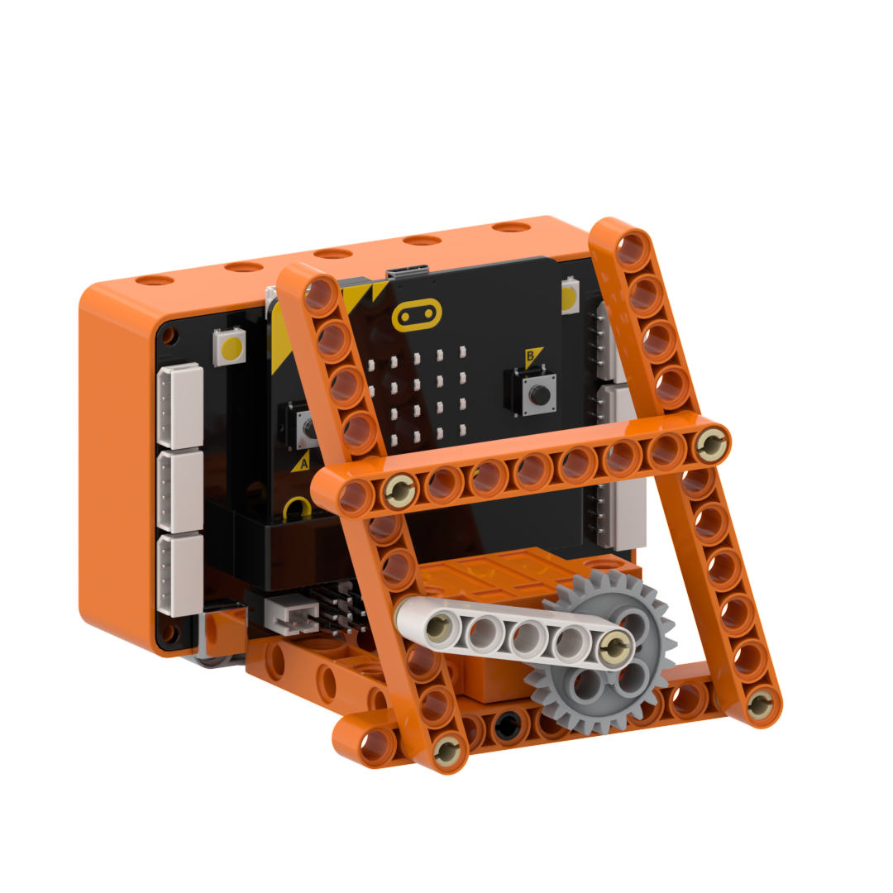

#### 3.3.4.1 Learning Objectives

1. Understand the working principles of DC motors and master the button control logic for motor start and stop.
2. Understand the control logic of button A to start and button B to stop, realizing back-and-forth sweeping for the wiper.

#### 3.3.4.2 Assembly Guide

For the building steps of the automated wiper, refer to the building guide in [6. Creative Builds Assembly Guide](https://wiki.hiwonder.com/projects/DaDabitV2/en/latest/docs/6_Creative_Assembly_Guide.html#automated-wiper) for **Automated Wiper**.

#### 3.3.4.3 Wiring Guide

Connect the motor to port S1 on the micro:bit expansion board, ensuring the orange signal wire is connected to the white pin of S1.

As shown below:

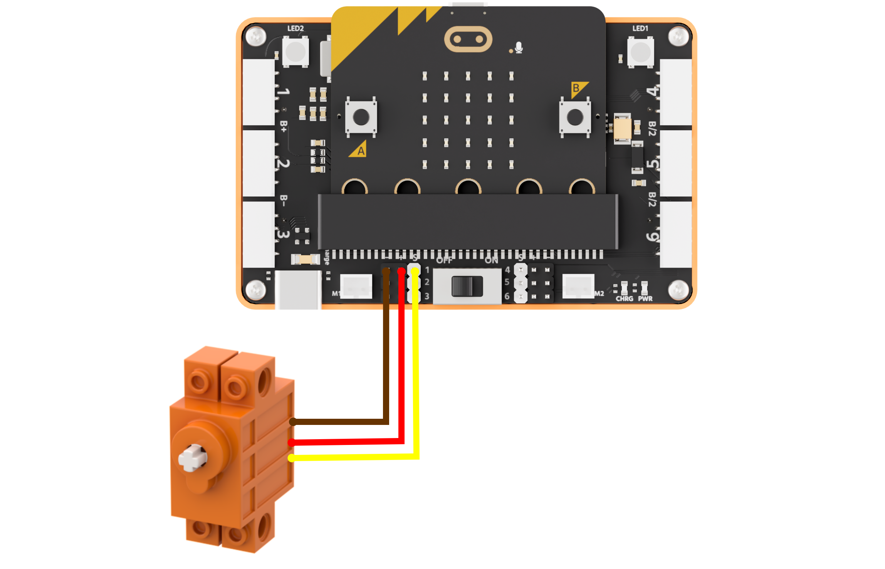

#### 3.3.4.4 Programming

1. Add the Extension Library:

   - Click **Extensions**.

     

   - Search for **https://github.com/HiwonderK12/DaDabitV2** in **Extensions** and add **dadabitv2**.

     

2. Principles:

   - The micro:bit expansion board sends control signals to control the output current of the motor drive circuit to rotate the motor. The motor drives the wiper through a linkage structure, realizing back-and-forth sweeping.
   - When button A is pressed, the micro:bit sends a start signal, and the drive circuit provides continuous power to cycle the motor in forward and reverse, making the wiper sweep continuously. When button B is pressed, the micro:bit sends a stop signal, the drive circuit cuts off power, and the wiper stops at its initial position.

3. Programming:

* Block Overview

| Block | Category | Description |
| :---: | :---: | :---: |
|  |  | Detects when button A or B is pressed to trigger actions. |
|  |  | Controls the specified motor to rotate continuously in the set direction and speed. |

* Block Combination

     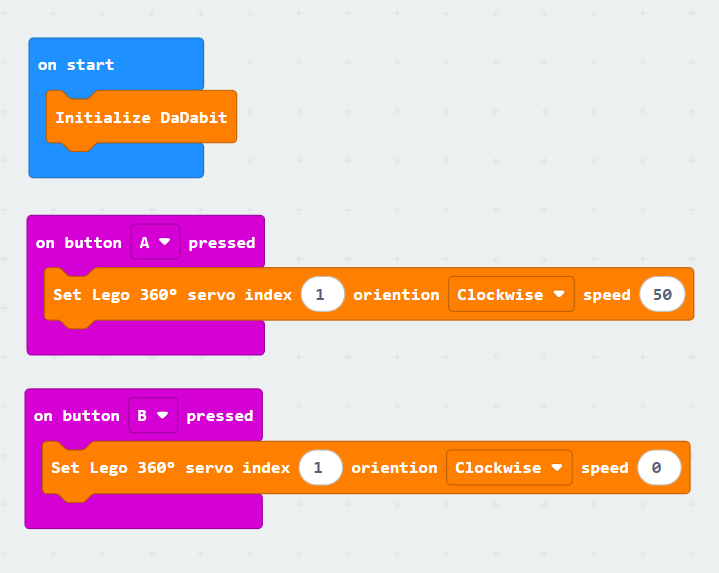

4. Device Pairing and Program Downloading

   1. **Wiring**: Connect the micro:bit board to the computer USB port using a data cable.

   2. **Device Pairing**:

      - When connecting the device for the first time, pair the device. Once connected, the browser will remember the connected device. Click the **...** button next to **Download**, and select **Connect Device** from the options.

        

      - Click **Next** in the pop-up window.

        

      - Click **Pair** and select the device shown in the pop-up window.

        

        

        

   3. **Download**:

      - After the device is successfully connected, click **Download** to download the program. During the download process, the yellow indicator light near the USB port on the micro:bit board will flash rapidly. Do not disconnect or move the data cable at this time to prevent download failure.

        

      - Once the download is complete, the indicator light will stop flashing and remain on, and a completion prompt will appear on the main programming interface.

        

   4. **Powering On**: The micro:bit automatically runs the program when powered on to test the functionality.

#### 3.3.4.5 Demo

---

### 3.3.5 Rocking Airplane

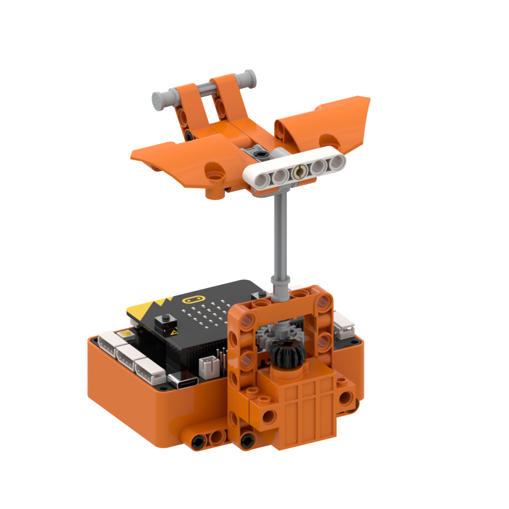

#### 3.3.5.1 Learning Objectives

1. Understand the working principles of DC motors and master the button control logic for motor start and stop.
2. Understand the control logic of button A to start and button B to stop, realizing back-and-forth swinging for the airplane.

#### 3.3.5.2 Assembly Guide

For the building steps of the rocking airplane, refer to the building guide in [6. Creative Builds Assembly Guide](https://wiki.hiwonder.com/projects/DaDabitV2/en/latest/docs/6_Creative_Assembly_Guide.html#rocking-airplane) for **Rocking Airplane**.

#### 3.3.5.3 Wiring Guide

Connect the motor to port S1 on the micro:bit expansion board, ensuring the orange signal wire is connected to the white pin of S1.

As shown below:

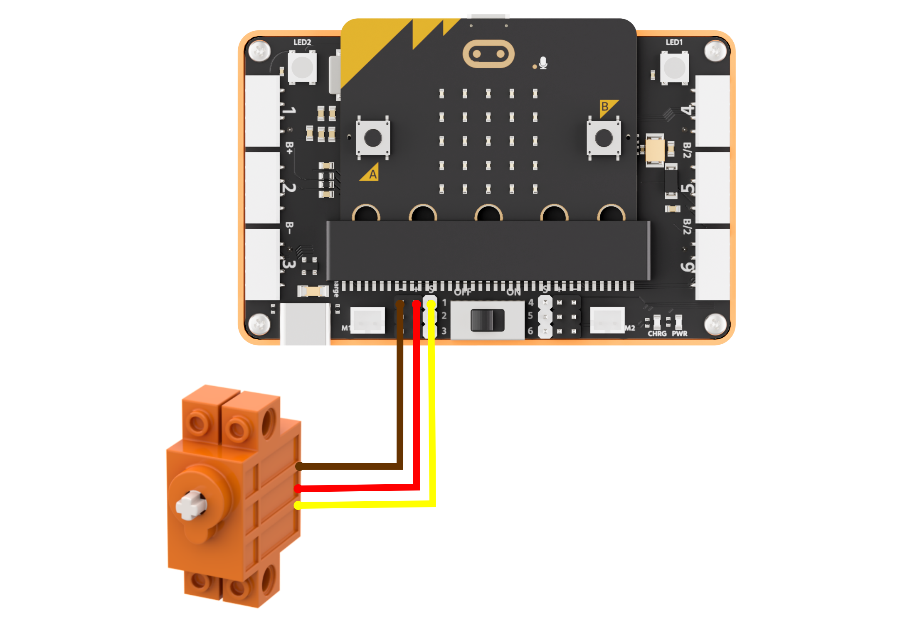

#### 3.3.5.4 Programming

1. Add the Extension Library:

   - Click **Extensions**.

     

   - Search for **https://github.com/HiwonderK12/DaDabitV2** in **Extensions** and add **dadabitv2**.

     

2. Principles:

   - The micro:bit expansion board sends control signals to control the output current of the motor drive circuit to rotate the motor. The motor drives the airplane bracket through a gear and linkage structure, realizing back-and-forth swinging.
   - When button A is pressed, the micro:bit sends a start signal, the drive circuit provides power, the motor cycles in forward and reverse, and the airplane swings. When button B is pressed, the micro:bit sends a stop signal, power is cut off, and the airplane stops at its initial position.

3. Programming:

* Block Overview

| Block | Category | Description |
| :---: | :---: | :---: |
|  |  | Detects when button A or B is pressed to trigger actions. |
|  |  | Controls the specified motor to rotate continuously in the set direction and speed. |

* Block Combination

     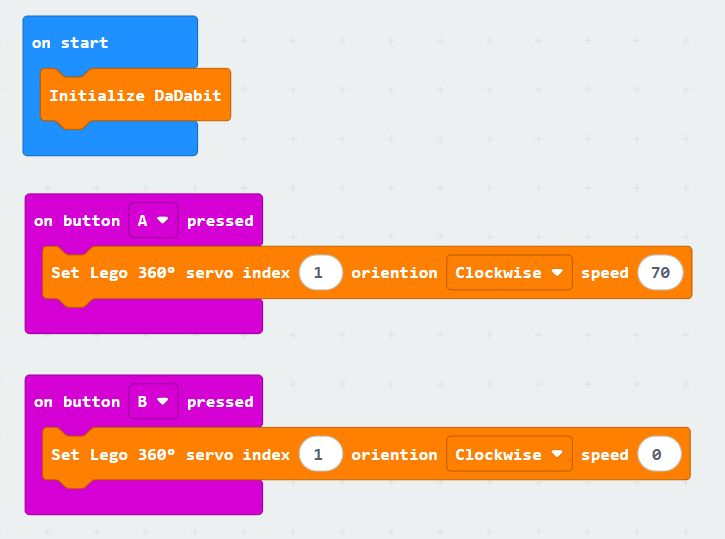

4. Device Pairing and Program Downloading

   1. **Wiring**: Connect the micro:bit board to the computer USB port using a data cable.

   2. **Device Pairing**:

      - When connecting the device for the first time, pair the device. Once connected, the browser will remember the connected device. Click the **...** button next to **Download**, and select **Connect Device** from the options.

        

      - Click **Next** in the pop-up window.

        

      - Click **Pair** and select the device shown in the pop-up window.

        

        

        

   3. **Download**:

      - After the device is successfully connected, click **Download** to download the program. During the download process, the yellow indicator light near the USB port on the micro:bit board will flash rapidly. Do not disconnect or move the data cable at this time to prevent download failure.

        

      - Once the download is complete, the indicator light will stop flashing and remain on, and a completion prompt will appear on the main programming interface.

        

   4. **Powering On**: The micro:bit automatically runs the program when powered on to test the functionality.

#### 3.3.5.5 Demo

---

### 3.3.6 Catapult

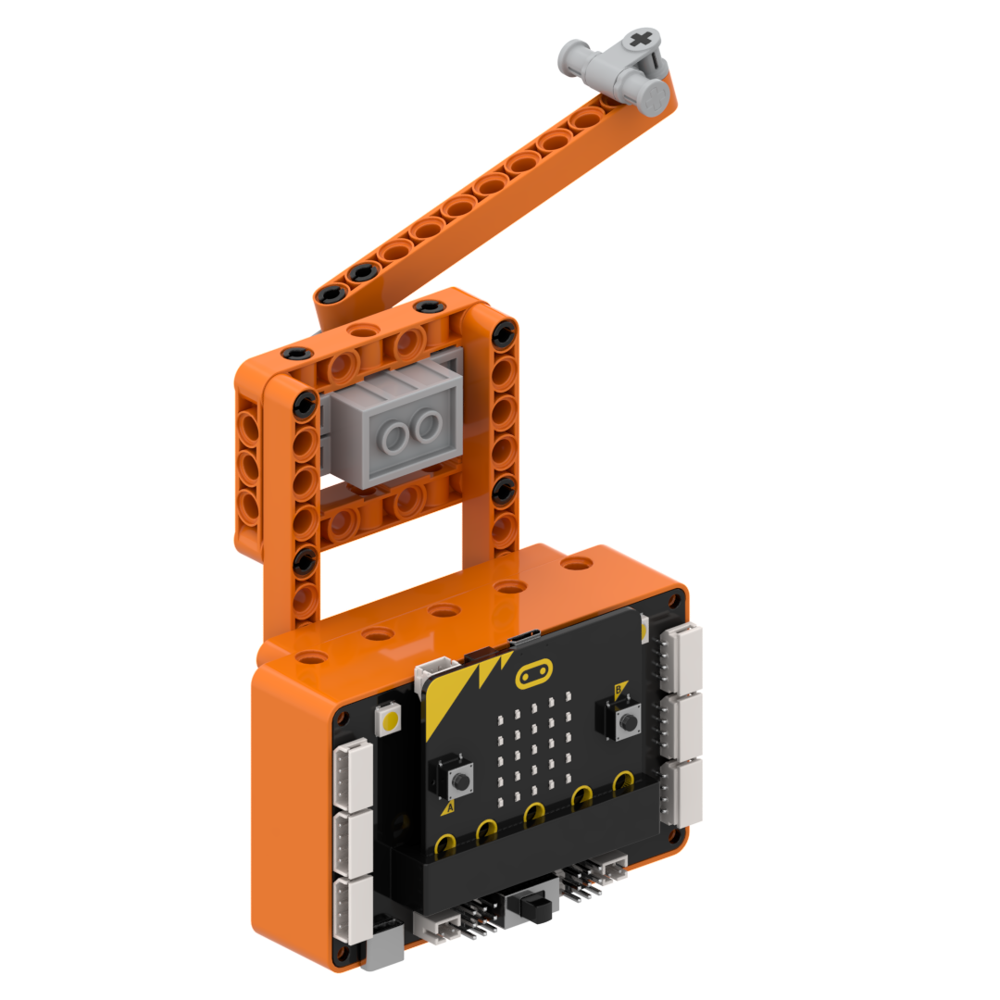

#### 3.3.6.1 Learning Objectives

1. Understand the angle control principles of servos and master the method of triggering servo motion via micro:bit buttons.
2. Understand the single trigger logic of button A to start, realizing catapult firing.

#### 3.3.6.2 Assembly Guide

For the building steps of the catapult, refer to the building guide in [6. Creative Builds Assembly Guide](https://wiki.hiwonder.com/projects/DaDabitV2/en/latest/docs/6_Creative_Assembly_Guide.html#catapult) for **Catapult**.

#### 3.3.6.3 Wiring Guide

Connect the servo to port S1 on the micro:bit expansion board, ensuring the orange signal wire is connected to the white pin of S1.

As shown below:

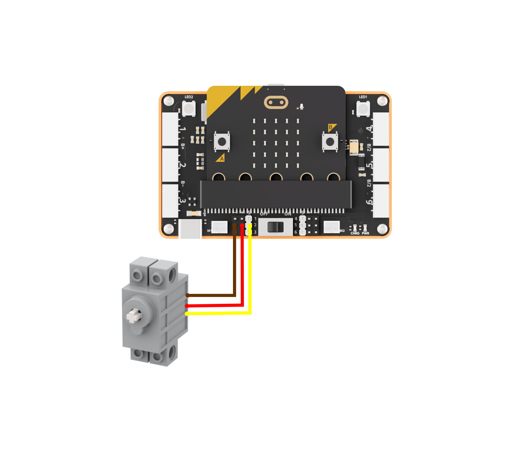

> [!NOTE]
>
> **When performing a program related to the servo for the first time, remove the parts from the servo, and upload the program to the micro:bit. Then, turn on the power switch of the expansion board, wait for the servo to rotate to the initial position of 50 degrees, and reinstall the parts. If the servo has already been reset, this step can be skipped.**

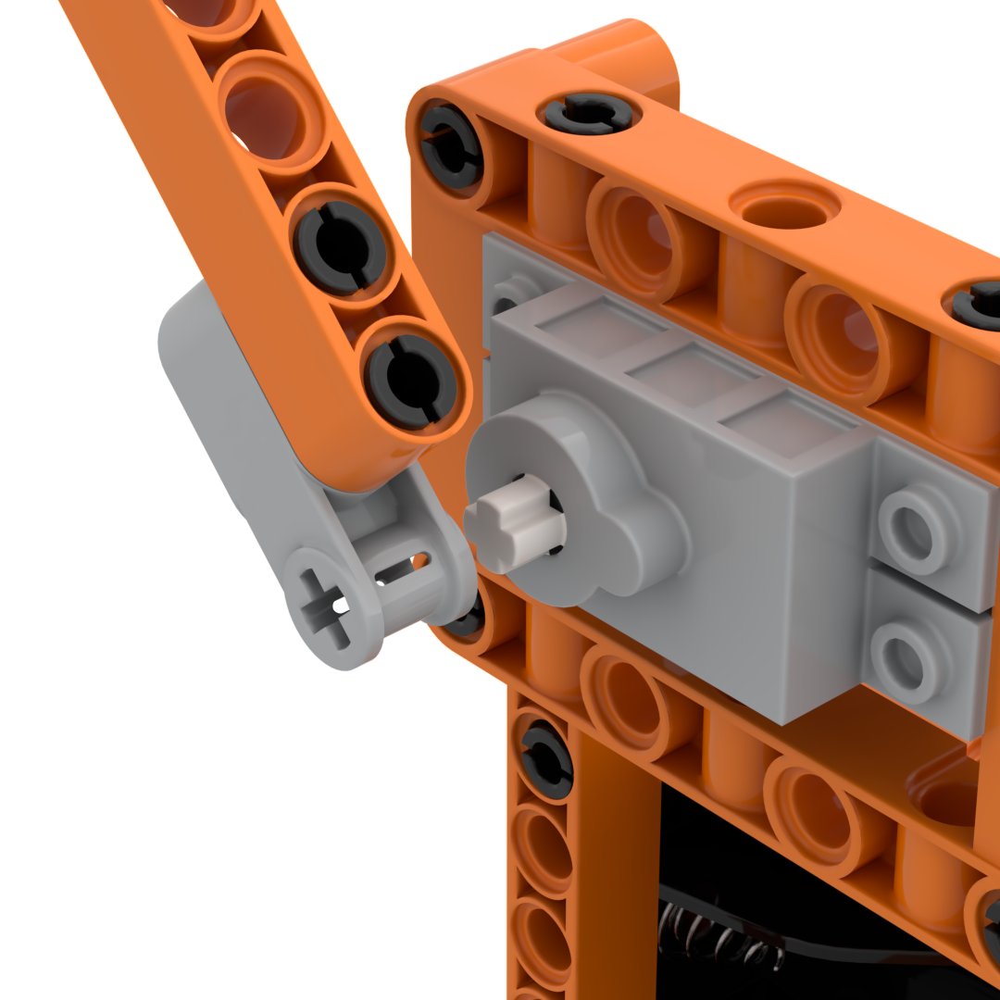

#### 3.3.6.4 Programming

1. Add the Extension Library:

   - Click **Extensions**.

     

   - Search for **https://github.com/HiwonderK12/DaDabitV2** in **Extensions** and add **dadabitv2**.

     

2. Principles:

   - The micro:bit expansion board sends control signals to control the rotation of the internal motor of the servo. The servo controller receives control signals from the signal line to drive the motor. The motor drives a series of gears to transmit power to the output shaft after deceleration, driving the catapult arm to fire.
   - The potentiometer inside the servo outputs a voltage feedback signal to the controller. The controller determines the rotation direction and speed of the motor based on current position to drive the catapult arm to the target angle and stop, launching the item.

3. Programming:

* Block Overview

| Block | Category | Description |
| :---: | :---: | :---: |
|  |  | Detects when button A or B is pressed to trigger actions. |
|  |  | Controls the specified motor to rotate continuously in the set direction and speed. |

* Block Combination

     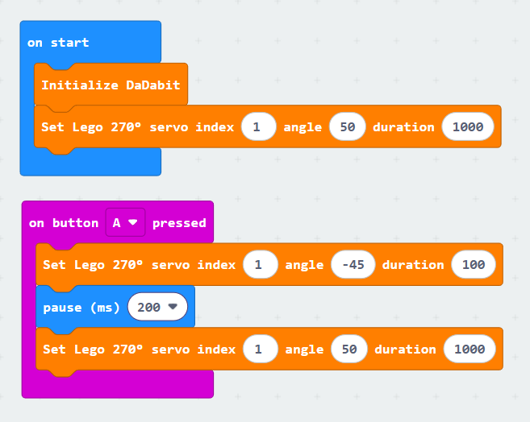

4. Device Pairing and Program Downloading

   1. **Wiring**: Connect the micro:bit board to the computer USB port using a data cable.

   2. **Device Pairing**:

      - When connecting the device for the first time, pair the device. Once connected, the browser will remember the connected device. Click the **...** button next to **Download**, and select **Connect Device** from the options.

        

      - Click **Next** in the pop-up window.

        

      - Click **Pair** and select the device shown in the pop-up window.

        

        

        

   3. **Download**:

      - After the device is successfully connected, click **Download** to download the program. During the download process, the yellow indicator light near the USB port on the micro:bit board will flash rapidly. Do not disconnect or move the data cable at this time to prevent download failure.

        

      - Once the download is complete, the indicator light will stop flashing and remain on, and a completion prompt will appear on the main programming interface.

        

   4. **Powering On**: The micro:bit automatically runs the program when powered on to test the functionality.

#### 3.3.6.5 Demo

---

### 3.3.7 Smart Swing

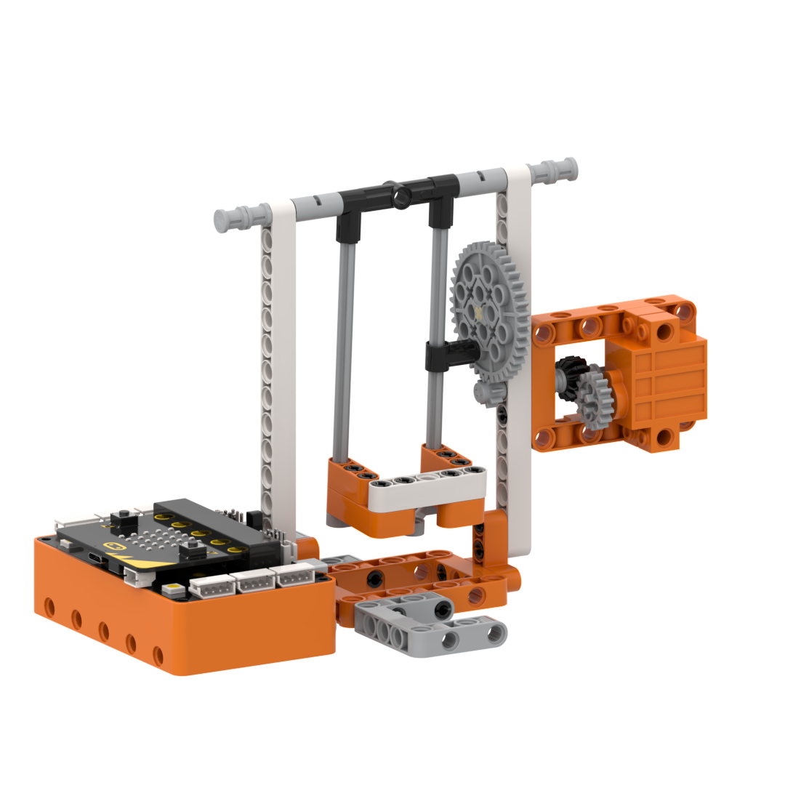

#### 3.3.7.1 Learning Objectives

1. Understand the working principles of DC motors and master the button control logic for motor start and stop.
2. Understand the control logic of button A to start and button B to stop, realizing back-and-forth swinging for the smart swing.

#### 3.3.7.2 Assembly Guide

For the building steps of the smart swing, refer to the building guide in [6. Creative Builds Assembly Guide](https://wiki.hiwonder.com/projects/DaDabitV2/en/latest/docs/6_Creative_Assembly_Guide.html#smart-swing) for **Smart Swing**.

#### 3.3.7.3 Wiring Guide

Connect the motor to port S1 on the micro:bit expansion board, ensuring the orange signal wire is connected to the white pin of S1.

As shown below:

#### 3.3.7.4 Programming

1. Add the Extension Library:

   - Click **Extensions**.

     

   - Search for **https://github.com/HiwonderK12/DaDabitV2** in **Extensions** and add **dadabitv2**.

     

2. Principles:

   - The micro:bit expansion board sends control signals to control the output current of the motor drive circuit to rotate the motor. The motor drives the smart swing bracket through a gear and linkage structure, realizing back-and-forth swinging.
   - When button A is pressed, the micro:bit sends a start signal, the drive circuit provides power, the motor cycles in forward and reverse, and the smart swing swings. When button B is pressed, the micro:bit sends a stop signal, power is cut off, and the smart swing stops at its initial position.

3. Programming:

* Block Overview

| Block | Category | Description |
| :---: | :---: | :---: |
|  |  | Detects when button A or B is pressed to trigger actions. |
|  |  | Controls the specified motor to rotate continuously in the set direction and speed. |

* Block Combination

     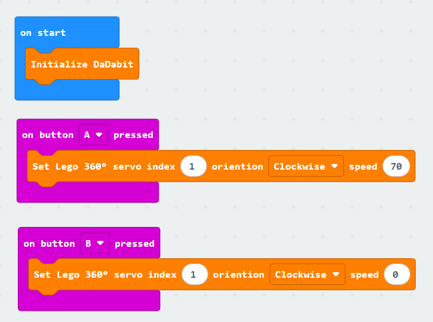

4. Device Pairing and Program Downloading

   1. **Wiring**: Connect the micro:bit board to the computer USB port using a data cable.

   2. **Device Pairing**:

      - When connecting the device for the first time, pair the device. Once connected, the browser will remember the connected device. Click the **...** button next to **Download**, and select **Connect Device** from the options.

        

      - Click **Next** in the pop-up window.

        

      - Click **Pair** and select the device shown in the pop-up window.

        

        

        

   3. **Download**:

      - After the device is successfully connected, click **Download** to download the program. During the download process, the yellow indicator light near the USB port on the micro:bit board will flash rapidly. Do not disconnect or move the data cable at this time to prevent download failure.

        

      - Once the download is complete, the indicator light will stop flashing and remain on, and a completion prompt will appear on the main programming interface.

        

   4. **Powering On**: The micro:bit automatically runs the program when powered on to test the functionality.

#### 3.3.7.5 Demo

---

### 3.3.8 Smart Seesaw

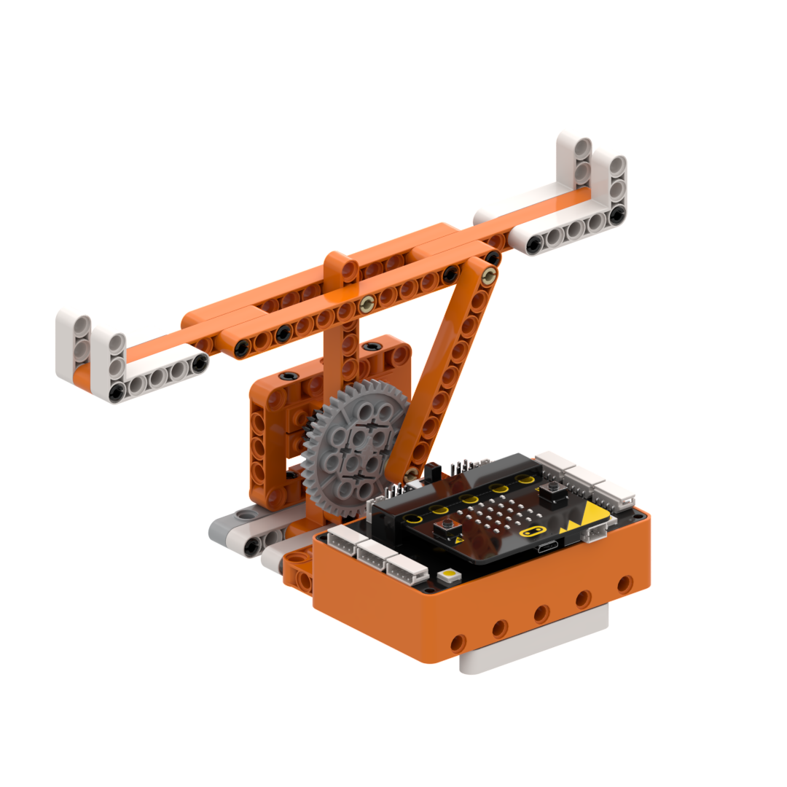

#### 3.3.8.1 Learning Objectives

1. Understand the working principles of DC motors and master the button control logic for motor start and stop.
2. Understand the control logic of button A to start and button B to stop, realizing up-and-down tilting for the smart seesaw.

#### 3.3.8.2 Assembly Guide

For the building steps of the smart seesaw, refer to the building guide in [6. Creative Builds Assembly Guide](https://wiki.hiwonder.com/projects/DaDabitV2/en/latest/docs/6_Creative_Assembly_Guide.html#smart-seesaw) for **Smart Seesaw**.

#### 3.3.8.3 Wiring Guide

Connect the motor to port S1 on the micro:bit expansion board, ensuring the orange signal wire is connected to the white pin of S1.

As shown below:

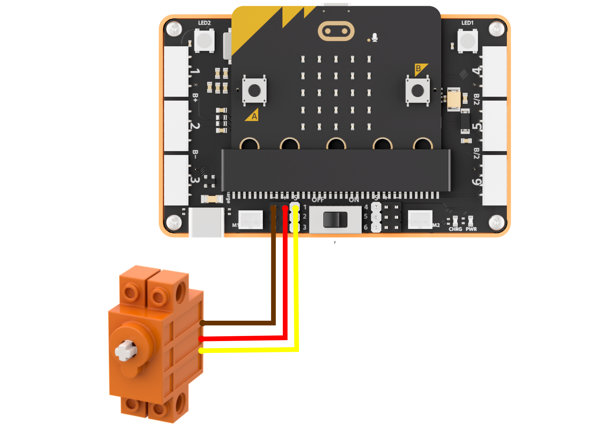

#### 3.3.8.4 Programming

1. Add the Extension Library:

   - Click **Extensions**.

     

   - Search for **https://github.com/HiwonderK12/DaDabitV2** in **Extensions** and add **dadabitv2**.

     

2. Principles:

   - The micro:bit expansion board sends control signals to control the output current of the motor drive circuit to rotate the motor. The motor drives the smart seesaw through a gear and eccentric wheel structure, realizing up-and-down tilting.
   - When button A is pressed, the micro:bit sends a start signal, the drive circuit provides power, the motor cycles in forward and reverse, and the smart seesaw tilts. When button B is pressed, the micro:bit sends a stop signal, power is cut off, and the smart seesaw stops at its horizontal initial position.

3. Programming:

* Block Overview

| Block | Category | Description |
| :---: | :---: | :---: |
|  |  | Detects when button A or B is pressed to trigger actions. |
|  |  | Controls the specified motor to rotate continuously in the set direction and speed. |

* Block Combination

     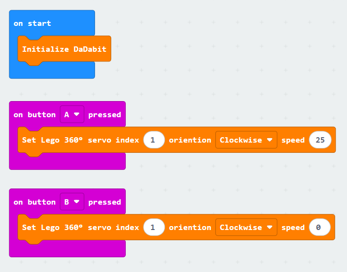

4. Device Pairing and Program Downloading

   1. **Wiring**: Connect the micro:bit board to the computer USB port using a data cable.

   2. **Device Pairing**:

      - When connecting the device for the first time, pair the device. Once connected, the browser will remember the connected device. Click the **...** button next to **Download**, and select **Connect Device** from the options.

        

      - Click **Next** in the pop-up window.

        

      - Click **Pair** and select the device shown in the pop-up window.

        

        

        

   3. **Download**:

      - After the device is successfully connected, click **Download** to download the program. During the download process, the yellow indicator light near the USB port on the micro:bit board will flash rapidly. Do not disconnect or move the data cable at this time to prevent download failure.

        

      - Once the download is complete, the indicator light will stop flashing and remain on, and a completion prompt will appear on the main programming interface.

        

   4. **Powering On**: The micro:bit automatically runs the program when powered on to test the functionality.

#### 3.3.8.5 Demo

---

### 3.3.9 Carousel

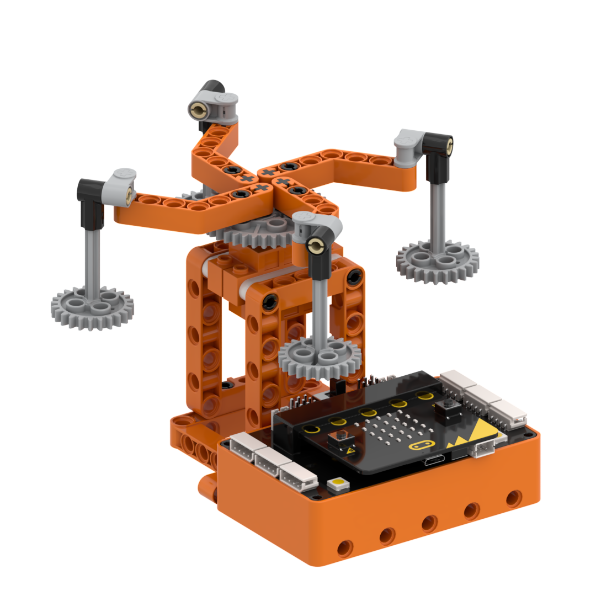

#### 3.3.9.1 Learning Objectives

1. Understand the working principles of DC motors and master the button control logic for motor rotation direction.
2. Understand the dual control logic of button A to rotate left and button B to rotate right, realizing bidirectional rotation for the carousel.

#### 3.3.9.2 Assembly Guide

For the building steps of the carousel, refer to the building guide in [6. Creative Builds Assembly Guide](https://wiki.hiwonder.com/projects/DaDabitV2/en/latest/docs/6_Creative_Assembly_Guide.html#carousel) for **Carousel**.

#### 3.3.9.3 Wiring Guide

Connect the motor to port S1 on the micro:bit expansion board, ensuring the orange signal wire is connected to the white pin of S1.

As shown below:

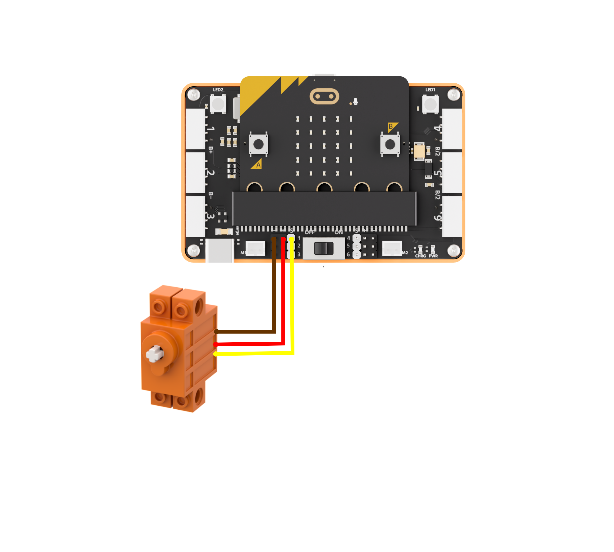

#### 3.3.9.4 Programming

1. Add the Extension Library:

   - Click **Extensions**.

     

   - Search for **https://github.com/HiwonderK12/DaDabitV2** in **Extensions** and add **dadabitv2**.

     

2. Principles:

   - The micro:bit expansion board sends control signals to control the output current of the motor drive circuit, rotating the motor in forward or reverse. The motor drives the carousel platform through a gear reduction structure, rotating the carousel.
   - When button A is pressed, the micro:bit sends a left-rotate signal, the drive circuit rotates the motor forward, and the carousel rotates left. When button B is pressed, the micro:bit sends a right-rotate signal, the drive circuit rotates the motor in reverse, and the carousel rotates right, realizing bidirectional rotation control.

3. Programming:

* Block Overview

| Block | Category | Description |
| :---: | :---: | :---: |
|  |  | Detects when button A or B is pressed to trigger actions. |
|  |  | Controls the specified motor to rotate continuously in the set direction and speed. |

* Block Combination

     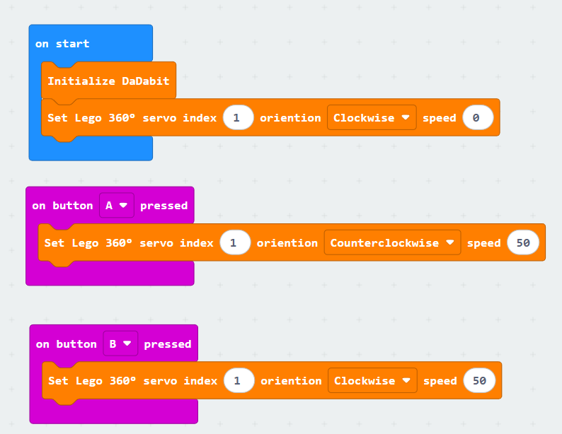

4. Device Pairing and Program Downloading

   1. **Wiring**: Connect the micro:bit board to the computer USB port using a data cable.

   2. **Device Pairing**:

      - When connecting the device for the first time, pair the device. Once connected, the browser will remember the connected device. Click the **...** button next to **Download**, and select **Connect Device** from the options.

        

      - Click **Next** in the pop-up window.

        

      - Click **Pair** and select the device shown in the pop-up window.

        

        

        

   3. **Download**:

      - After the device is successfully connected, click **Download** to download the program. During the download process, the yellow indicator light near the USB port on the micro:bit board will flash rapidly. Do not disconnect or move the data cable at this time to prevent download failure.

        

      - Once the download is complete, the indicator light will stop flashing and remain on, and a completion prompt will appear on the main programming interface.

        

   4. **Powering On**: The micro:bit automatically runs the program when powered on to test the functionality.

#### 3.3.9.5 Demo

---

### 3.3.10 Grinding Bot

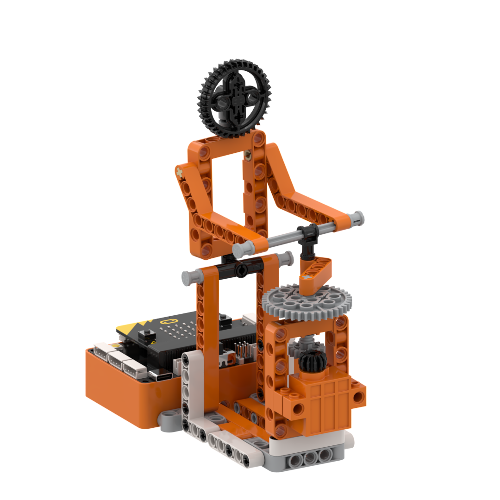

#### 3.3.10.1 Learning Objectives

1. Understand the working principles of DC motors and master the button control logic for motor start and stop.
2. Understand the control logic of button A to start and button B to stop, realizing the reciprocating motion of the grinding bot.

#### 3.3.10.2 Assembly Guide

For the building steps of the grinding bot, refer to the building guide in [6. Creative Builds Assembly Guide](https://wiki.hiwonder.com/projects/DaDabitV2/en/latest/docs/6_Creative_Assembly_Guide.html#grinding-bot) for **Grinding Bot**.

#### 3.3.10.3 Wiring Guide

Connect the motor to port S1 on the micro:bit expansion board, ensuring the orange signal wire is connected to the white pin of S1.

As shown below:

#### 3.3.10.4 Programming

1. Add the Extension Library:

   - Click **Extensions**.

     

   - Search for **https://github.com/HiwonderK12/DaDabitV2** in **Extensions** and add **dadabitv2**.

     

2. Principles:

   - The micro:bit expansion board sends control signals to control the output current of the motor drive circuit to rotate the motor. The motor drives the arms of the robot through a gear and linkage structure, realizing the reciprocating mill-pushing motion.
   - When button A is pressed, the micro:bit sends a start signal, the drive circuit provides power, the motor cycles in forward and reverse, and the robot pushes the mill. When button B is pressed, the micro:bit sends a stop signal, power is cut off, and the robot stops at its initial position.

3. Programming:

* Block Overview

| Block | Category | Description |
| :---: | :---: | :---: |
|  |  | Detects when button A is pressed to trigger actions. |
|  |  | Controls the specified motor to rotate continuously in the set direction and speed. |

* Block Combination

     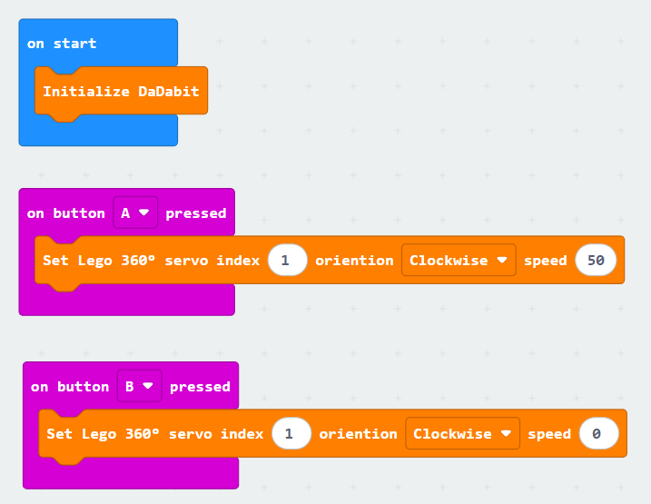

4. Device Pairing and Program Downloading

   1. **Wiring**: Connect the micro:bit board to the computer USB port using a data cable.

   2. **Device Pairing**:

      - When connecting the device for the first time, pair the device. Once connected, the browser will remember the connected device. Click the **...** button next to **Download**, and select **Connect Device** from the options.

        

      - Click **Next** in the pop-up window.

        

      - Click **Pair** and select the device shown in the pop-up window.

        

        

        

   3. **Download**:

      - After the device is successfully connected, click **Download** to download the program. During the download process, the yellow indicator light near the USB port on the micro:bit board will flash rapidly. Do not disconnect or move the data cable at this time to prevent download failure.

        

      - Once the download is complete, the indicator light will stop flashing and remain on, and a completion prompt will appear on the main programming interface.

        

   4. **Powering On**: The micro:bit automatically runs the program when powered on to test the functionality.

#### 3.3.10.5 Demo

---

### 3.3.11 Weightlifter

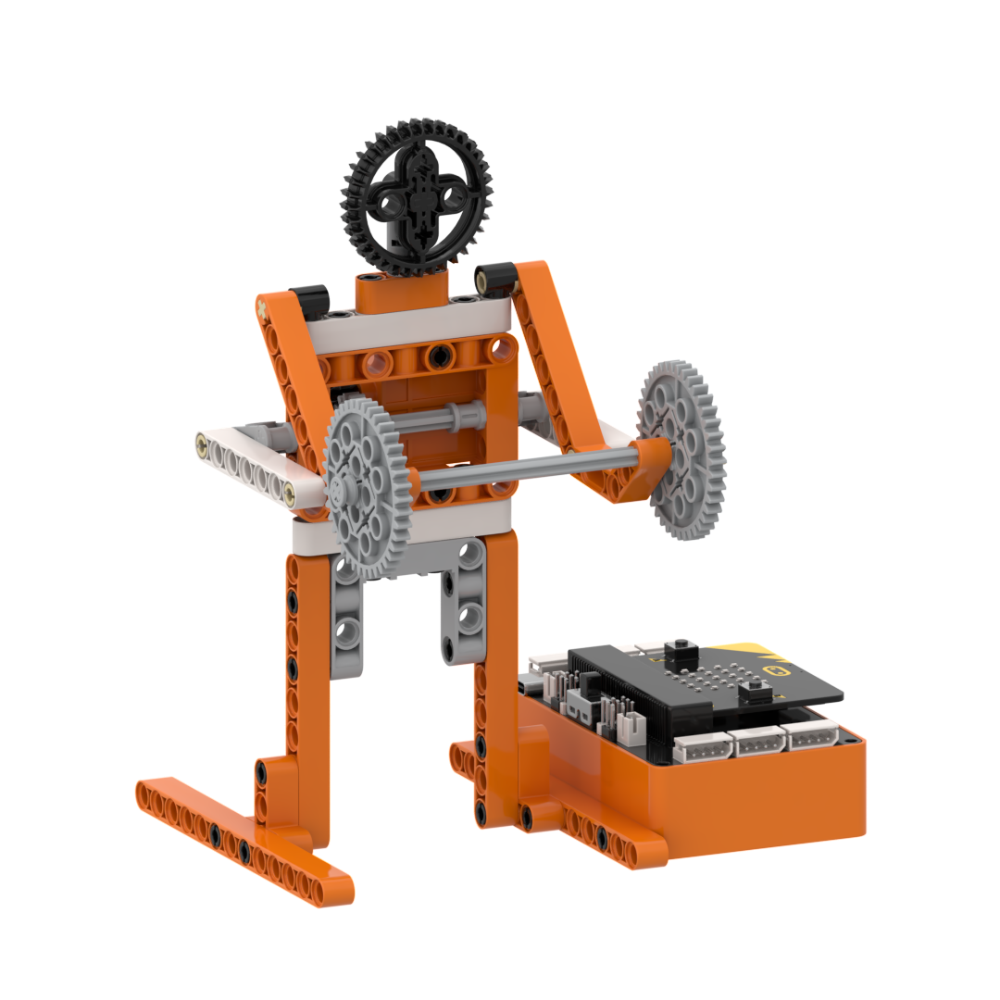

#### 3.3.11.1 Learning Objectives

1. Understand the working principles of DC motors and master the button control logic for motor start and stop.
2. Understand the control logic of button A to start and button B to stop, realizing the up-and-down motion of the weightlifter.

#### 3.3.11.2 Assembly Guide

For the building steps of the weightlifter, refer to the building guide in [6. Creative Builds Assembly Guide](https://wiki.hiwonder.com/projects/DaDabitV2/en/latest/docs/6_Creative_Assembly_Guide.html#weightlifter) for **Weightlifter**.

#### 3.3.11.3 Wiring Guide

Connect the motor to port S4 on the micro:bit expansion board, ensuring the orange signal wire is connected to the white pin of S4.

As shown below:

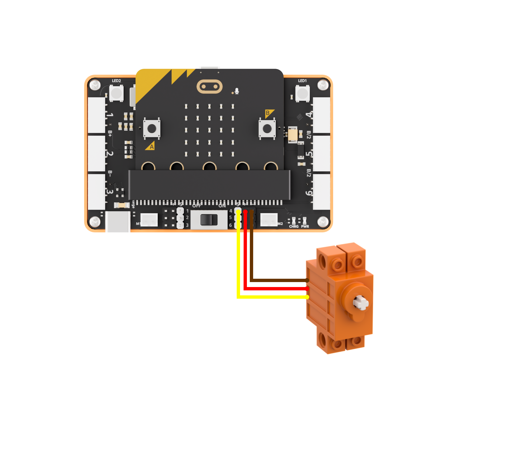

#### 3.3.11.4 Programming

1. Add the Extension Library:

   - Click **Extensions**.

     

   - Search for **https://github.com/HiwonderK12/DaDabitV2** in **Extensions** and add **dadabitv2**.

     

2. Principles:

   - The micro:bit expansion board sends control signals to control the output current of the motor drive circuit to rotate the motor. The motor drives the arms of the robot through a gear and linkage structure, realizing the up-and-down weightlifting action.
   - When button A is pressed, the micro:bit sends a start signal, the drive circuit provides power, the motor cycles in forward and reverse, and the robot lifts the weight. When button B is pressed, the micro:bit sends a stop signal, power is cut off, and the robot stops at its initial position.

3. Programming:

* Block Overview

| Block | Category | Description |
| :---: | :---: | :---: |
|  |  | Detects when button A or B is pressed to trigger actions. |
|  |  | Controls the specified motor to rotate continuously in the set direction and speed. |

* Block Combination

     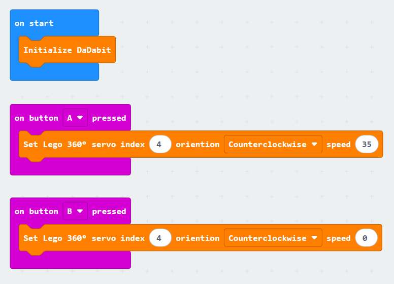

4. Device Pairing and Program Downloading

   1. **Wiring**: Connect the micro:bit board to the computer USB port using a data cable.

   2. **Device Pairing**:

      - When connecting the device for the first time, pair the device. Once connected, the browser will remember the connected device. Click the **...** button next to **Download**, and select **Connect Device** from the options.

        

      - Click **Next** in the pop-up window.

        

      - Click **Pair** and select the device shown in the pop-up window.

        

        

        

   3. **Download**:

      - After the device is successfully connected, click **Download** to download the program. During the download process, the yellow indicator light near the USB port on the micro:bit board will flash rapidly. Do not disconnect or move the data cable at this time to prevent download failure.

        

      - Once the download is complete, the indicator light will stop flashing and remain on, and a completion prompt will appear on the main programming interface.

        

   4. **Powering On**: The micro:bit automatically runs the program when powered on to test the functionality.

#### 3.3.11.5 Demo

---

### 3.3.12 Twist Dancer

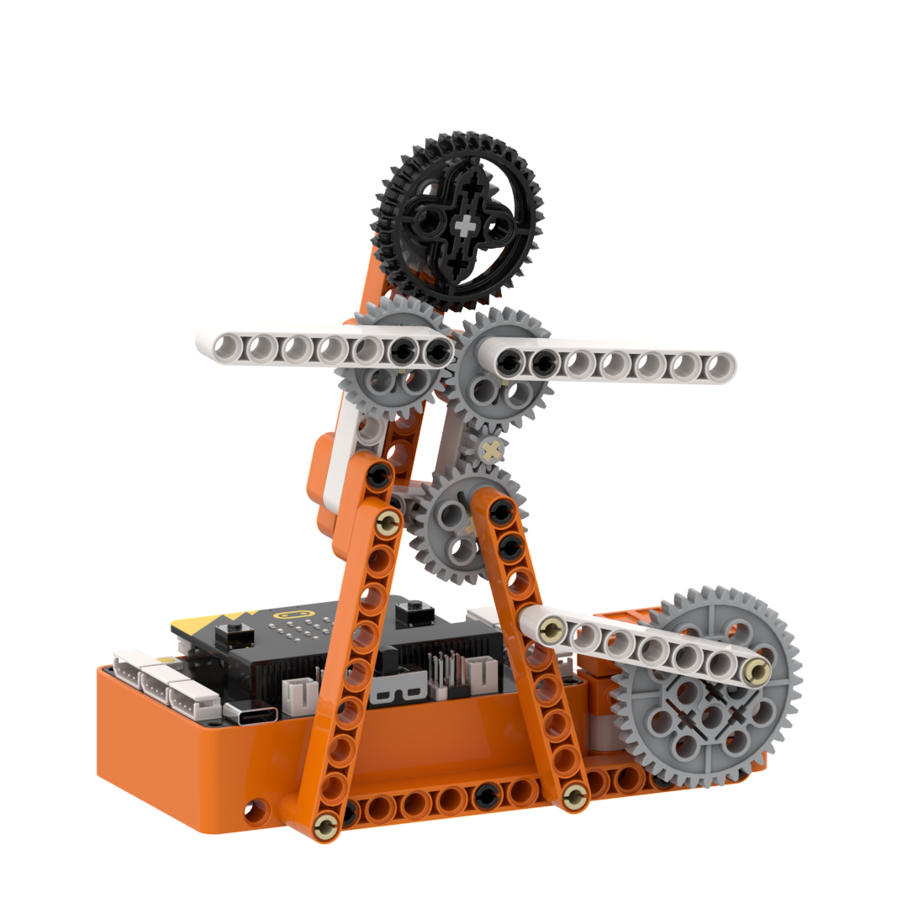

#### 3.3.12.1 Learning Objectives

1. Understand the working principles of DC motors and master the button control logic for motor start and stop.
2. Understand the control logic of button A to start and button B to stop, realizing the reciprocating waist-twisting motion of the robot.

#### 3.3.12.2 Assembly Guide

For the building steps of the twist dancer, refer to the building guide in [6. Creative Builds Assembly Guide](https://wiki.hiwonder.com/projects/DaDabitV2/en/latest/docs/6_Creative_Assembly_Guide.html#twist-dancer) for **Twist Dancer**.

#### 3.3.12.3 Wiring Guide

Connect the motor to port S1 on the micro:bit expansion board, ensuring the orange signal wire is connected to the white pin of S1.

As shown below:

#### 3.3.12.4 Programming

1. Add the Extension Library:

   - Click **Extensions**.

     

   - Search for **https://github.com/HiwonderK12/DaDabitV2** in **Extensions** and add **dadabitv2**.

     

2. Principles:

   - The micro:bit expansion board sends control signals to control the output current of the motor drive circuit to rotate the motor. The motor drives the waist of the robot through a gear and eccentric structure, realizing the reciprocating waist-twisting motion.
   - When button A is pressed, the micro:bit sends a start signal, the drive circuit provides power, the motor cycles in forward and reverse, and the robot twists its waist. When button B is pressed, the micro:bit sends a stop signal, power is cut off, and the robot stops at its initial position.

3. Programming:

* Block Overview

| Block | Category | Description |
| :---: | :---: | :---: |
|  |  | Detects when button A or B is pressed to trigger actions. |
|  |  | Controls the specified motor to rotate continuously in the set direction and speed. |

* Block Combination

     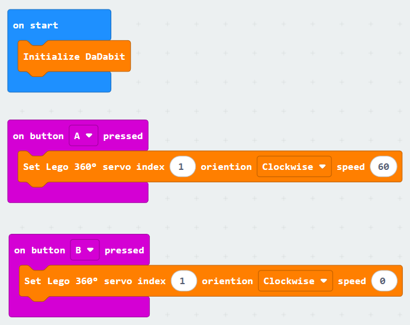

4. Device Pairing and Program Downloading

   1. **Wiring**: Connect the micro:bit board to the computer USB port using a data cable.

   2. **Device Pairing**:

      - When connecting the device for the first time, pair the device. Once connected, the browser will remember the connected device. Click the **...** button next to **Download**, and select **Connect Device** from the options.

        

      - Click **Next** in the pop-up window.

        

      - Click **Pair** and select the device shown in the pop-up window.

        

        

        

   3. **Download**:

      - After the device is successfully connected, click **Download** to download the program. During the download process, the yellow indicator light near the USB port on the micro:bit board will flash rapidly. Do not disconnect or move the data cable at this time to prevent download failure.

        

      - Once the download is complete, the indicator light will stop flashing and remain on, and a completion prompt will appear on the main programming interface.

        

   4. **Powering On**: The micro:bit automatically runs the program when powered on to test the functionality.

#### 3.3.12.5 Demo

