# 4. Standard Kit Projects

## 4.1 Advanced Sensor Courses

### 4.1.1 Light Sensing

This is a sensor for detecting ambient light intensity. It is commonly used in interactive projects that respond to changes in light intensity, such as automatic roadside lighting systems and environmental monitoring systems. The sensor features LEGO-compatible mounting holes, making it suitable for more creative DIY projects.

#### 4.1.1.1 Learning Objectives

1. Understand the function of the light sensor and how it senses ambient light intensity.
2. Learn how to acquire ambient light data through the hardware interface and convert it into readable signals.

#### 4.1.1.2 Wiring Guide

Connect the light sensor to port P1 on the micro:bit expansion board.

As shown below:

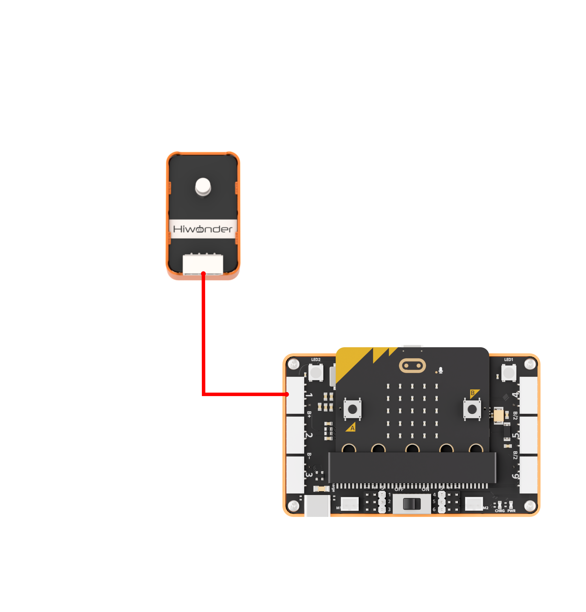

#### 4.1.1.3 Programming

1. Add the Extension Library:

   - Click **Extensions**.

     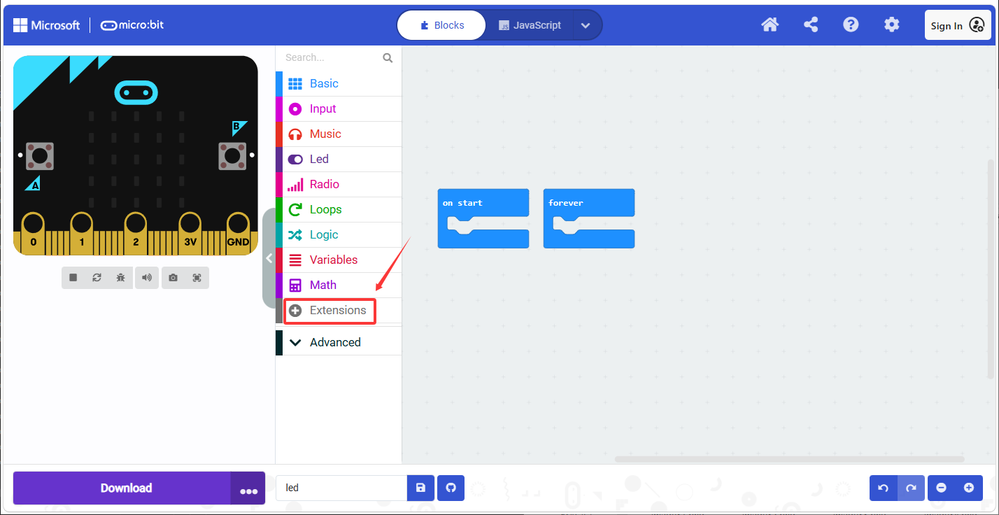

   - Search for **https://github.com/HiwonderK12/DaDabitV2** in **Extensions** and add **dadabitv2**.

     

2. Principles:

   The light sensor is an electronic component capable of sensing the intensity of light in the environment. It converts different light levels into corresponding electrical signals, which are recognized by the board as specific numerical values. When the ambient light changes, the output value of the sensor changes accordingly, allowing the device to perceive brightness variations and interact with the environment.

3. Programming:

- Block Overview

| Block | Category | Description |
| :---: | :---: | :---: |
|  |  | Reads the light intensity from the light sensor within a range of 0 to 100. |
|  |  | Displays the specified text string on the device screen. |

- Block Combination

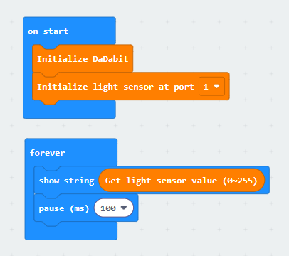

4. Device Pairing and Program Downloading

   1) **Wiring**: Connect the micro:bit board to the computer USB port using a data cable.

   2) **Device Pairing**:

      - When connecting the device for the first time, pair the device. Once connected, the browser will remember the connected device. Click the **...** button next to **Download**, and select **Connect Device** from the options.

        

      - Click **Next** in the pop-up window.

        

      - Click **Pair** and select the device shown in the pop-up window.

        

        

        

   3) **Download**:

      - After the device is successfully connected, click **Download** to download the program. During the download process, the yellow indicator light near the USB port on the micro:bit board will flash rapidly. Do not disconnect or move the data cable at this time to prevent download failure.

        

      - Once the download is complete, the indicator light will stop flashing and remain on, and a completion prompt will appear on the main programming interface.

        

   4) **Powering On**: The micro:bit automatically runs the program when powered on to test the functionality.

#### 4.1.1.4 Program Outcome

Once the program runs, it continuously reads the ambient light intensity data. The data is updated every 0.5 seconds to reflect light intensity changes in real time.

---

### 4.1.2 Distance Display

This is a glowy ultrasonic sensor that uses an industrial-grade ultrasonic ranging chip. The chip integrates the ultrasonic transmitting circuit, ultrasonic receiving circuit, digital processing circuit, and more. The module uses an I2C communication interface, allowing the measured distance to be read through I2C communication. The module features LEGO-compatible mounting holes, making it suitable for more creative DIY projects.

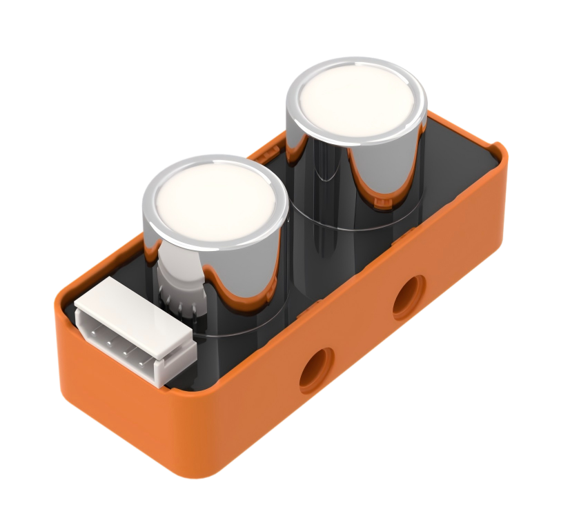

#### 4.1.2.1 Learning Objectives

1. Understand the ranging function of the ultrasonic sensor and how it measures the distance between an object and the device.
2. Master the basic method of initializing and reading sensor data through the hardware interface.

#### 4.1.2.2 Wiring Guide

Connect the ultrasonic sensor to port P3 on the micro:bit expansion board.

As shown below:

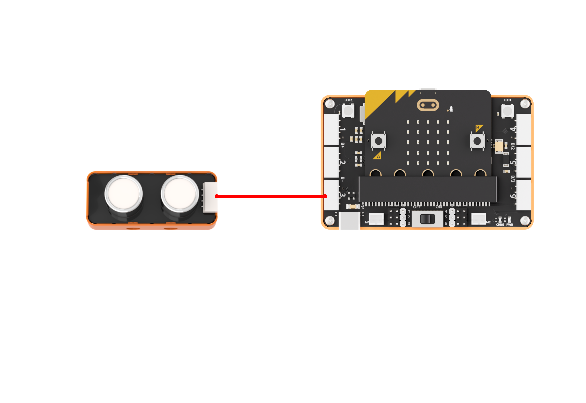

#### 4.1.2.3 Programming

1. Add the Extension Library:

   - Click **Extensions**.

     

   - Search for **https://github.com/HiwonderK12/DaDabitV2** in **Extensions** and add **dadabitv2**.

     

2. Principles:

   The ultrasonic sensor transmits and receives sound wave signals, calculates the time difference of the sound wave round trip, and converts it into a distance value. This realizes non-contact detection of the distance to the obstacle in front, providing the device with environmental distance perception.

3. Programming:

- Block Overview

| Block | Category | Description |
| :---: | :---: | :---: |
|  |  | Reads the distance data from the ultrasonic sensor in centimeters. |
|  |  | Displays the specified text string on the device screen. |

- Block Combination

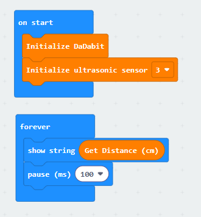

4. Device Pairing and Program Downloading

   1. **Wiring**: Connect the micro:bit board to the computer USB port using a data cable.

   2. **Device Pairing**:

      - When connecting the device for the first time, pair the device. Once connected, the browser will remember the connected device. Click the **...** button next to **Download**, and select **Connect Device** from the options.

        

      - Click **Next** in the pop-up window.

        

      - Click **Pair** and select the device shown in the pop-up window.

        

        

        

   3. **Download**:

      - After the device is successfully connected, click **Download** to download the program. During the download process, the yellow indicator light near the USB port on the micro:bit board will flash rapidly. Do not disconnect or move the data cable at this time to prevent download failure.

        

      - Once the download is complete, the indicator light will stop flashing and remain on, and a completion prompt will appear on the main programming interface.

        

   4. **Powering On**: The micro:bit automatically runs the program when powered on to test the functionality.

#### 4.1.2.4 Program Outcome

After the program is downloaded, the distance data measured by the ultrasonic sensor is displayed on the micro:bit screen.

---

### 4.1.3 Distance-Based RGB Light Control

This is a glowy ultrasonic sensor that uses an industrial-grade ultrasonic ranging chip. The chip integrates the ultrasonic transmitting circuit, ultrasonic receiving circuit, digital processing circuit, and more. The module uses an I2C communication interface, allowing the measured distance to be read through I2C communication. The module features LEGO-compatible mounting holes, making it suitable for more creative DIY projects.

#### 4.1.3.1 Learning Objectives

1. Program the logic to change the color of the ultrasonic sensor RGB lights based on the detected distance.
2. Understand the relationship between sensor values and visual feedback to achieve advanced interactive effects.

#### 4.1.3.2 Wiring Guide

Connect the ultrasonic sensor to port P3 on the micro:bit expansion board.

As shown below:

#### 4.1.3.3 Programming

1. Add the Extension Library:

   - Click **Extensions**.

     

   - Search for **https://github.com/HiwonderK12/DaDabitV2** in **Extensions** and add **dadabitv2**.

     

2. Principles:

   The ultrasonic sensor detects the distance of the obstacle in front in real time. The board compares the distance value through conditional logic. When the distance is greater than the set threshold, it controls the RGB lights to switch to the specified color, realizing distance-triggered light feedback.

3. Programming:

- Block Overview

| Block | Category | Description |
| :---: | :---: | :---: |
|  |  | Reads the distance data from the ultrasonic sensor in centimeters. |
|  |  | Sets the color of the glowy ultrasonic sensor RGB lights. |

- Block Combination

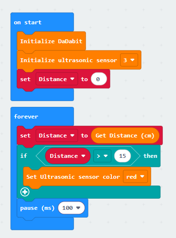

4. Device Pairing and Program Downloading

   1. **Wiring**: Connect the micro:bit board to the computer USB port using a data cable.

   2. **Device Pairing**:

      - When connecting the device for the first time, pair the device. Once connected, the browser will remember the connected device. Click the **...** button next to **Download**, and select **Connect Device** from the options.

        

      - Click **Next** in the pop-up window.

        

      - Click **Pair** and select the device shown in the pop-up window.

        

        

        

   3. **Download**:

      - After the device is successfully connected, click **Download** to download the program. During the download process, the yellow indicator light near the USB port on the micro:bit board will flash rapidly. Do not disconnect or move the data cable at this time to prevent download failure.

        

      - Once the download is complete, the indicator light will stop flashing and remain on, and a completion prompt will appear on the main programming interface.

        

   4. **Powering On**: The micro:bit automatically runs the program when powered on to test the functionality.

#### 4.1.3.4 Program Outcome

After powering on and initialization, the device continuously detects the distance of the obstacle in front. When the distance between the obstacle and the sensor is greater than 15 cm, the RGB lights on the ultrasonic sensor automatically light up red. The status is updated every 0.1 seconds to provide real-time feedback.

## 4.2 Standard Creative Builds

### 4.2.1 Smart Emergency Light

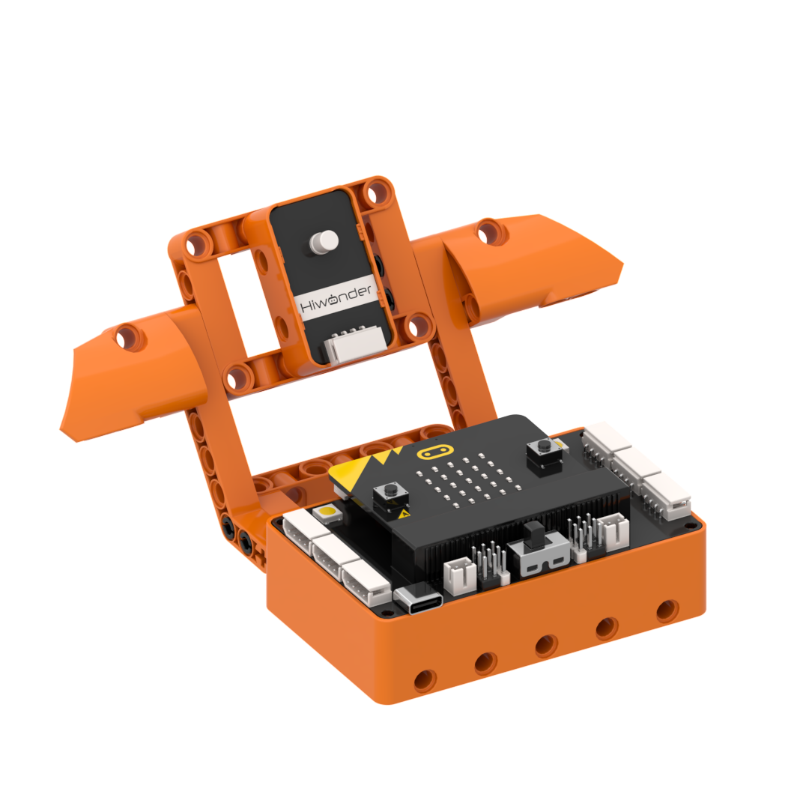

#### 4.2.1.1 Learning Objectives

1. Understand the sensing principle of the light sensor and master the method of controlling lights through sensor values on the micro:bit.
2. Understand the control logic of automatic light activation when the light intensity is below the threshold to achieve automatic illumination in low light conditions.

#### 4.2.1.2 Assembly Guide

For the building steps of the smart emergency light, refer to the building guide in [6. Creative Builds Assembly Guide](https://wiki.hiwonder.com/projects/DaDabitV2/en/latest/docs/6_Creative_Assembly_Guide.html#smart-emergency-light) for **Smart Emergency Light**.

#### 4.2.1.3 Wiring Guide

Connect the light sensor to port P1 on the micro:bit expansion board.

As shown below:

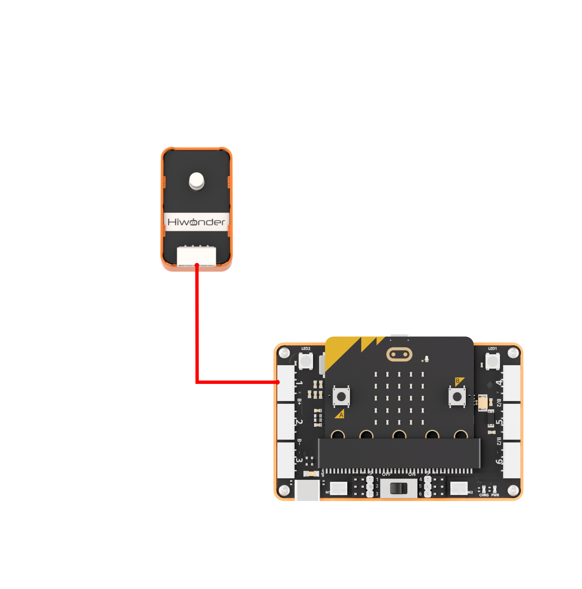

#### 4.2.1.4 Programming

1. Add the Extension Library:

   - Click **Extensions**.

     

   - Search for **https://github.com/HiwonderK12/DaDabitV2** in **Extensions** and add **dadabitv2**.

     

2. Principles:

   - The micro:bit expansion board reads the light intensity value of the light sensor. When the value is lower than the set threshold of 30, the onboard RGB lights are controlled to turn on. When the light is sufficient, the lights are turned off to achieve emergency lighting.
   - When the ambient light dims and the micro:bit detects that the light value is below 30, it sends a signal to turn on the lights, and the onboard RGB lights light up automatically. When the light becomes sufficient again and the micro:bit detects that the value is above 30, it sends a signal to turn off the lights, and the lights go out automatically.

3. Programming:

- Block Overview

| Block | Category | Description |
| :---: | :---: | :---: |
|  |  | Refreshes and displays the set state of the onboard RGB light. |
|  |  | Turns off all onboard RGB lights on the expansion board. |
| 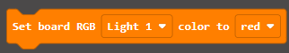 |  | Sets the color of all onboard RGB lights to the specified color. |
|  |  | Reads the light intensity from the light sensor within a range of 0 to 100. |

- Block Combination

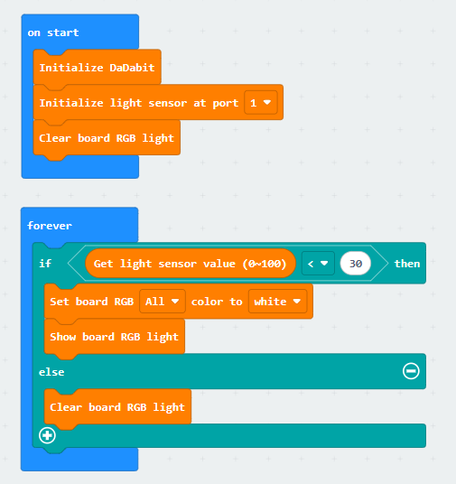

4. Device Pairing and Program Downloading

   1) **Wiring**: Connect the micro:bit board to the computer USB port using a data cable.

   2) **Device Pairing**:

      - When connecting the device for the first time, pair the device. Once connected, the browser will remember the connected device. Click the **...** button next to **Download**, and select **Connect Device** from the options.

        

      - Click **Next** in the pop-up window.

        

      - Click **Pair** and select the device shown in the pop-up window.

        

        

        

   3) **Download**:

      - After the device is successfully connected, click **Download** to download the program. During the download process, the yellow indicator light near the USB port on the micro:bit board will flash rapidly. Do not disconnect or move the data cable at this time to prevent download failure.

        

      - Once the download is complete, the indicator light will stop flashing and remain on, and a completion prompt will appear on the main programming interface.

        

   4) **Powering On**: The micro:bit automatically runs the program when powered on to test the functionality.

#### 4.2.1.5 Demo

---

### 4.2.2 Smart Gesture-Controlled Light

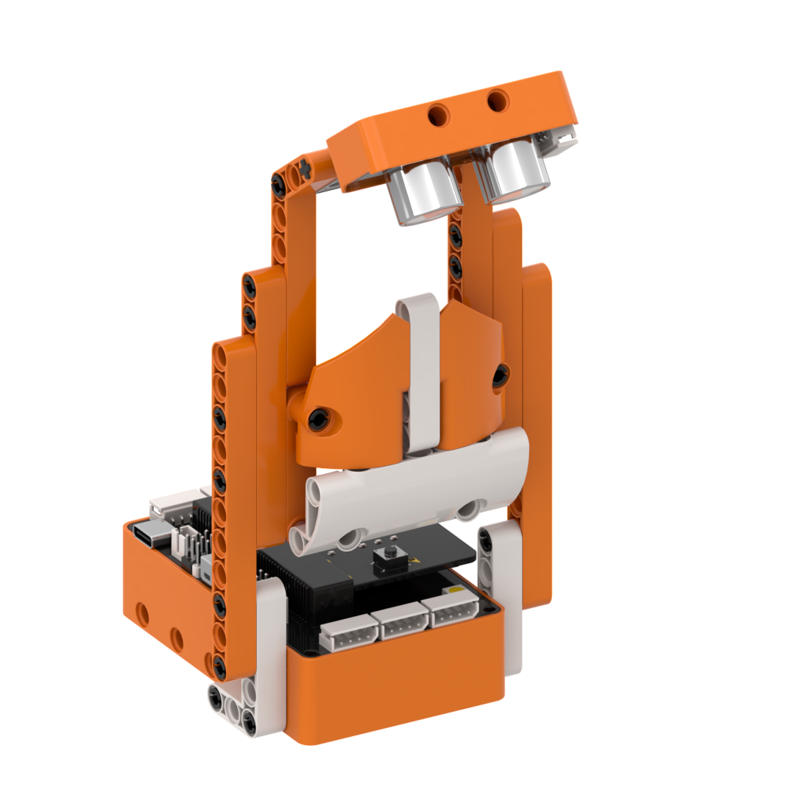

#### 4.2.2.1 Learning Objectives

1. Understand the ranging principle of the ultrasonic sensor and master the method of controlling light color through gestures on the micro:bit.
2. Understand the control logic of triggering color switching when the distance is less than the threshold to achieve the interactive effect of switching light colors by waving a hand.

#### 4.2.2.2 Assembly Guide

For the building steps of the smart gesture-controlled light, refer to the building guide in [6. Creative Builds Assembly Guide](https://wiki.hiwonder.com/projects/DaDabitV2/en/latest/docs/6_Creative_Assembly_Guide.html#smart-gesture-controlled-light) for **Smart Gesture-Controlled Light**.

#### 4.2.2.3 Wiring Guide

Connect the ultrasonic sensor to port P3 on the micro:bit expansion board.

As shown below:

#### 4.2.2.4 Programming

1. Add the Extension Library:

   - Click **Extensions**.

     

   - Search for **https://github.com/HiwonderK12/DaDabitV2** in **Extensions** and add **dadabitv2**.

     

2. Principles:

   - The micro:bit expansion board reads the distance value of the ultrasonic sensor. When the distance is less than 15 cm, the color switching logic is triggered, and the light cycles through the sequence of blue, red, green, white, and blue to achieve gesture-controlled lighting.
   - The initial state of the light is blue. When a hand waves in front of the sensor at a distance less than 15 cm, the micro:bit detects the trigger signal and sends a color switching command, making the light cycle according to the preset sequence to control the light with gestures.

3. Programming:

- Block Overview

| Block | Category | Description |
| :---: | :---: | :---: |
|  |  | Reads the distance data from the ultrasonic sensor. |
|  |  | Sets the light color of the glowy ultrasonic sensor to the specified color. |

- Block Combination

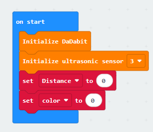

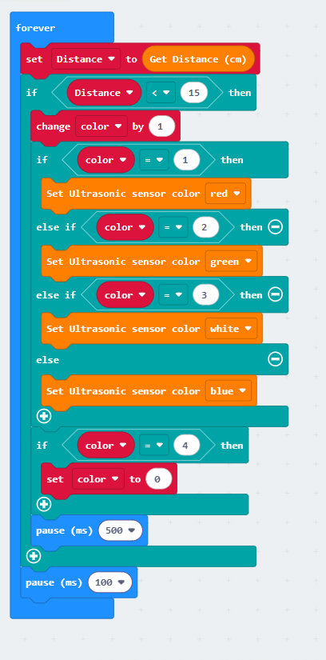

4. Device Pairing and Program Downloading

   1) **Wiring**: Connect the micro:bit board to the computer USB port using a data cable.

   2) **Device Pairing**:

      - When connecting the device for the first time, pair the device. Once connected, the browser will remember the connected device. Click the **...** button next to **Download**, and select **Connect Device** from the options.

        

      - Click **Next** in the pop-up window.

        

      - Click **Pair** and select the device shown in the pop-up window.

        

        

        

   3) **Download**:

      - After the device is successfully connected, click **Download** to download the program. During the download process, the yellow indicator light near the USB port on the micro:bit board will flash rapidly. Do not disconnect or move the data cable at this time to prevent download failure.

        

      - Once the download is complete, the indicator light will stop flashing and remain on, and a completion prompt will appear on the main programming interface.

        

   4) **Powering On**: The micro:bit automatically runs the program when powered on to test the functionality.

#### 4.2.2.5 Demo

---

### 4.2.3 Automatic Clothes Rack

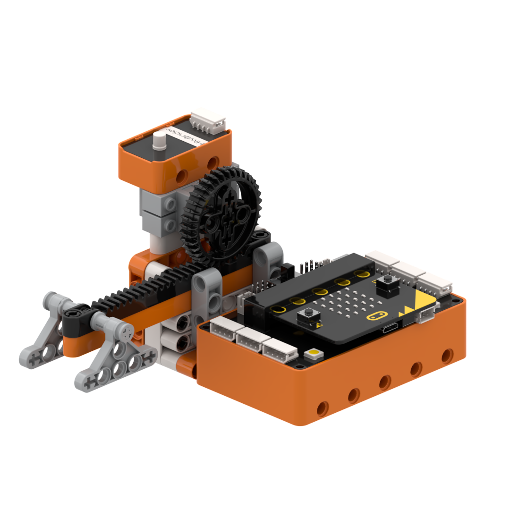

#### 4.2.3.1 Learning Objectives

1. Understand the working principles of the servo and light sensor, and master the method of controlling servo movements through light intensity on the micro:bit.
2. Understand the control logic of extending the clothes rack when the light is sufficient and retracting the clothes rack when the light is insufficient to achieve automatic clothes drying.

#### 4.2.3.2 Assembly Guide

For the building steps of the automatic clothes rack, refer to the building guide in [6. Creative Builds Assembly Guide](https://wiki.hiwonder.com/projects/DaDabitV2/en/latest/docs/6_Creative_Assembly_Guide.html#automatic-clothes-rack) for **Automatic Clothes Rack**.

#### 4.2.3.3 Wiring Guide

Connect the light sensor to port P1 on the micro:bit expansion board.

Connect the block servo to port S4 on the micro:bit expansion board, ensuring the orange signal wire is connected to the white pin of S4.

As shown below:

> [!NOTE]
>
> **When conducting a program related to the block servo for the first time, remove the gear from the servo first and upload the program of this course to the micro:bit. Then turn on the power switch of the micro:bit expansion board and wait for the block servo to rotate to the initial position of 0 degrees before reinstalling the servo gear. This step can be skipped if the servo reset program has been used before.**

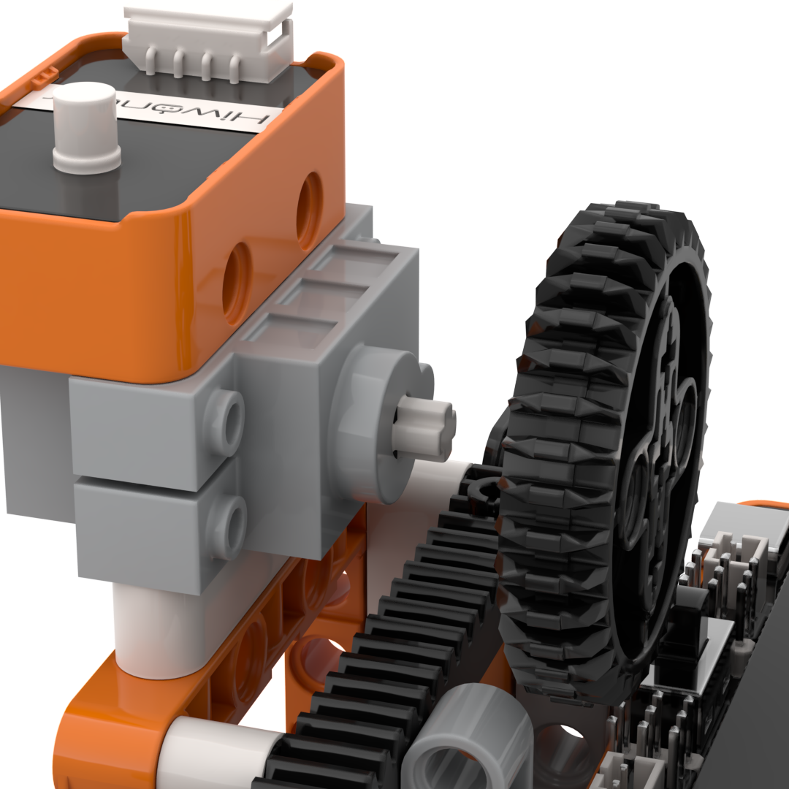

#### 4.2.3.4 Programming

1. Add the Extension Library:

   - Click **Extensions**.

     

   - Search for **https://github.com/HiwonderK12/DaDabitV2** in **Extensions** and add **dadabitv2**.

     

2. Principles:

   - The micro:bit expansion board reads the light intensity value of the light sensor. When the value is greater than the set threshold of 60, the servo is controlled to rotate and extend the clothes rack. When the light is insufficient, the servo rotates in the opposite direction to retract the clothes rack, achieving automatic clothes drying.
   - When the ambient light is sufficient and the micro:bit detects that the light value is greater than 60, it sends an extension signal, and the servo rotates to extend the clothes rack. When the light dims and the value is below 60, it sends a retraction signal, and the servo rotates in the opposite direction to retract the clothes rack.

3. Programming:

- Block Overview

| Block | Category | Description |
| :---: | :---: | :---: |
|  |  | Controls the specified LEGO 270 degree servo to rotate to the target angle within a set time. |
|  |  | Reads the light intensity from the light sensor within a range of 0 to 100. |

- Block Combination

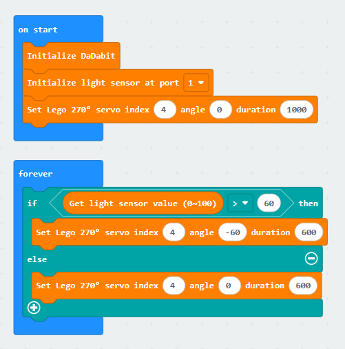

4. Device Pairing and Program Downloading

   1) **Wiring**: Connect the micro:bit board to the computer USB port using a data cable.

   2) **Device Pairing**:

      - When connecting the device for the first time, pair the device. Once connected, the browser will remember the connected device. Click the **...** button next to **Download**, and select **Connect Device** from the options.

        

      - Click **Next** in the pop-up window.

        

      - Click **Pair** and select the device shown in the pop-up window.

        

        

        

   3) **Download**:

      - After the device is successfully connected, click **Download** to download the program. During the download process, the yellow indicator light near the USB port on the micro:bit board will flash rapidly. Do not disconnect or move the data cable at this time to prevent download failure.

        

      - Once the download is complete, the indicator light will stop flashing and remain on, and a completion prompt will appear on the main programming interface.

        

   4) **Powering On**: The micro:bit automatically runs the program when powered on to test the functionality.

#### 4.2.3.5 Demo

---

### 4.2.4 Automated Flagpole

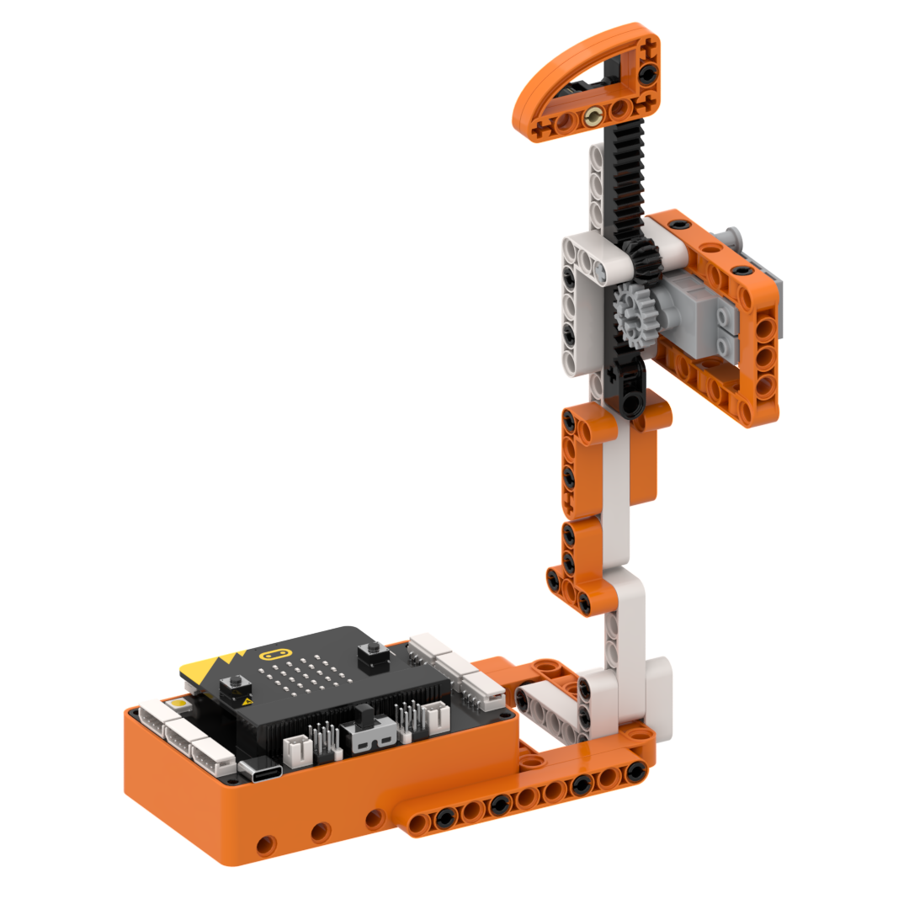

#### 4.2.4.1 Learning Objectives

1. Understand the drive principle of the servo and master the method of controlling the servo movement through buttons on the micro:bit.
2. Understand the control logic of button A raising the flag and button B lowering the flag to simulate flag platform movements.

#### 4.2.4.2 Assembly Guide

For the building steps of the automated flagpole, refer to the building guide in [6. Creative Builds Assembly Guide](https://wiki.hiwonder.com/projects/DaDabitV2/en/latest/docs/6_Creative_Assembly_Guide.html#automated-flagpole) for **Automated Flagpole**.

#### 4.2.4.3 Wiring Guide

Connect the block servo to port S4 on the micro:bit expansion board, ensuring the orange signal wire is connected to the white pin of S4.

As shown below:

> [!NOTE]
>
> **When conducting a program related to the block servo for the first time, remove the gear from the servo first and upload the program of this course to the micro:bit. Then turn on the power switch of the micro:bit expansion board and wait for the block servo to rotate to the initial position of -135 degrees before reinstalling the servo gear. This step can be skipped if the servo reset program has been used before.**

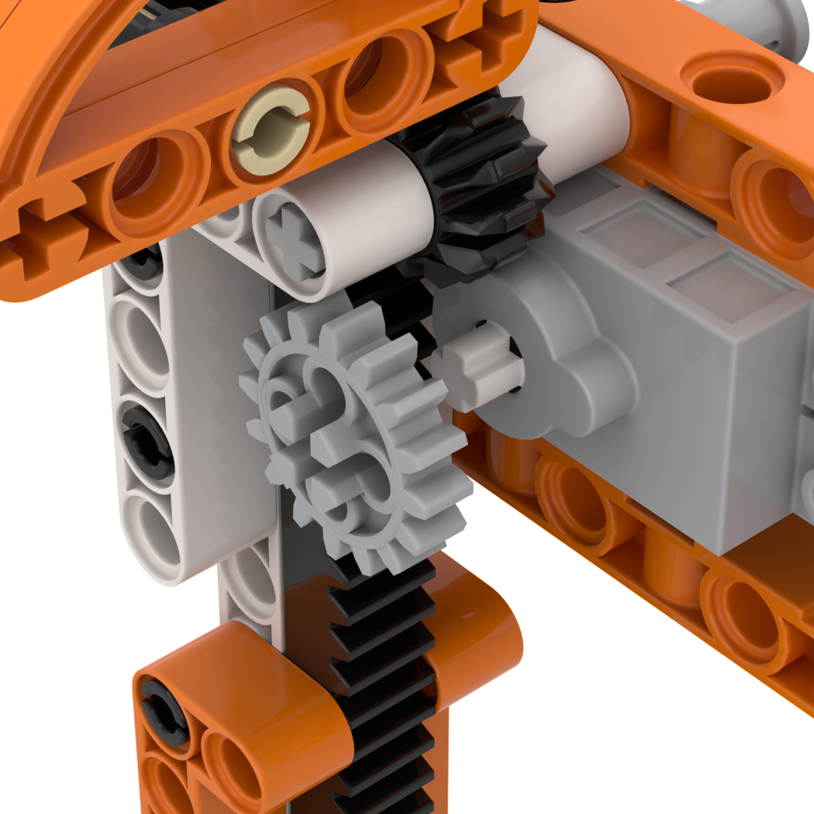

#### 4.2.4.4 Programming

1. Add the Extension Library:

   - Click **Extensions**.

     

   - Search for **https://github.com/HiwonderK12/DaDabitV2** in **Extensions** and add **dadabitv2**.

     

2. Principles:

   - The micro:bit expansion board detects button A and button B inputs to control the servo to rotate forward or backward. Pressing button A makes the servo rotate in the direction of raising the flag, and pressing button B makes it rotate in the direction of lowering the flag, achieving control of the electric flag-raising platform.
   - When button A is pressed, the micro:bit sends a raising signal, and the servo rotates in the flag-raising direction to slowly raise the flag. When button B is pressed, the micro:bit sends a lowering signal, and the servo rotates in the flag-lowering direction to slowly lower the flag.

3. Programming:

- Block Overview

| Block | Category | Description |
| :---: | :---: | :---: |
|  |  | Controls the specified LEGO 270 degree servo to rotate to the target angle within a set time. |
|  |  | Detects the pressed state of button A or button B to trigger actions. |

- Block Combination

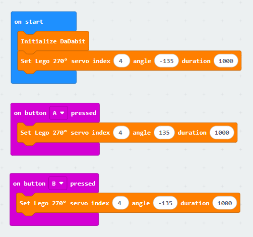

4. Device Pairing and Program Downloading

   1) **Wiring**: Connect the micro:bit board to the computer USB port using a data cable.

   2) **Device Pairing**:

      - When connecting the device for the first time, pair the device. Once connected, the browser will remember the connected device. Click the **...** button next to **Download**, and select **Connect Device** from the options.

        

      - Click **Next** in the pop-up window.

        

      - Click **Pair** and select the device shown in the pop-up window.

        

        

        

   3) **Download**:

      - After the device is successfully connected, click **Download** to download the program. During the download process, the yellow indicator light near the USB port on the micro:bit board will flash rapidly. Do not disconnect or move the data cable at this time to prevent download failure.

        

      - Once the download is complete, the indicator light will stop flashing and remain on, and a completion prompt will appear on the main programming interface.

        

   4) **Powering On**: The micro:bit automatically runs the program when powered on to test the functionality.

#### 4.2.4.5 Demo

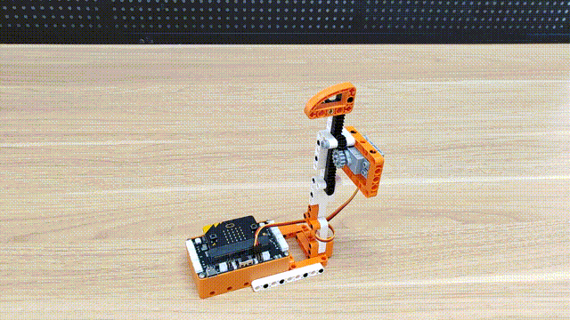

---

### 4.2.5 Scissor Lift

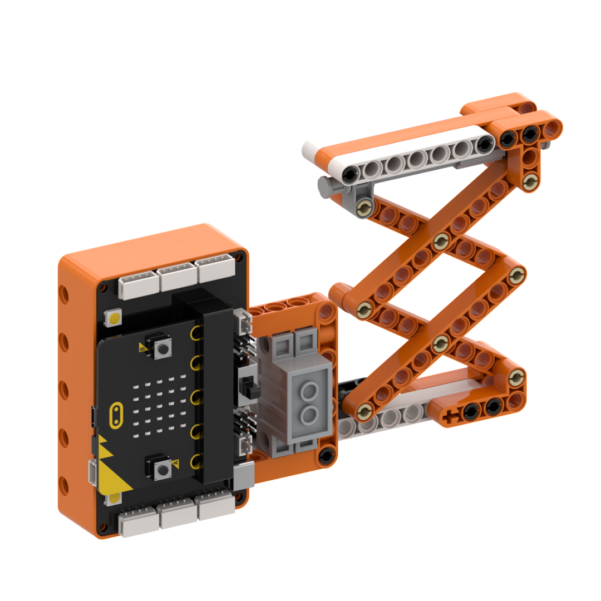

#### 4.2.5.1 Learning Objectives

1. Understand the drive principle of the servo and master the method of controlling the servo movement through buttons on the micro:bit.
2. Understand the control logic of button A raising the ladder and button B lowering the ladder to simulate ladder movements.

#### 4.2.5.2 Assembly Guide

For the building steps of the scissor lift, refer to the building guide in [6. Creative Builds Assembly Guide](https://wiki.hiwonder.com/projects/DaDabitV2/en/latest/docs/6_Creative_Assembly_Guide.html#scissor-lift) for **Scissor Lift**.

#### 4.2.5.3 Wiring Guide

Connect the block servo to port S1 on the micro:bit expansion board, ensuring the orange signal wire is connected to the white pin of S1.

As shown below:

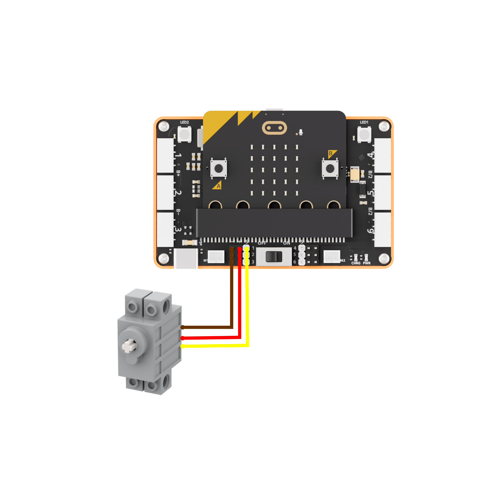

> [!NOTE]
>
> **When conducting a program related to the block servo for the first time, remove the gear from the servo first and upload the program of this course to the micro:bit. Then turn on the power switch of the micro:bit expansion board and wait for the block servo to rotate to the initial position of -135 degrees before reinstalling the servo gear. This step can be skipped if the servo reset program has been used before.**

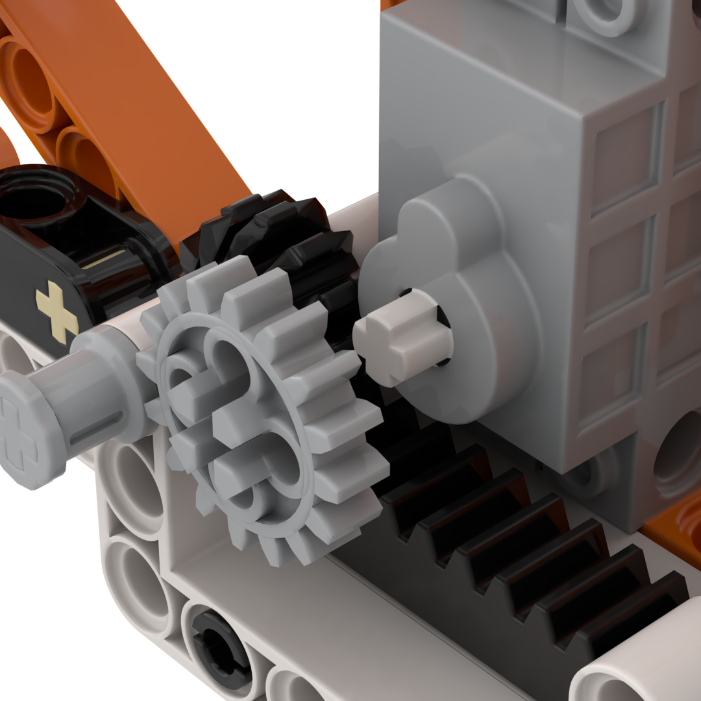

#### 4.2.5.4 Programming

1. Add the Extension Library:

   - Click **Extensions**.

     

   - Search for **https://github.com/HiwonderK12/DaDabitV2** in **Extensions** and add **dadabitv2**.

     

2. Principles:

   - The micro:bit expansion board detects button A and button B inputs to control the servo to rotate forward or backward. Pressing button A makes the servo rotate in the ascending direction, and pressing button B makes it rotate in the descending direction, achieving control of the scissor lift.
   - When button A is pressed, the micro:bit sends an ascending signal, and the servo rotates in the ascending direction to slowly raise the ladder. When button B is pressed, the micro:bit sends a descending signal, and the servo rotates in the descending direction to slowly lower the ladder.

3. Programming:

- Block Overview

| Block | Category | Description |
| :---: | :---: | :---: |
|  |  | Controls the specified LEGO 270 degree servo to rotate to the target angle within a set time. |
|  |  | Detects the pressed state of button A or button B to trigger actions. |

- Block Combination

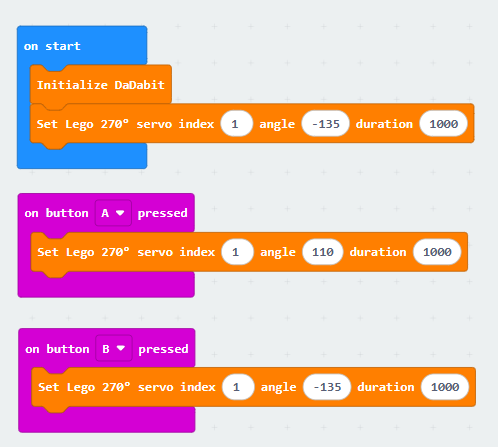

4. Device Pairing and Program Downloading

   1) **Wiring**: Connect the micro:bit board to the computer USB port using a data cable.

   2) **Device Pairing**:

      - When connecting the device for the first time, pair the device. Once connected, the browser will remember the connected device. Click the **...** button next to **Download**, and select **Connect Device** from the options.

        

      - Click **Next** in the pop-up window.

        

      - Click **Pair** and select the device shown in the pop-up window.

        

        

        

   3) **Download**:

      - After the device is successfully connected, click **Download** to download the program. During the download process, the yellow indicator light near the USB port on the micro:bit board will flash rapidly. Do not disconnect or move the data cable at this time to prevent download failure.

        

      - Once the download is complete, the indicator light will stop flashing and remain on, and a completion prompt will appear on the main programming interface.

        

   4) **Powering On**: The micro:bit automatically runs the program when powered on to test the functionality.

#### 4.2.5.5 Demo

---

### 4.2.6 Greeting Bot

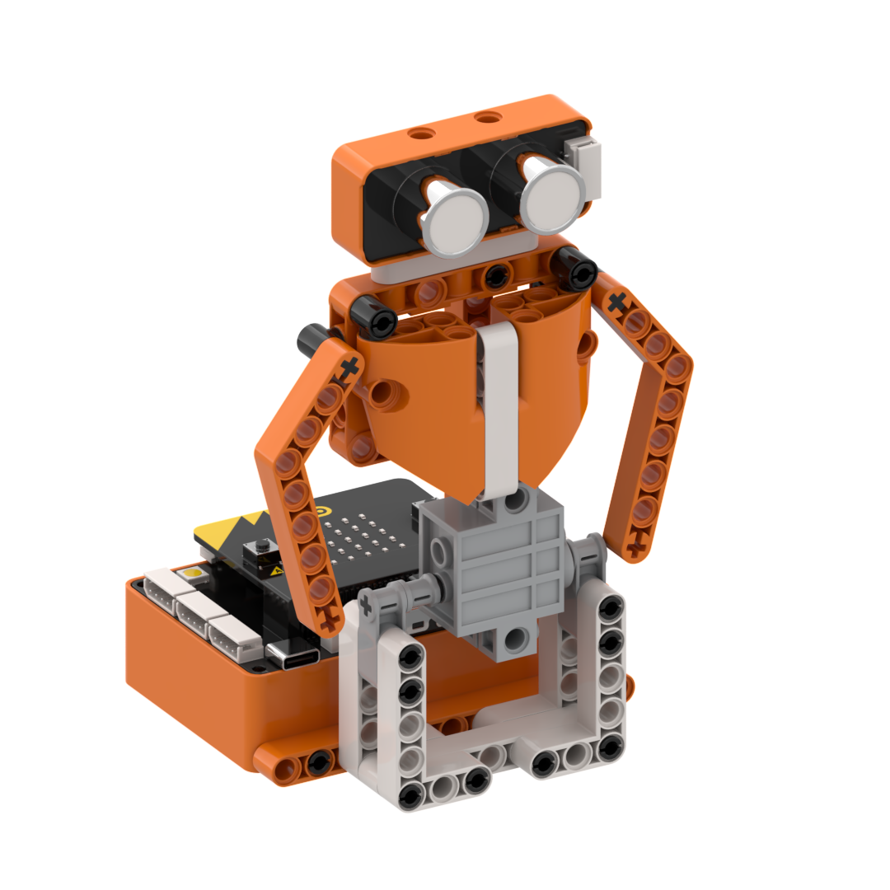

#### 4.2.6.1 Learning Objectives

1. Understand the working principles of the servo and ultrasonic sensor, and master the method of controlling servo movement through distance on the micro:bit.
2. Understand the control logic of bowing automatically when someone approaches to achieve a bowing interactive effect.

#### 4.2.6.2 Assembly Guide

For the building steps of the greeting bot, refer to the building guide in [6. Creative Builds Assembly Guide](https://wiki.hiwonder.com/projects/DaDabitV2/en/latest/docs/6_Creative_Assembly_Guide.html#greeting-bot) for **Greeting Bot**.

#### 4.2.6.3 Wiring Guide

Connect the ultrasonic sensor to port P3 on the micro:bit expansion board.

Connect the block servo to port S1 on the micro:bit expansion board, ensuring the orange signal wire is connected to the white pin of S1.

As shown below:

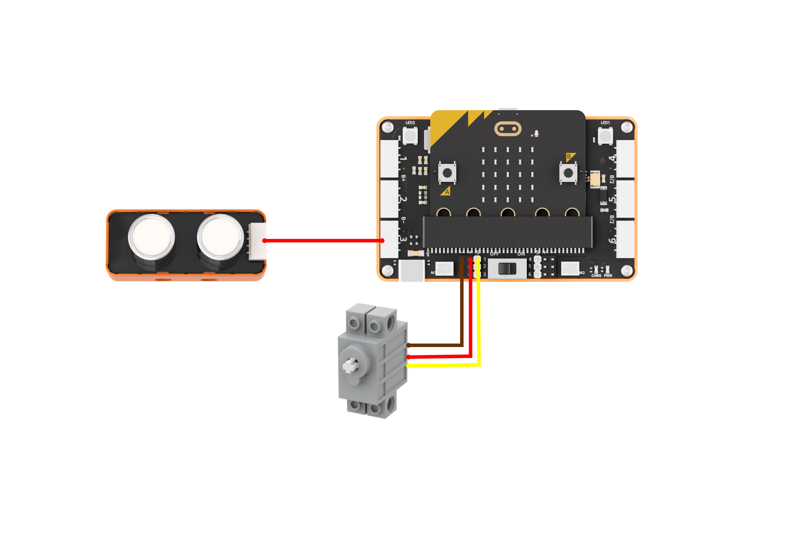

> [!NOTE]
>
> **When conducting a program related to the block servo for the first time, remove the block from the servo first and upload the program of this course to the micro:bit. Then turn on the power switch of the micro:bit expansion board and wait for the block servo to rotate to the initial position of 0 degrees before reinstalling the block. This step can be skipped if the servo reset program has been used before.**

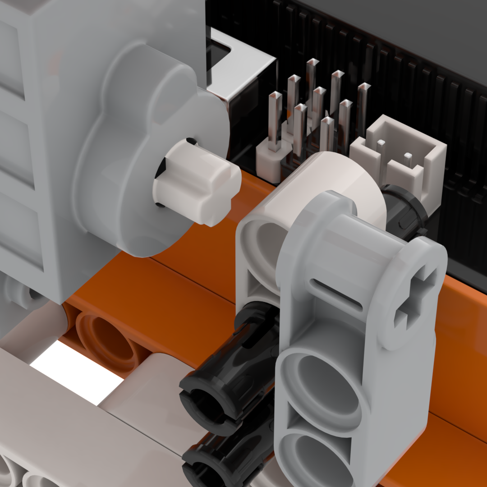

#### 4.2.6.4 Programming

1. Add the Extension Library:

   - Click **Extensions**.

     

   - Search for **https://github.com/HiwonderK12/DaDabitV2** in **Extensions** and add **dadabitv2**.

     

2. Principles:

   - The micro:bit expansion board reads the distance value of the ultrasonic sensor. When the distance is less than 15 cm, meaning someone is approaching, the servo is controlled to rotate to a bowing angle, hold for 2 seconds, and then return to an upright position to achieve a bowing interactive effect.
   - When someone approaches the sensor and the distance is less than 15 cm, the micro:bit detects the trigger signal and sends a bowing command, making the servo rotate to bow the figure, hold for 2 seconds, and then automatically return to the upright position.

3. Programming:

- Block Overview

| Block | Category | Description |
| :---: | :---: | :---: |
|  |  | Reads the distance data collected by the ultrasonic sensor in centimeters. |
|  |  | Controls the specified servo to rotate to the target angle within a set time. |

- Block Combination

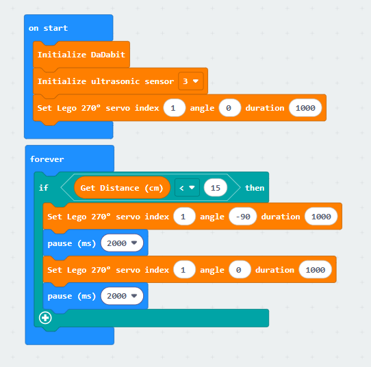

4. Device Pairing and Program Downloading

   1) **Wiring**: Connect the micro:bit board to the computer USB port using a data cable.

   2) **Device Pairing**:

      - When connecting the device for the first time, pair the device. Once connected, the browser will remember the connected device. Click the **...** button next to **Download**, and select **Connect Device** from the options.

        

      - Click **Next** in the pop-up window.

        

      - Click **Pair** and select the device shown in the pop-up window.

        

        

        

   3) **Download**:

      - After the device is successfully connected, click **Download** to download the program. During the download process, the yellow indicator light near the USB port on the micro:bit board will flash rapidly. Do not disconnect or move the data cable at this time to prevent download failure.

        

      - Once the download is complete, the indicator light will stop flashing and remain on, and a completion prompt will appear on the main programming interface.

        

   4) **Powering On**: The micro:bit automatically runs the program when powered on to test the functionality.

#### 4.2.6.5 Demo

---

### 4.2.7 Woodpecker

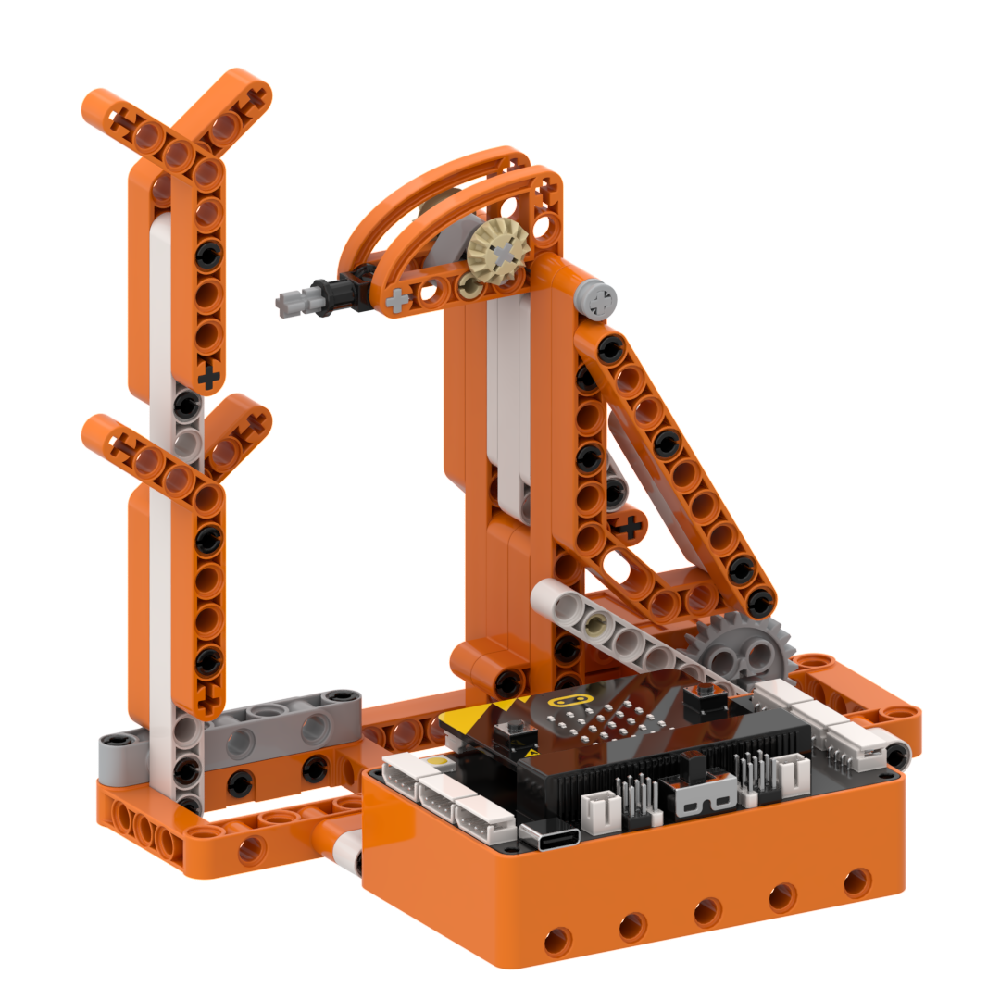

#### 4.2.7.1 Learning Objectives

1. Understand the drive principle of the DC motor and master the method of controlling the start and stop of the motor through buttons on the micro:bit.
2. Understand the control logic of button A starting and button B stopping to simulate the woodpecker pecking motion.

#### 4.2.7.2 Assembly Guide

For the building steps of the woodpecker, refer to the building guide in [6. Creative Builds Assembly Guide](https://wiki.hiwonder.com/projects/DaDabitV2/en/latest/docs/6_Creative_Assembly_Guide.html#woodpecker) for **Woodpecker**.

#### 4.2.7.3 Wiring Guide

Connect the block motor to port S1 on the micro:bit expansion board, ensuring the orange signal wire is connected to the white pin of S1.

As shown below:

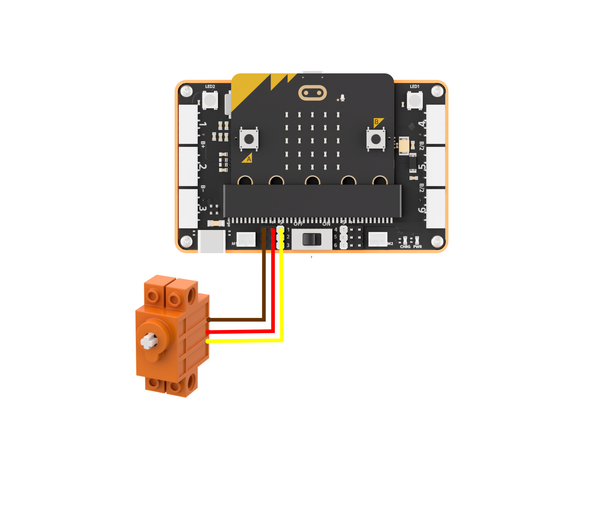

#### 4.2.7.4 Programming

1. Add the Extension Library:

   - Click **Extensions**.

     

   - Search for **https://github.com/HiwonderK12/DaDabitV2** in **Extensions** and add **dadabitv2**.

     

2. Principles:

   - The micro:bit expansion board detects button A and button B inputs to control the start and stop of the motor. Pressing button A starts the motor, and pressing button B stops the motor, achieving control of the woodpecker pecking motion.
   - When button A is pressed, the micro:bit sends a start signal to supply power continuously, and the motor rotates to drive the mechanism to simulate the woodpecker pecking motion. When button B is pressed, the micro:bit sends a stop signal to cut off power, and the motor stops rotating.

3. Programming:

- Block Overview

| Block | Category | Description |
| :---: | :---: | :---: |
|  |  | Controls the specified motor to rotate continuously in a set direction and speed. |
|  |  | Detects the pressed state of button A or button B to trigger actions. |

- Block Combination

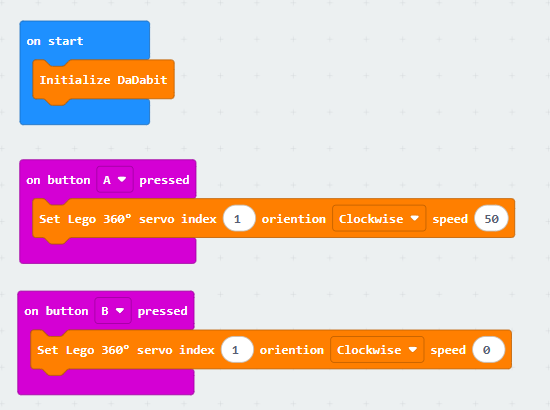

4. Device Pairing and Program Downloading

   1) **Wiring**: Connect the micro:bit board to the computer USB port using a data cable.

   2) **Device Pairing**:

      - When connecting the device for the first time, pair the device. Once connected, the browser will remember the connected device. Click the **...** button next to **Download**, and select **Connect Device** from the options.

        

      - Click **Next** in the pop-up window.

        

      - Click **Pair** and select the device shown in the pop-up window.

        

        

        

   3) **Download**:

      - After the device is successfully connected, click **Download** to download the program. During the download process, the yellow indicator light near the USB port on the micro:bit board will flash rapidly. Do not disconnect or move the data cable at this time to prevent download failure.

        

      - Once the download is complete, the indicator light will stop flashing and remain on, and a completion prompt will appear on the main programming interface.

        

   4) **Powering On**: The micro:bit automatically runs the program when powered on to test the functionality.

#### 4.2.7.5 Demo

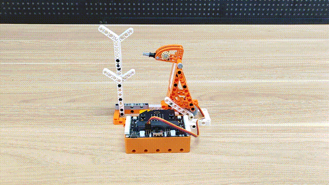

---

### 4.2.8 Jump Rope Pro

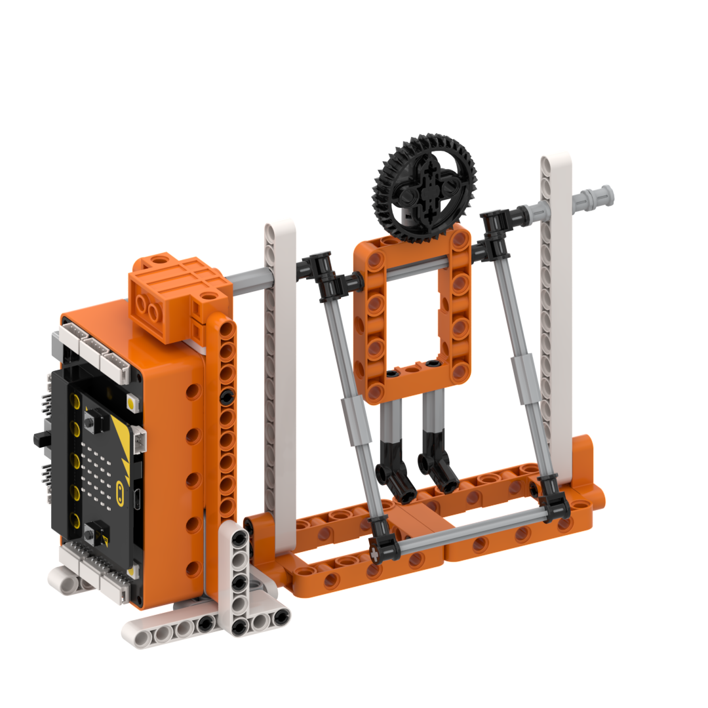

#### 4.2.8.1 Learning Objectives

1. Understand the drive principle of the DC motor and master the method of controlling the start and stop of the motor through buttons on the micro:bit.
2. Understand the control logic of button A starting and button B stopping to simulate the jump rope motion.

#### 4.2.8.2 Assembly Guide

For the building steps of the jump rope pro, refer to the building guide in [6. Creative Builds Assembly Guide](https://wiki.hiwonder.com/projects/DaDabitV2/en/latest/docs/6_Creative_Assembly_Guide.html#jump-rope-pro) for **Jump Rope Pro**.

#### 4.2.8.3 Wiring Guide

Connect the block motor to port S1 on the micro:bit expansion board, ensuring the orange signal wire is connected to the white pin of S1.

As shown below:

#### 4.2.8.4 Programming

1. Add the Extension Library:

   - Click **Extensions**.

     

   - Search for **https://github.com/HiwonderK12/DaDabitV2** in **Extensions** and add **dadabitv2**.

     

2. Principles:

   - The micro:bit expansion board detects button A and button B inputs to control the start and stop of the motor. Pressing button A starts the motor, and pressing button B stops the motor, achieving control of the jump rope motion.
   - When button A is pressed, the micro:bit sends a start signal to supply power continuously, and the motor rotates to drive the mechanism to simulate the jump rope motion. When button B is pressed, the micro:bit sends a stop signal to cut off power, and the motor stops rotating.

3. Programming:

- Block Overview

| Block | Category | Description |
| :---: | :---: | :---: |
|  |  | Controls the specified LEGO 360-degree servo to run in a set direction and speed. |
|  |  | Detects the pressed state of button A or button B to trigger actions. |

- Block Combination

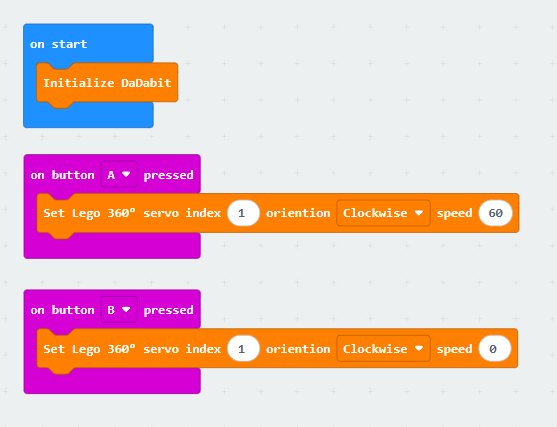

4. Device Pairing and Program Downloading

   1) **Wiring**: Connect the micro:bit board to the computer USB port using a data cable.

   2) **Device Pairing**:

      - When connecting the device for the first time, pair the device. Once connected, the browser will remember the connected device. Click the **...** button next to **Download**, and select **Connect Device** from the options.

        

      - Click **Next** in the pop-up window.

        

      - Click **Pair** and select the device shown in the pop-up window.

        

        

        

   3) **Download**:

      - After the device is successfully connected, click **Download** to download the program. During the download process, the yellow indicator light near the USB port on the micro:bit board will flash rapidly. Do not disconnect or move the data cable at this time to prevent download failure.

        

      - Once the download is complete, the indicator light will stop flashing and remain on, and a completion prompt will appear on the main programming interface.

        

   4) **Powering On**: The micro:bit automatically runs the program when powered on to test the functionality.

#### 4.2.8.5 Demo

---

### 4.2.9 Sentinel Radar

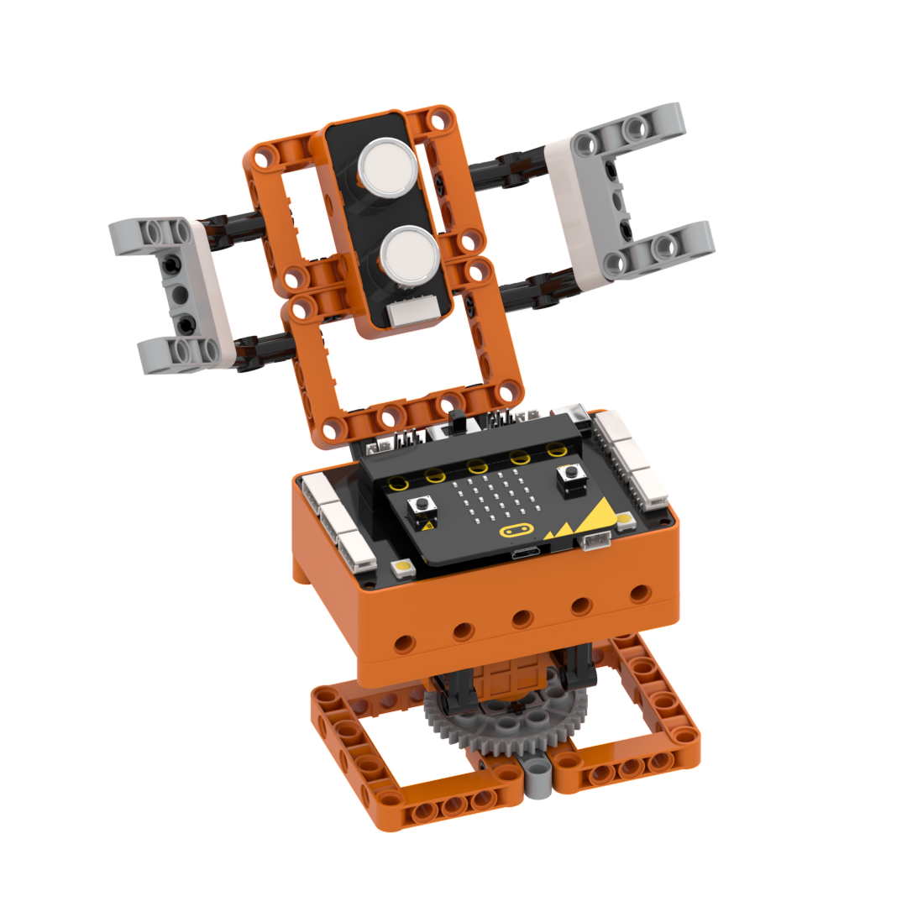

#### 4.2.9.1 Learning Objectives

1. Understand the working principles of the motor and ultrasonic sensor, and master the method of controlling the motor and light through distance on the micro:bit.
2. Understand the control logic of stopping rotation and sounding an alarm when an object approaches and resuming work when the object leaves to achieve a sentinel radar effect.

#### 4.2.9.2 Assembly Guide

For the building steps of the sentinel radar, refer to the building guide in [6. Creative Builds Assembly Guide](https://wiki.hiwonder.com/projects/DaDabitV2/en/latest/docs/6_Creative_Assembly_Guide.html#sentinel-radar) for **Sentinel Radar**.

#### 4.2.9.3 Wiring Guide

Connect the ultrasonic sensor to port P3 on the micro:bit expansion board.

Connect the block motor to port S1 on the micro:bit expansion board, ensuring the orange signal wire is connected to the white pin of S1.

As shown below:

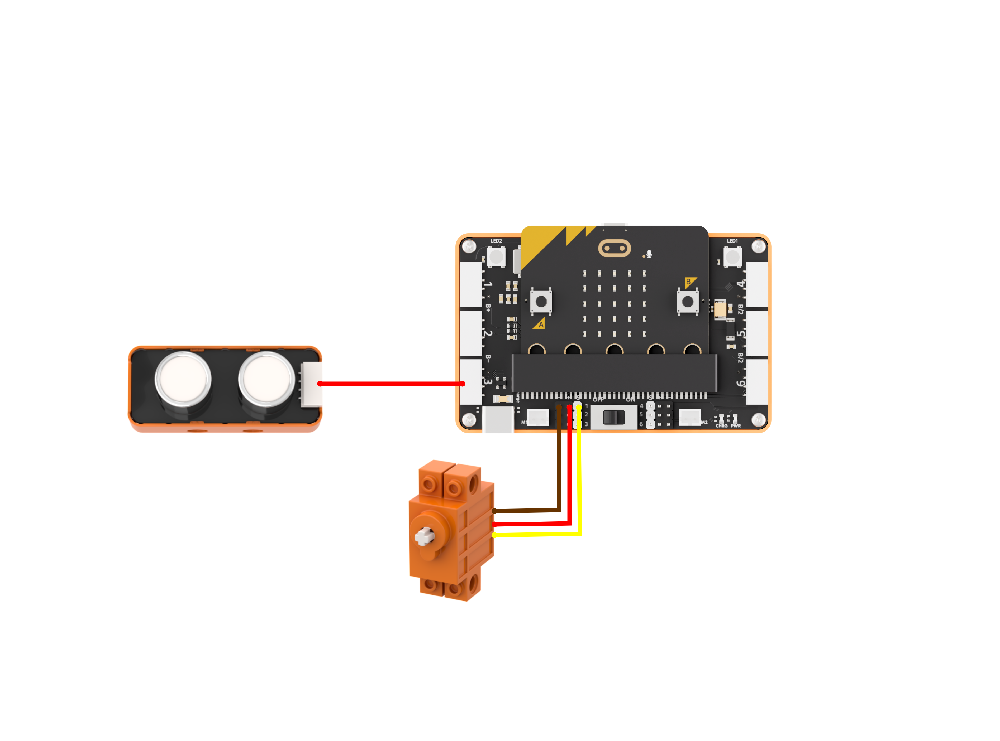

#### 4.2.9.4 Programming

1. Add the Extension Library:

   - Click **Extensions**.

     

   - Search for **https://github.com/HiwonderK12/DaDabitV2** in **Extensions** and add **dadabitv2**.

     

2. Principles:

   - The micro:bit expansion board reads the distance value of the ultrasonic sensor. When the distance is less than 15 cm, the motor stops rotating, the RGB lights flash red and white, and an alarm sounds. When the distance is greater than 15 cm, the motor resumes rotating, the light turns green, and the alarm stops, achieving a sentinel radar function.
   - The initial state has the motor rotating and the light set to green. When an object approaches at a distance less than 15 cm, the micro:bit sends a stop and alarm signal to stop the motor, flash the light red and white, and sound the alarm. After the object leaves, the micro:bit sends a recovery signal to make the motor rotate again and turn the light back to green.

3. Programming:

- Block Overview

| Block | Category | Description |
| :---: | :---: | :---: |
|  |  | Plays a note of designated pitch and duration. |
|  |  | A conditional judgment block that decides subsequent execution logic based on the distance variable value. |
|  |  | Reads the distance data from the ultrasonic sensor. |
|  |  | Sets the light color of the glowy ultrasonic sensor to the specified color. |
|  |  | Controls the specified LEGO 360-degree servo to run in a set direction and speed. |

- Block Combination

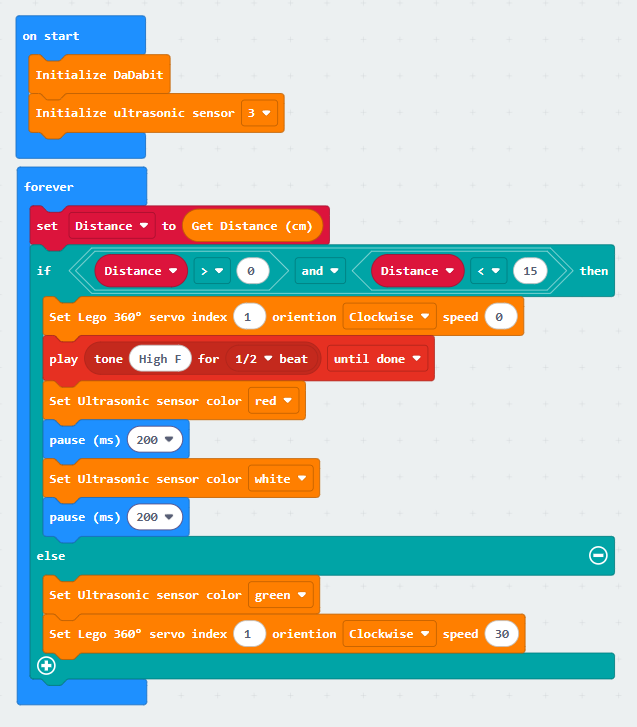

4. Device Pairing and Program Downloading

   1) **Wiring**: Connect the micro:bit board to the computer USB port using a data cable.

   2) **Device Pairing**:

      - When connecting the device for the first time, pair the device. Once connected, the browser will remember the connected device. Click the **...** button next to **Download**, and select **Connect Device** from the options.

        

      - Click **Next** in the pop-up window.

        

      - Click **Pair** and select the device shown in the pop-up window.

        

        

        

   3) **Download**:

      - After the device is successfully connected, click **Download** to download the program. During the download process, the yellow indicator light near the USB port on the micro:bit board will flash rapidly. Do not disconnect or move the data cable at this time to prevent download failure.

        

      - Once the download is complete, the indicator light will stop flashing and remain on, and a completion prompt will appear on the main programming interface.

        

   4) **Powering On**: The micro:bit automatically runs the program when powered on to test the functionality.

#### 4.2.9.5 Demo

---

### 4.2.10 Chopping Bot

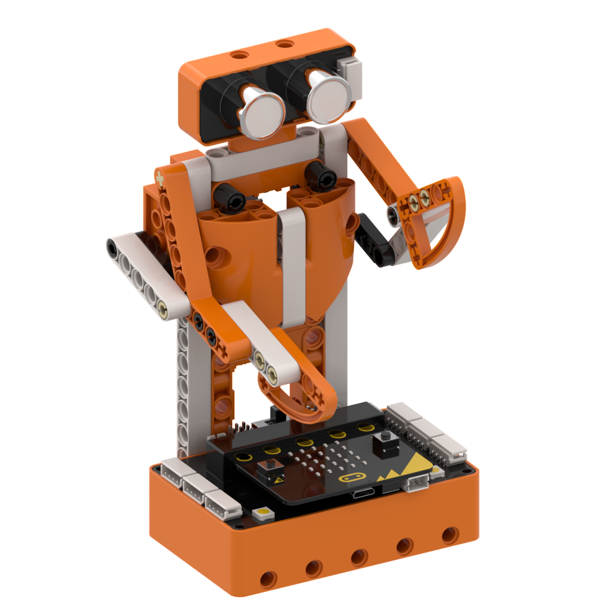

#### 4.2.10.1 Learning Objectives

1. Understand the working principles of the motor and ultrasonic sensor, and master the method of controlling motor starting and stopping through distance on the micro:bit.
2. Understand the control logic of starting the pecking/chopping motion when someone approaches and stopping when the person leaves to simulate a chopping bot.

#### 4.2.10.2 Assembly Guide

For the building steps of the chopping bot, refer to the building guide in [6. Creative Builds Assembly Guide](https://wiki.hiwonder.com/projects/DaDabitV2/en/latest/docs/6_Creative_Assembly_Guide.html#chopping-bot) for **Chopping Bot**.

#### 4.2.10.3 Wiring Guide

Connect the ultrasonic sensor to port P3 on the micro:bit expansion board.

Connect the block motor to port S1 on the micro:bit expansion board, ensuring the orange signal wire is connected to the white pin of S1.

As shown below:

#### 4.2.10.4 Programming

1. Add the Extension Library:

   - Click **Extensions**.

     

   - Search for **https://github.com/HiwonderK12/DaDabitV2** in **Extensions** and add **dadabitv2**.

     

2. Principles:

   - The micro:bit expansion board reads the distance value of the ultrasonic sensor. When the distance is less than 20 cm, indicating someone is approaching, the motor is controlled to start rotating to simulate the chopping motion. When the distance is greater than 20 cm, the motor stops, achieving control of the chopping bot.
   - When someone approaches the sensor and the distance is less than 20 cm, the micro:bit sends a start signal, and the motor rotates to drive the mechanism to simulate the chopping motion. When the person leaves and the distance is greater than 20 cm, the micro:bit sends a stop signal, and the motor stops rotating.

3. Programming:

- Block Overview

| Block | Category | Description |
| :---: | :---: | :---: |
|  |  | Reads the distance data from the ultrasonic sensor. |
|  |  | Controls the specified LEGO 360-degree servo to run in a set direction and speed. |

- Block Combination

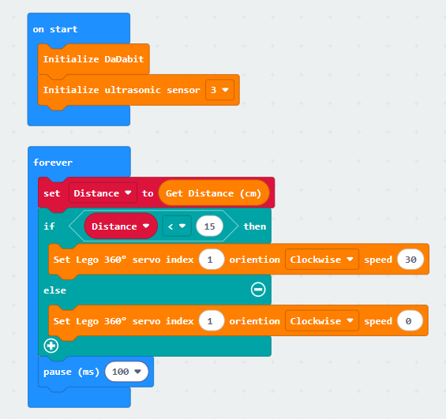

4. Device Pairing and Program Downloading

   1) **Wiring**: Connect the micro:bit board to the computer USB port using a data cable.

   2) **Device Pairing**:

      - When connecting the device for the first time, pair the device. Once connected, the browser will remember the connected device. Click the **...** button next to **Download**, and select **Connect Device** from the options.

        

      - Click **Next** in the pop-up window.

        

      - Click **Pair** and select the device shown in the pop-up window.

        

        

        

   3) **Download**:

      - After the device is successfully connected, click **Download** to download the program. During the download process, the yellow indicator light near the USB port on the micro:bit board will flash rapidly. Do not disconnect or move the data cable at this time to prevent download failure.

        

      - Once the download is complete, the indicator light will stop flashing and remain on, and a completion prompt will appear on the main programming interface.

        

   4) **Powering On**: The micro:bit automatically runs the program when powered on to test the functionality.

#### 4.2.10.5 Demo

---

### 4.2.11 Smart Sunshade

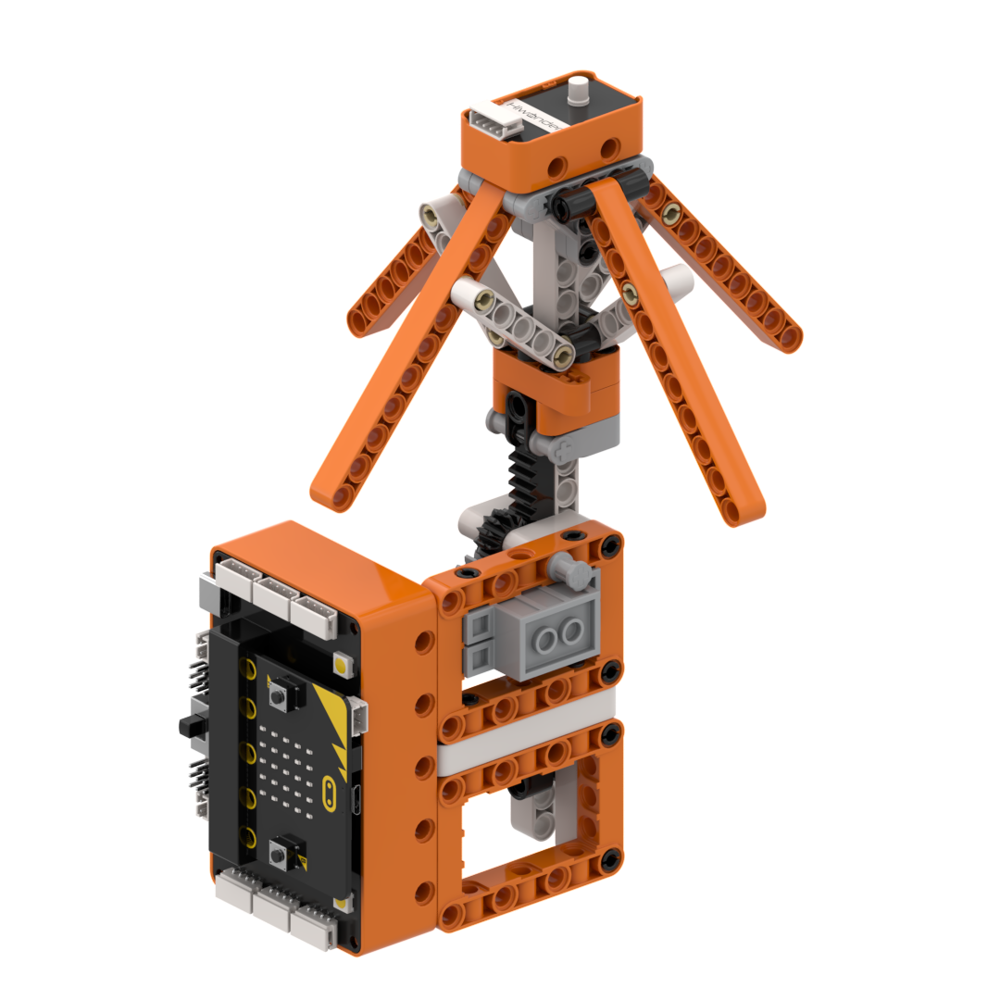

#### 4.2.11.1 Learning Objectives

1. Understand the working principles of the servo and light sensor, and master the method of controlling servo movements through light intensity on the micro:bit.
2. Understand the control logic of opening the sunshade when light is sufficient and closing it when light is insufficient to achieve a sensor-activated shading effect.

#### 4.2.11.2 Assembly Guide

For the building steps of the smart sunshade, refer to the building guide in [6. Creative Builds Assembly Guide](https://wiki.hiwonder.com/projects/DaDabitV2/en/latest/docs/6_Creative_Assembly_Guide.html#smart-sunshade) for **Smart Sunshade**.

#### 4.2.11.3 Wiring Guide

Connect the light sensor to port P1 on the micro:bit expansion board.

Connect the block servo to port S1 on the micro:bit expansion board, ensuring the orange signal wire is connected to the white pin of S1.

As shown below:

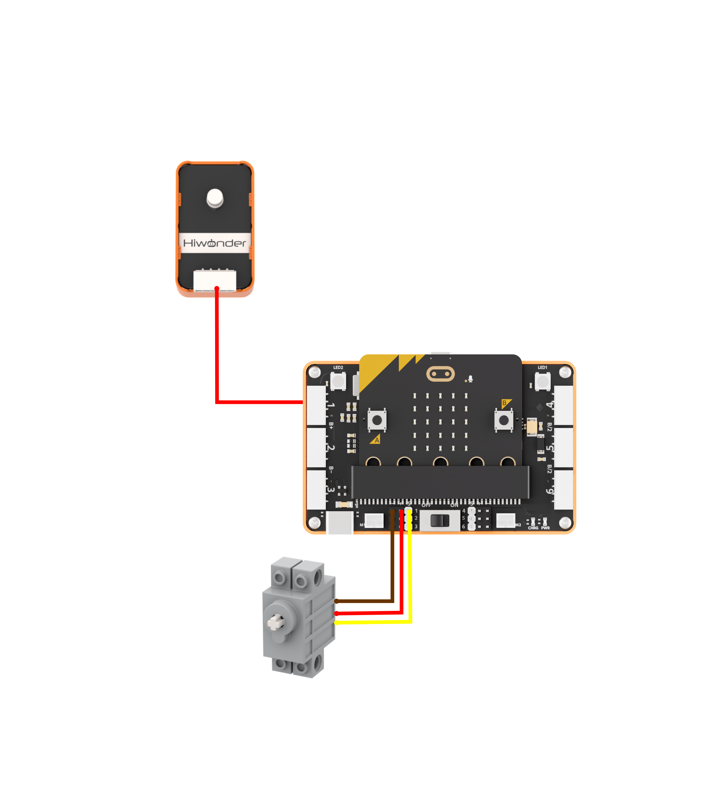

> [!NOTE]
>
> **When conducting a program related to the block servo for the first time, remove the gear from the servo first and upload the program of this course to the micro:bit. Then turn on the power switch of the micro:bit expansion board and wait for the block servo to rotate to the initial position before reinstalling the servo gear. This step can be skipped if the servo reset program has been used before.**

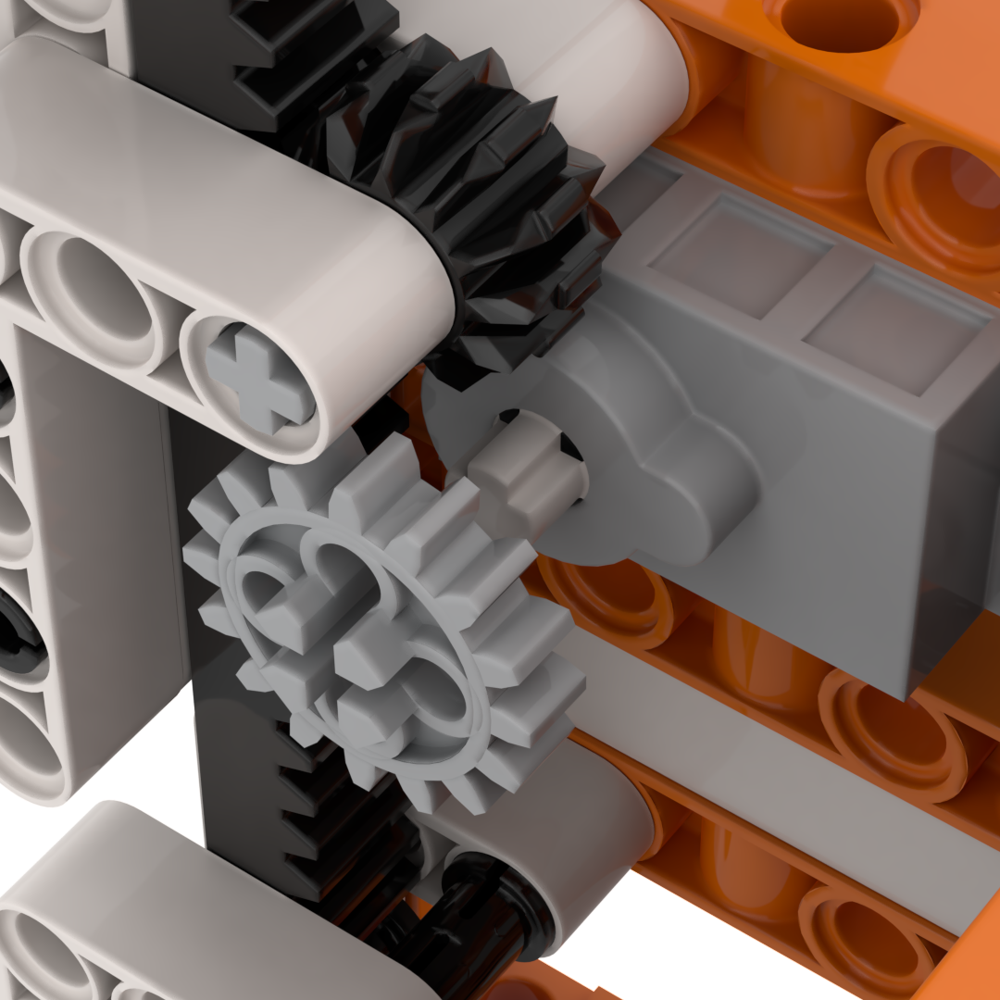

#### 4.2.11.4 Programming

1. Add the Extension Library:

   - Click **Extensions**.

     

   - Search for **https://github.com/HiwonderK12/DaDabitV2** in **Extensions** and add **dadabitv2**.

     

2. Principles:

   - The micro:bit expansion board reads the light value of the light sensor. When the value is greater than the set threshold of 60, the servo is controlled to rotate and open the sunshade. When the light is insufficient, the servo rotates in the opposite direction to close the sunshade, achieving a smart sunshade function.
   - When the ambient light is sufficient and the micro:bit detects that the light value is greater than 60, it sends an open signal, and the servo rotates to open the sunshade. When the light dims and the value is below 60, it sends a close signal, and the servo rotates in the opposite direction to close the sunshade.

3. Programming:

- Block Overview

| Block | Category | Description |
| :---: | :---: | :---: |
|  |  | Controls the specified LEGO 270-degree servo to rotate to the target angle within a set time. |
|  |  | Reads the light intensity from the light sensor within a range of 0 to 100. |

- Block Combination

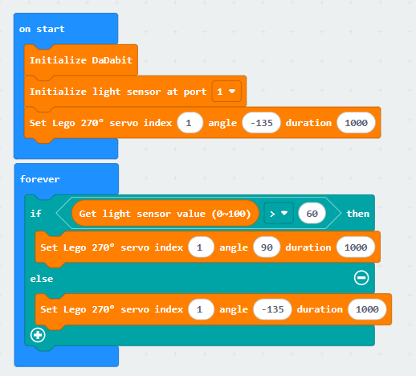

4. Device Pairing and Program Downloading

   1) **Wiring**: Connect the micro:bit board to the computer USB port using a data cable.

   2) **Device Pairing**:

      - When connecting the device for the first time, pair the device. Once connected, the browser will remember the connected device. Click the **...** button next to **Download**, and select **Connect Device** from the options.

        

      - Click **Next** in the pop-up window.

        

      - Click **Pair** and select the device shown in the pop-up window.

        

        

        

   3) **Download**:

      - After the device is successfully connected, click **Download** to download the program. During the download process, the yellow indicator light near the USB port on the micro:bit board will flash rapidly. Do not disconnect or move the data cable at this time to prevent download failure.

        

      - Once the download is complete, the indicator light will stop flashing and remain on, and a completion prompt will appear on the main programming interface.

        

   4) **Powering On**: The micro:bit automatically runs the program when powered on to test the functionality.

#### 4.2.11.5 Demo

---

### 4.2.12 Parkour Runner

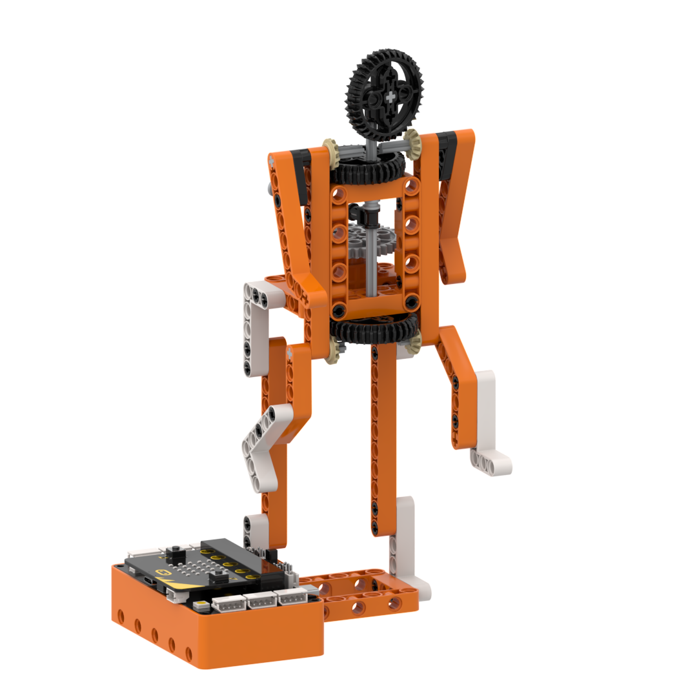

#### 4.2.12.1 Learning Objectives

1. Understand the drive principle of the DC motor and master the method of controlling the start and stop of the motor through buttons on the micro:bit.
2. Understand the control logic of button A starting and button B stopping to simulate the parkour motion.

#### 4.2.12.2 Assembly Guide

For the building steps of the parkour runner, refer to the building guide in [6. Creative Builds Assembly Guide](https://wiki.hiwonder.com/projects/DaDabitV2/en/latest/docs/6_Creative_Assembly_Guide.html#parkour-runner) for **Parkour Runner**.

#### 4.2.12.3 Wiring Guide

Connect the block motor to port S1 on the micro:bit expansion board, ensuring the orange signal wire is connected to the white pin of S1.

As shown below:

#### 4.2.12.4 Programming

1. Add the Extension Library:

   - Click **Extensions**.

     

   - Search for **https://github.com/HiwonderK12/DaDabitV2** in **Extensions** and add **dadabitv2**.

     

2. Principles:

   - The micro:bit expansion board detects button A and button B inputs to control the start and stop of the motor. Pressing button A starts the motor, and pressing button B stops the motor, achieving control of the parkour motion.
   - When button A is pressed, the micro:bit sends a start signal to supply power continuously, and the motor rotates to drive the mechanism to simulate the parkour motion. When button B is pressed, the micro:bit sends a stop signal to cut off power, and the motor stops rotating.

3. Programming:

- Block Overview

| Block | Category | Description |
| :---: | :---: | :---: |
|  |  | Controls the specified motor to rotate continuously in a set direction and speed. |
|  |  | Detects the pressed state of button A or button B to trigger actions. |

- Block Combination

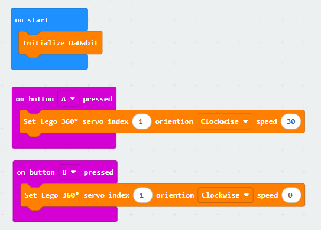

4. Device Pairing and Program Downloading

   1) **Wiring**: Connect the micro:bit board to the computer USB port using a data cable.

   2) **Device Pairing**:

      - When connecting the device for the first time, pair the device. Once connected, the browser will remember the connected device. Click the **...** button next to **Download**, and select **Connect Device** from the options.

        

      - Click **Next** in the pop-up window.

        

      - Click **Pair** and select the device shown in the pop-up window.

        

        

        

   3) **Download**:

      - After the device is successfully connected, click **Download** to download the program. During the download process, the yellow indicator light near the USB port on the micro:bit board will flash rapidly. Do not disconnect or move the data cable at this time to prevent download failure.

        

      - Once the download is complete, the indicator light will stop flashing and remain on, and a completion prompt will appear on the main programming interface.

        

   4) **Powering On**: The micro:bit automatically runs the program when powered on to test the functionality.

#### 4.2.12.5 Demo

