# 5. Advanced Kit Projects

## 5.1 Ultimate Sensor Courses

### 5.1.1 Infrared Alarm

The infrared obstacle avoidance sensor detects the presence of obstacles in front of the device. The sensor features an infrared transmitter and an infrared receiver. When the sensor encounters an obstacle, the infrared light is reflected back and received by the receiver. This sensor is highly versatile and features LEGO-compatible mounting holes for more creative DIY projects.

#### 5.1.1.1 Learning Objectives

1. Understand the detection logic of the infrared obstacle avoidance sensor and master the method of triggering audible alarms when obstacles are detected.
2. Learn to implement the feedback logic of triggering an alarm when detecting an obstacle and stopping the alarm when no obstacle is detected through conditional statements.

#### 5.1.1.2 Wiring Guide

Connect the infrared obstacle avoidance sensor to port P1 on the micro:bit expansion board.

As shown below:

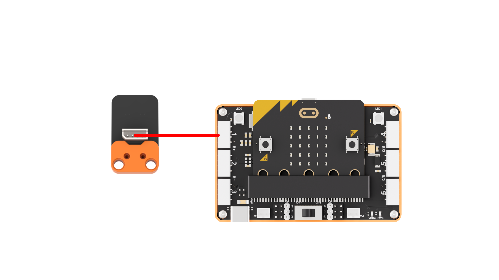

#### 5.1.1.3 Programming

1. Add the Extension Library:

   - Click **Extensions**.

     

   - Search for **https://github.com/HiwonderK12/DaDabitV2** in **Extensions** and add **dadabitv2**.

     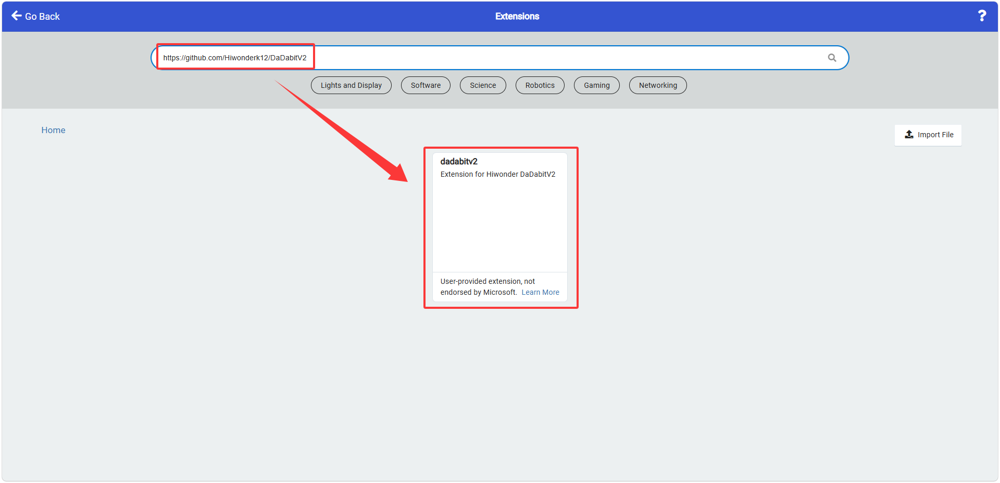

2. Principles:

   The infrared obstacle avoidance sensor detects the presence of obstacles in front of the device in real time through infrared signals. When an obstacle is detected, the program triggers a preset alarm sound. When the obstacle disappears, the sound output stops automatically to achieve an active alarm function based on infrared detection.

3. Programming:

   - Block Overview

     | Block | Category | Description |
     | :---: | :---: | :---: |
     |  |  | Plays a note of designated pitch and duration. |
     |  |  | Stops all sounds currently playing on the device. |
     | 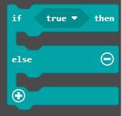 |  | A conditional judgment block that executes different program logic branches depending on whether the condition is met. |
     |  |  | Reads the detection state of the infrared obstacle avoidance sensor. |

   - Block Combination

     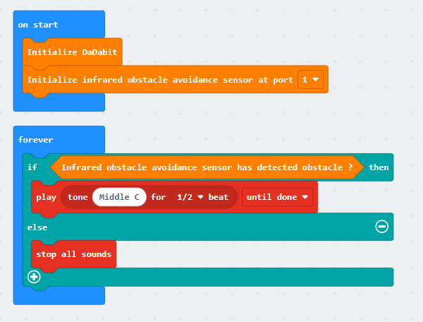

4. Device Pairing and Program Downloading

   1) **Wiring**: Connect the micro:bit board to the computer USB port using a data cable.

   2) **Device Pairing**:

      - When connecting the device for the first time, pair the device. Once connected, the browser will remember the connected device. Click the **...** button next to **Download**, and select **Connect Device** from the options.

        

      - Click **Next** in the pop-up window.

        

      - Click **Pair** and select the device shown in the pop-up window.

        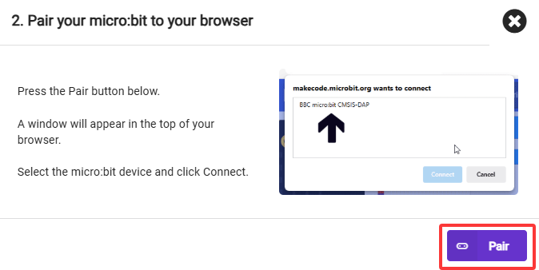

        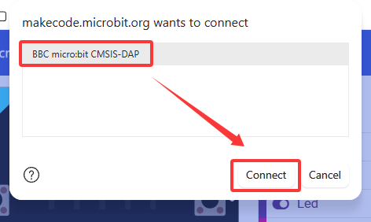

        

   3) **Download**:

      - After the device is successfully connected, click **Download** to download the program. During the download process, the yellow indicator light near the USB port on the micro:bit board will flash rapidly. Do not disconnect or move the data cable at this time to prevent download failure.

        

      - Once the download is complete, the indicator light will stop flashing and remain on, and a completion prompt will appear on the main programming interface.

        

   4) **Powering On**: The micro:bit automatically runs the program when powered on to test the functionality.

#### 5.1.1.4 Program Outcome

The device automatically initializes the hardware upon powering on and then continuously monitors the surrounding environment. When the infrared obstacle avoidance sensor detects an obstacle, the device immediately plays the preset alarm sound. The alarm stops as soon as the obstacle is removed, providing intuitive alarm feedback triggered by infrared detection.

---

### 5.1.2 Count Display

This is a 4-digit red LED digital tube module for displaying numbers, decimal points, and special characters. Featuring a compact size and ease of use, this module can be applied in robotic projects to display sensor values such as speed, time, score, temperature, and distance.

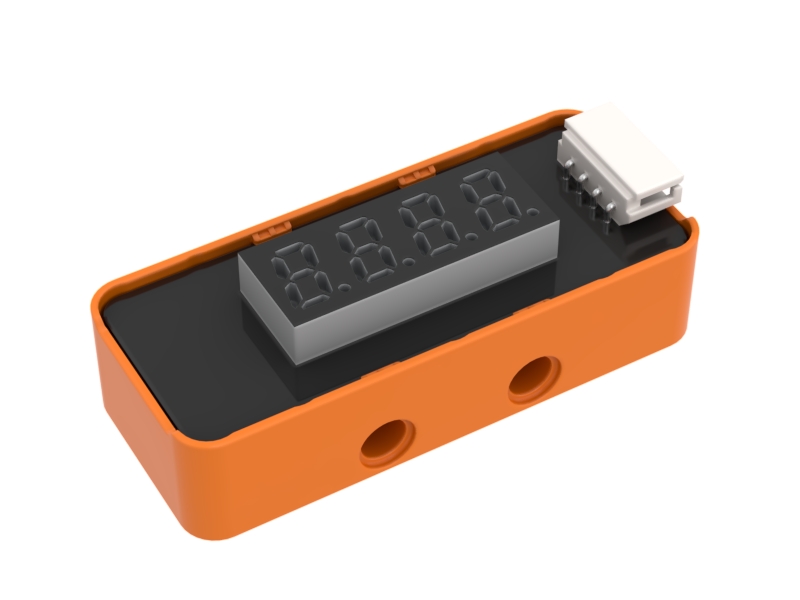

#### 5.1.2.1 Learning Objectives

1. Master the logic of triggering counting through buttons and understand the linkage between variable counting and the digital tube module.
2. Learn to implement a simple counting function through button triggering and digital tube output to understand the basic flow of human-robot interaction.

#### 5.1.2.2 Wiring Guide

Connect the digital tube module to port P3 on the micro:bit expansion board.

As shown below:

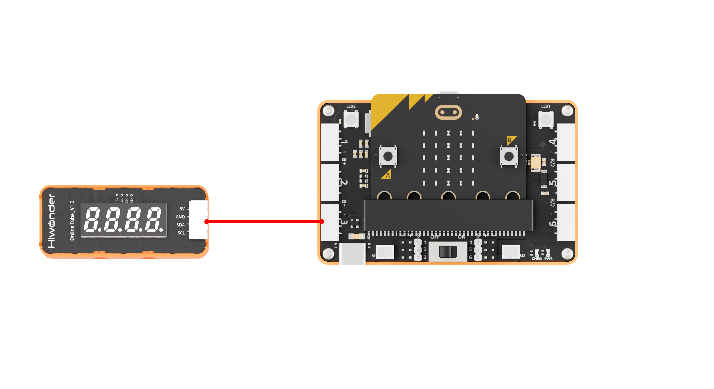

#### 5.1.2.3 Programming

1. Add the Extension Library:

   - Click **Extensions**.

     

   - Search for **https://github.com/HiwonderK12/DaDabitV2** in **Extensions** and add **dadabitv2**.

     

2. Principles:

   The buttons on the mainboard serve as the counting trigger signals. The program automatically increments the count value by 1 each time a button is pressed. The digital tube module shows the current count value in real time, converting button actions into intuitive numeric changes and updating the count display with each press.

3. Programming:

   - Block Overview

     | Block | Category | Description |
     | :---: | :---: | :---: |
     |  |  | Detects the pressed state of button A or button B to trigger actions. |
     |  |  | Displays the specified numeric content on the digital tube module. |

   - Block Combination

     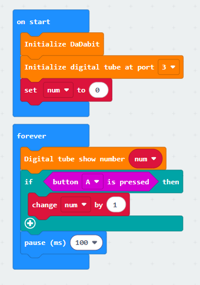

4. Device Pairing and Program Downloading

   1) **Wiring**: Connect the micro:bit board to the computer USB port using a data cable.

   2) **Device Pairing**:

      - When connecting the device for the first time, pair the device. Once connected, the browser will remember the connected device. Click the **...** button next to **Download**, and select **Connect Device** from the options.

        

      - Click **Next** in the pop-up window.

        

      - Click **Pair** and select the device shown in the pop-up window.

        

        

        

   3) **Download**:

      - After the device is successfully connected, click **Download** to download the program. During the download process, the yellow indicator light near the USB port on the micro:bit board will flash rapidly. Do not disconnect or move the data cable at this time to prevent download failure.

        

      - Once the download is complete, the indicator light will stop flashing and remain on, and a completion prompt will appear on the main programming interface.

        

   4) **Powering On**: The micro:bit automatically runs the program when powered on to test the functionality.

#### 5.1.2.4 Program Outcome

The digital tube module shows the initial count value by default after the device is powered on. The count value automatically increases by 1 each time button A is pressed, and the digital tube updates to show the latest count, providing intuitive count feedback of the button-triggered counting process.

## 5.2 Advanced Creative Builds

### 5.2.1 Cute Penguin

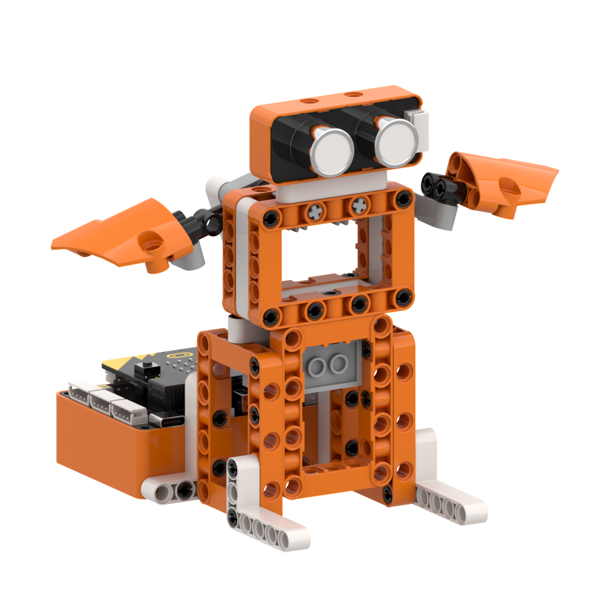

#### 5.2.1.1 Learning Objectives

1. Understand the working principles of the servo and ultrasonic sensor, and master the method of controlling servo movement through distance on the micro:bit.
2. Understand the control logic of waving the arms when someone approaches to achieve a cute penguin interactive effect.

#### 5.2.1.2 Assembly Guide

For the building steps of the cute penguin, refer to the building guide in [6_Assembly_Manual]() for **Cute Penguin**.

#### 5.2.1.3 Wiring Guide

* Connect the ultrasonic sensor to port P3 on the micro:bit expansion board.

* Connect the block servo to port S1 on the micro:bit expansion board, ensuring the orange signal wire is connected to the white pin of S1.

As shown below:

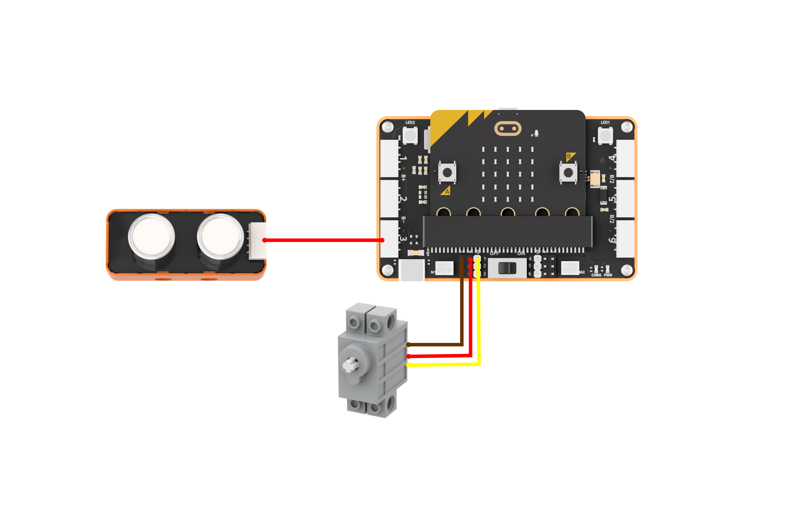

> [!NOTE]
>
> **When conducting a program related to the block servo for the first time, remove the gear from the servo first and upload the program in this section to the micro:bit. Then turn on the power switch of the micro:bit expansion board and wait for the block servo to rotate to the initial position of -60 degrees before reinstalling the gear. This step can be skipped if the servo reset program has been used before.**

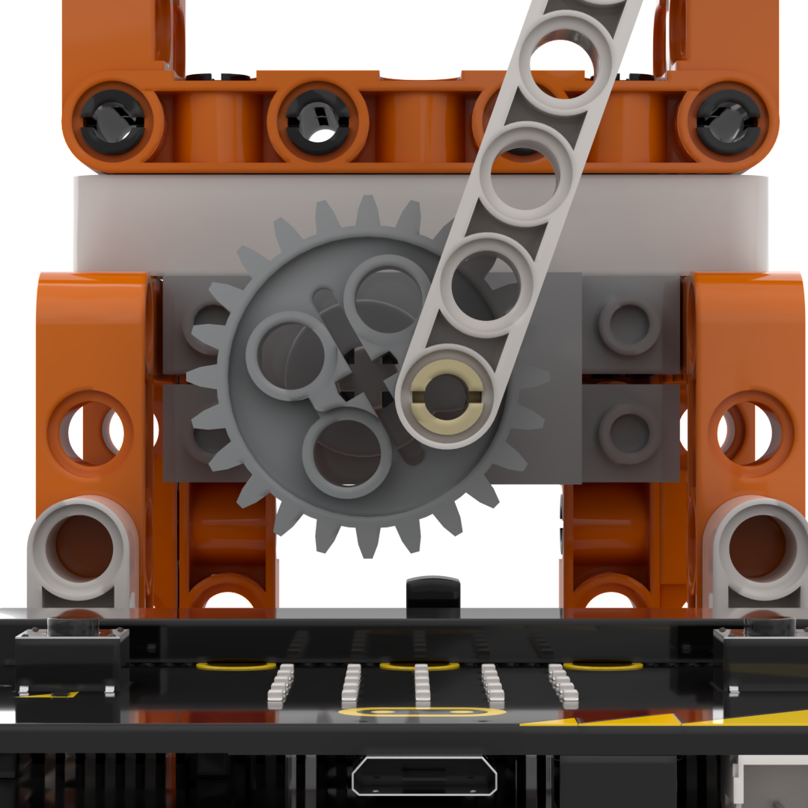

#### 5.2.1.4 Programming

1. Add the Extension Library:

   - Click **Extensions**.

     

   - Search for **https://github.com/HiwonderK12/DaDabitV2** in **Extensions** and add **dadabitv2**.

     

2. Principles:

   - The micro:bit expansion board reads the distance value of the ultrasonic sensor. When the distance is less than 15 cm, meaning someone is approaching, the servo is controlled to rotate back and forth, making the cute penguin wave its arms to achieve an interactive effect.
   - When someone approaches the sensor and the distance is less than 15 cm, the micro:bit sends a waving command, and the servo controls the cute penguin arms to wave back and forth. After the person leaves, the servo stops moving and remains at the initial position.

3. Programming:

   - Block Overview

     | Block | Category | Description |
     | :---: | :---: | :---: |
     |  |  | Controls the specified servo to rotate to the target angle within a set time. |
     |  |  | Reads the distance data collected by the ultrasonic sensor in centimeters. |

   - Block Combination

     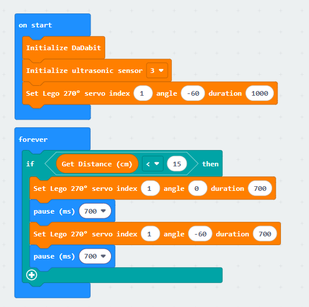

4. Device Pairing and Program Downloading

   1) **Wiring**: Connect the micro:bit board to the computer USB port using a data cable.

   2) **Device Pairing**:

      - When connecting the device for the first time, pair the device. Once connected, the browser will remember the connected device. Click the **...** button next to **Download**, and select **Connect Device** from the options.

        

      - Click **Next** in the pop-up window.

        

      - Click **Pair** and select the device shown in the pop-up window.

        

        

        

   3) **Download**:

      - After the device is successfully connected, click **Download** to download the program. During the download process, the yellow indicator light near the USB port on the micro:bit board will flash rapidly. Do not disconnect or move the data cable at this time to prevent download failure.

        

      - Once the download is complete, the indicator light will stop flashing and remain on, and a completion prompt will appear on the main programming interface.

        

   4) **Powering On**: The micro:bit automatically runs the program when powered on to test the functionality.

#### 5.2.1.5 Demo

---

### 5.2.2 Rotating Rangefinder

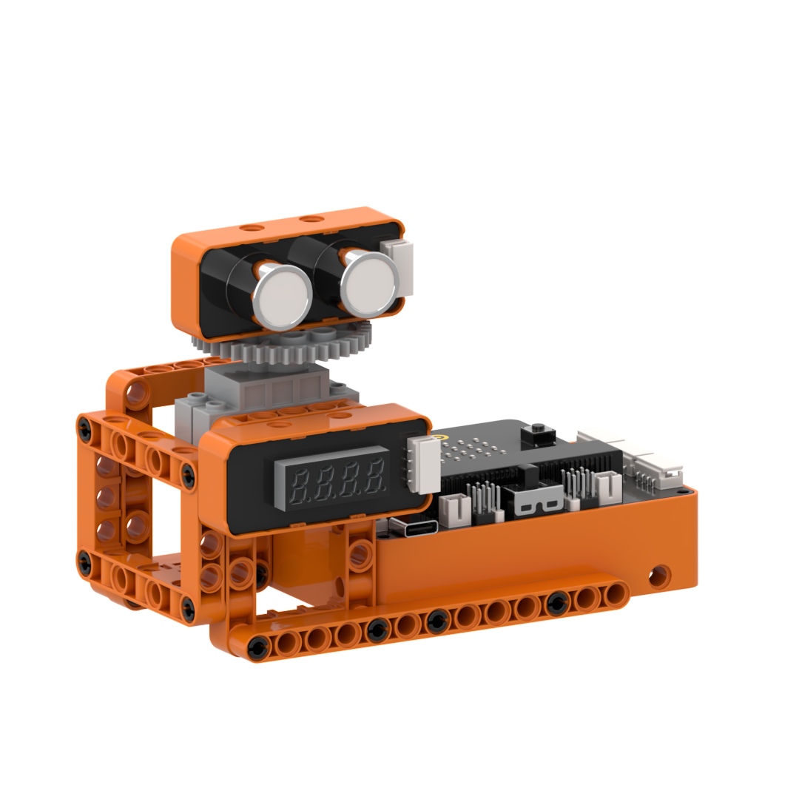

#### 5.2.2.1 Learning Objectives

1. Understand the working principles of the servo and ultrasonic sensor, and master the method of controlling the servo steering and displaying the distance in real time through buttons on the micro:bit.
2. Understand the control logic of button A turning left and button B turning right to achieve a rotating distance measurement.

#### 5.2.2.2 Assembly Guide

For the building steps of the rotating rangefinder, refer to the building guide in [6_Assembly_Manual]() for **Rotating Rangefinder**.

#### 5.2.2.3 Wiring Guide

* Connect the ultrasonic sensor to port P3 on the micro:bit expansion board.

* Connect the digital tube module to port P4 on the micro:bit expansion board.

* Connect the block servo to port S1 on the micro:bit expansion board, ensuring the orange signal wire is connected to the white pin of S1.

As shown below:

> [!NOTE]
>
> **When conducting a program related to the block servo for the first time, remove the ultrasonic sensor from the servo first and upload the program in this section to the micro:bit. Then turn on the power switch of the micro:bit expansion board and wait for the block servo to rotate to the initial position of 0 degrees before reinstalling the ultrasonic sensor. This step can be skipped if the servo reset program has been used before.**

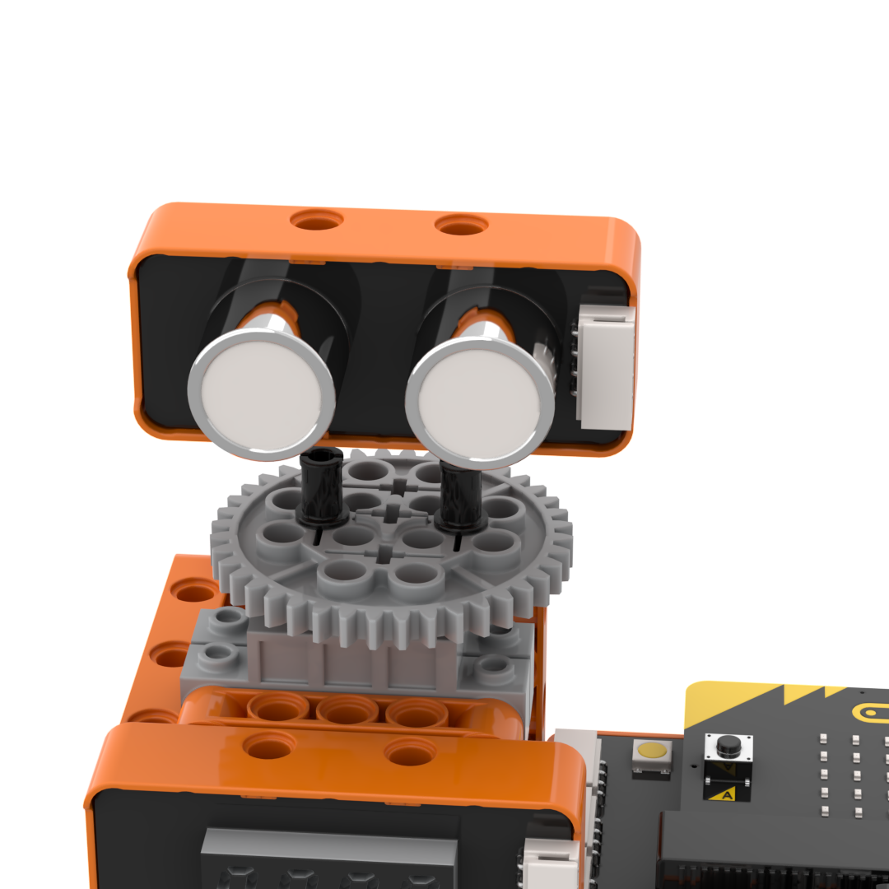

#### 5.2.2.4 Programming

1. Add the Extension Library:

   - Click **Extensions**.

     

   - Search for **https://github.com/HiwonderK12/DaDabitV2** in **Extensions** and add **dadabitv2**.

     

2. Principles:

   - The micro:bit expansion board sends control signals to rotate the servo driving the ultrasonic sensor left and right, achieving multi-angle distance detection.
   - When button A is pressed, the micro:bit sends a left-turn signal, and the servo drives the sensor to rotate left. When button B is pressed, it sends a right-turn signal, and the servo drives the sensor to rotate right, while showing the detected distance in real time.

3. Programming:

   - Block Overview

     | Block | Category | Description |
     | :---: | :---: | :---: |
     |  |  | A conditional judgment block that detects the pressed state of buttons and decides subsequent execution logic. |
     |  |  | Controls the specified servo to rotate to the target angle within a set time. |
     |  |  | Displays the specified numeric content on the digital tube module. |
     |  |  | Reads the distance data from the ultrasonic sensor. |

   - Block Combination

     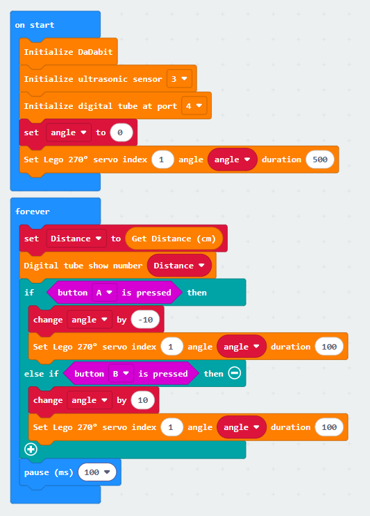

4. Device Pairing and Program Downloading

   1) **Wiring**: Connect the micro:bit board to the computer USB port using a data cable.

   2) **Device Pairing**:

      - When connecting the device for the first time, pair the device. Once connected, the browser will remember the connected device. Click the **...** button next to **Download**, and select **Connect Device** from the options.

        

      - Click **Next** in the pop-up window.

        

      - Click **Pair** and select the device shown in the pop-up window.

        

        

        

   3) **Download**:

      - After the device is successfully connected, click **Download** to download the program. During the download process, the yellow indicator light near the USB port on the micro:bit board will flash rapidly. Do not disconnect or move the data cable at this time to prevent download failure.

        

      - Once the download is complete, the indicator light will stop flashing and remain on, and a completion prompt will appear on the main programming interface.

        

   4) **Powering On**: The micro:bit automatically runs the program when powered on to test the functionality.

#### 5.2.2.5 Demo

---

### 5.2.3 Digital Thermometer

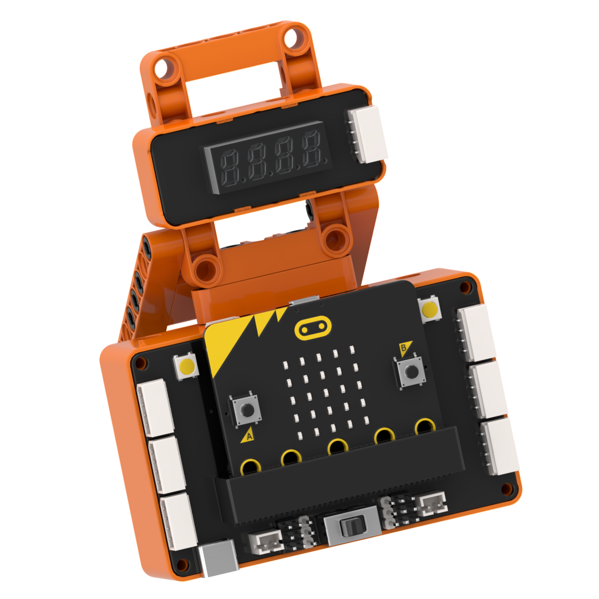

#### 5.2.3.1 Learning Objectives

1. Understand the working principle of the temperature sensor and master the method of reading and displaying environmental data on the micro:bit.
2. Understand the control logic of displaying temperature through the digital tube module to achieve an environmental monitoring effect.

#### 5.2.3.2 Assembly Guide

For the building steps of the digital thermometer, refer to the building guide in [6_Assembly_Manual]() for **Digital Thermometer**.

#### 5.2.3.3 Wiring Guide

Connect the digital tube module to port P6 on the micro:bit expansion board.

As shown below:

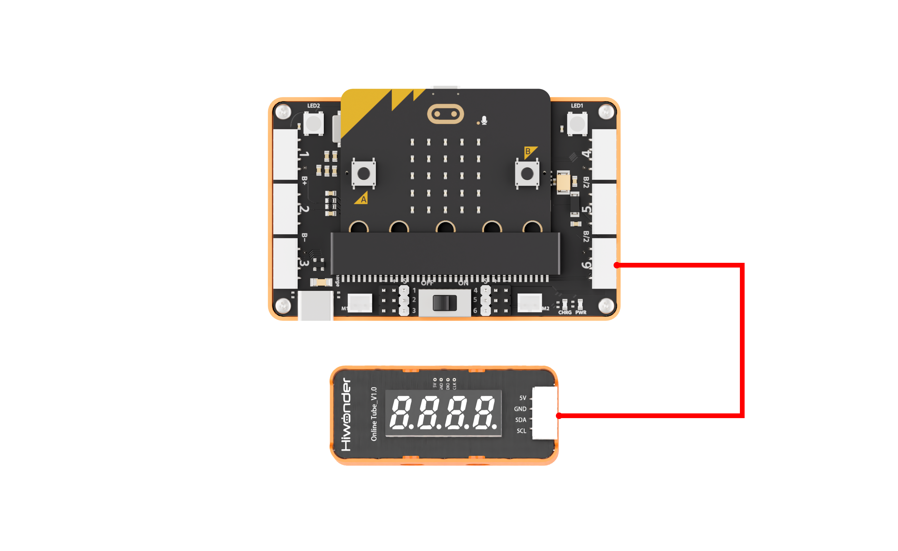

#### 5.2.3.4 Programming

1. Add the Extension Library:

   - Click **Extensions**.

     

   - Search for **https://github.com/HiwonderK12/DaDabitV2** in **Extensions** and add **dadabitv2**.

     

2. Principles:

   - The micro:bit expansion board sends control signals to read the data collected by the temperature sensor, realizing real-time measurement and processing of ambient temperature.
   - The micro:bit displays the current environmental temperature value on the digital tube module.

3. Programming:

   - Block Overview

     | Block | Category | Description |
     | :---: | :---: | :---: |
     |  |  | Reads the temperature data from the micro:bit in degrees Celsius. |
     | 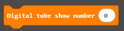 |  | Displays the specified numeric content on the digital tube module. |

   - Block Combination

     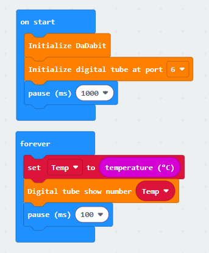

4. Device Pairing and Program Downloading

   1) **Wiring**: Connect the micro:bit board to the computer USB port using a data cable.

   2) **Device Pairing**:

      - When connecting the device for the first time, pair the device. Once connected, the browser will remember the connected device. Click the **...** button next to **Download**, and select **Connect Device** from the options.

        

      - Click **Next** in the pop-up window.

        

      - Click **Pair** and select the device shown in the pop-up window.

        

        

        

   3) **Download**:

      - After the device is successfully connected, click **Download** to download the program. During the download process, the yellow indicator light near the USB port on the micro:bit board will flash rapidly. Do not disconnect or move the data cable at this time to prevent download failure.

        

      - Once the download is complete, the indicator light will stop flashing and remain on, and a completion prompt will appear on the main programming interface.

        

   4) **Powering On**: The micro:bit automatically runs the program when powered on to test the functionality.

#### 5.2.3.5 Demo

---

### 5.2.4 Basketball Arcade

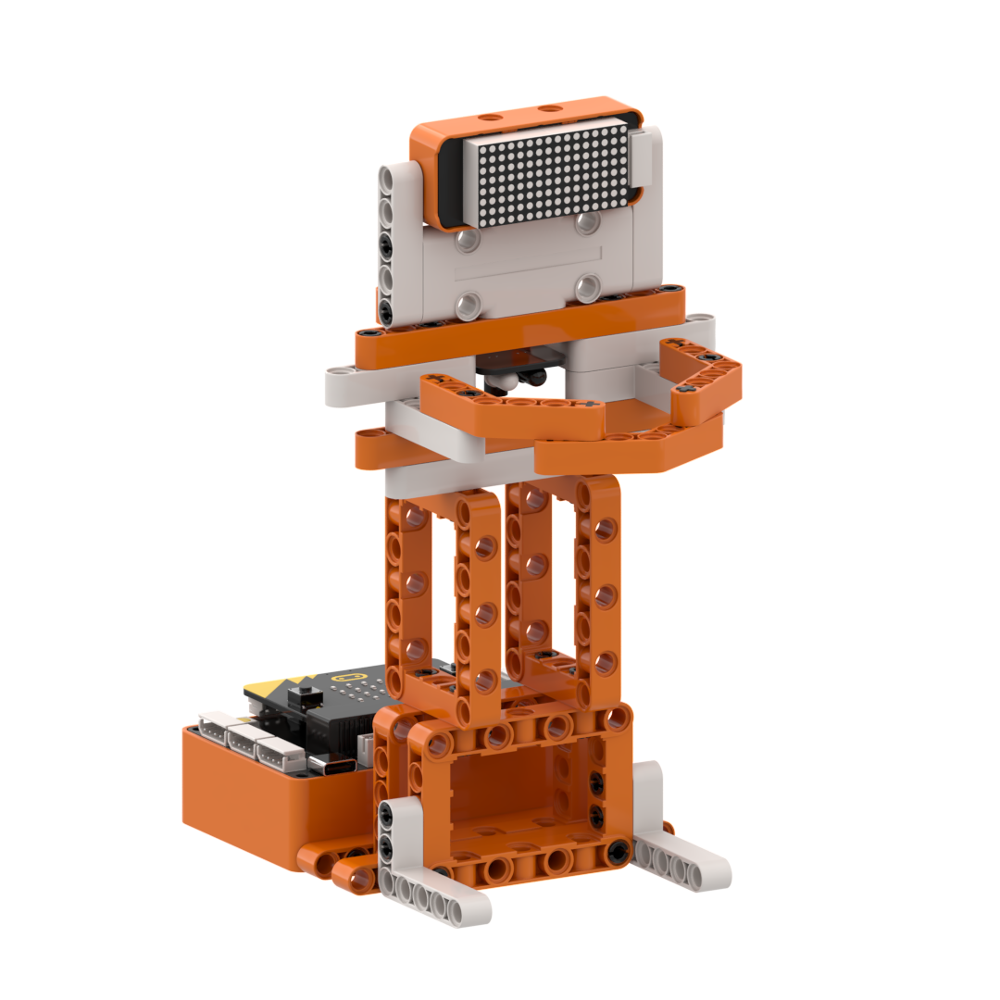

#### 5.2.4.1 Learning Objectives

1. Understand the working principle of the infrared sensor and master the method of counting automatically through infrared signals on the micro:bit.
2. Understand the control logic of incrementing the score by 1 for each successful shot to achieve a basketball scoring effect.

#### 5.2.4.2 Assembly Guide

For the building steps of the basketball arcade, refer to the building guide in [6_Assembly_Manual]() for **Basketball Arcade**.

#### 5.2.4.3 Wiring Guide

* Connect the infrared obstacle avoidance sensor to port P1 on the micro:bit expansion board.

* Connect the digital tube module to port P6 on the micro:bit expansion board.

As shown below:

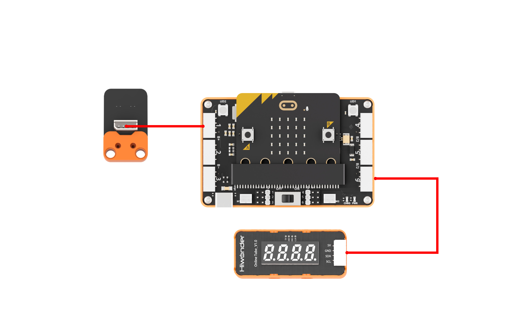

#### 5.2.4.4 Programming

1. Add the Extension Library:

   - Click **Extensions**.

     

   - Search for **https://github.com/HiwonderK12/DaDabitV2** in **Extensions** and add **dadabitv2**.

     

2. Principles:

   - The micro:bit expansion board sends control signals to receive detection signals from the infrared sensor, monitoring the status of the basketball entry in real time.
   - When the infrared sensor detects an object passing through, the micro:bit automatically increments the score and displays it in real time, achieving an automatic basketball scoring effect.

3. Programming:

   - Block Overview

     | Block | Category | Description |
     | :---: | :---: | :---: |
     | 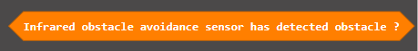 |  | Reads the detection state of the infrared obstacle avoidance sensor. |
     |  |  | Displays the specified numeric content on the digital tube module. |

   - Block Combination

     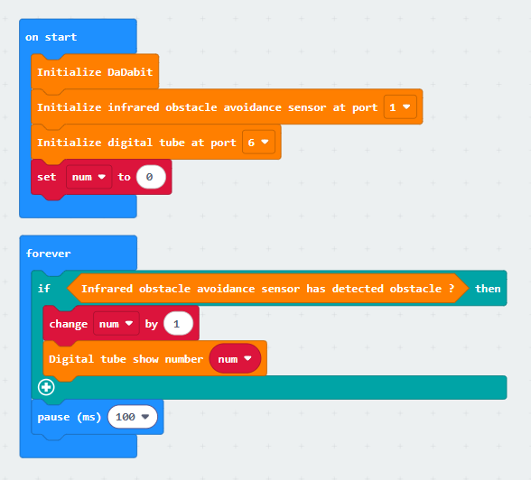

4. Device Pairing and Program Downloading

   1) **Wiring**: Connect the micro:bit board to the computer USB port using a data cable.

   2) **Device Pairing**:

      - When connecting the device for the first time, pair the device. Once connected, the browser will remember the connected device. Click the **...** button next to **Download**, and select **Connect Device** from the options.

        

      - Click **Next** in the pop-up window.

        

      - Click **Pair** and select the device shown in the pop-up window.

        

        

        

   3) **Download**:

      - After the device is successfully connected, click **Download** to download the program. During the download process, the yellow indicator light near the USB port on the micro:bit board will flash rapidly. Do not disconnect or move the data cable at this time to prevent download failure.

        

      - Once the download is complete, the indicator light will stop flashing and remain on, and a completion prompt will appear on the main programming interface.

        

   4) **Powering On**: The micro:bit automatically runs the program when powered on to test the functionality.

#### 5.2.4.5 Demo

---

### 5.2.5 Golf Robot

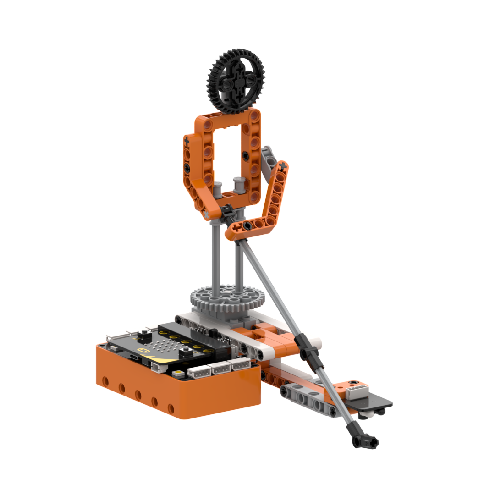

#### 5.2.5.1 Learning Objectives

1. Understand the working principles of the servo and infrared sensor, and master the method of controlling servo movements through detection signals on the micro:bit.
2. Understand the control logic of target detection, triggering a hit to achieve a golf robot simulation effect.

#### 5.2.5.2 Assembly Guide

For the building steps of the golf robot, refer to the building guide in [6_Assembly_Manual]() for **Golf Robot**.

#### 5.2.5.3 Wiring Guide

* Connect the infrared sensor to port P1 on the micro:bit expansion board.

* Connect the block servo to port S1 on the micro:bit expansion board, ensuring the orange signal wire is connected to the white pin of S1.

As shown below:

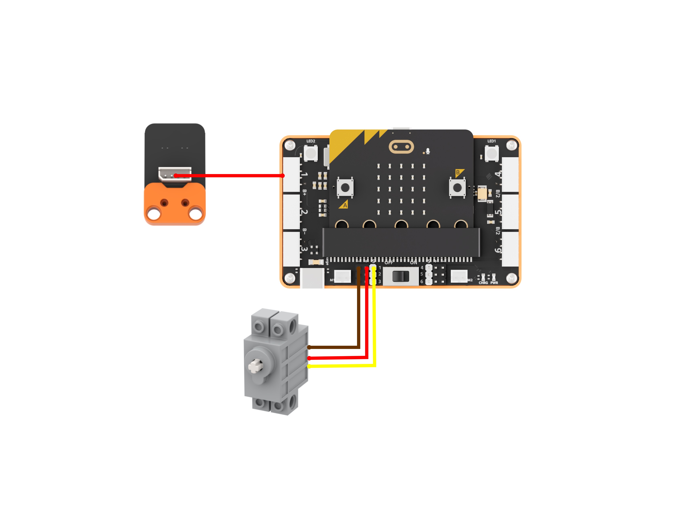

> [!NOTE]
>
> **When conducting a program related to the block servo for the first time, remove the figure from the servo first and upload the program in this section to the micro:bit. Then turn on the power switch of the micro:bit expansion board and wait for the block servo to rotate to the initial position of 10 degrees before reinstalling the figure. This step can be skipped if the servo reset program has been used before.**

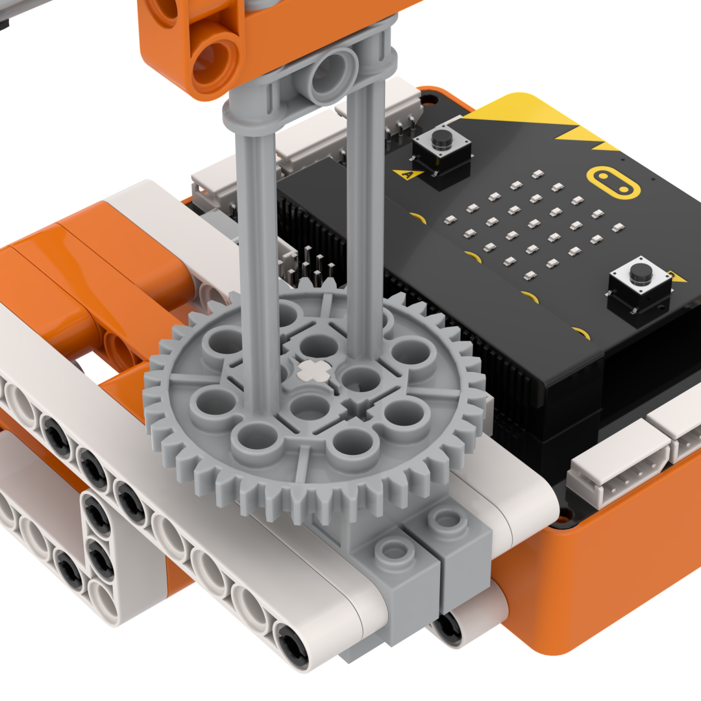

#### 5.2.5.4 Programming

1. Add the Extension Library:

   - Click **Extensions**.

     

   - Search for **https://github.com/HiwonderK12/DaDabitV2** in **Extensions** and add **dadabitv2**.

     

2. Principles:

   - The micro:bit expansion board sends control signals to rotate the servo. The servo drives the golf club structure to swing, simulating hitting a ball.
   - When the infrared sensor detects a target object, the micro:bit sends an action signal, and the servo drives the club to complete the swing and hit the ball.

3. Programming:

   - Block Overview

     | Block | Category | Description |
     | :---: | :---: | :---: |
     |  |  | Reads the detection state of the infrared obstacle avoidance sensor. |
     |  |  | Controls the specified servo to rotate to the target angle within a set time. |

   - Block Combination

     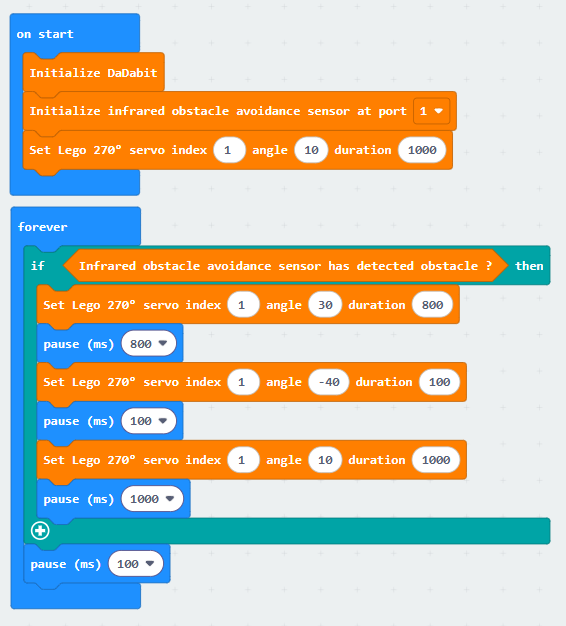

4. Device Pairing and Program Downloading

   1) **Wiring**: Connect the micro:bit board to the computer USB port using a data cable.

   2) **Device Pairing**:

      - When connecting the device for the first time, pair the device. Once connected, the browser will remember the connected device. Click the **...** button next to **Download**, and select **Connect Device** from the options.

        

      - Click **Next** in the pop-up window.

        

      - Click **Pair** and select the device shown in the pop-up window.

        

        

        

   3) **Download**:

      - After the device is successfully connected, click **Download** to download the program. During the download process, the yellow indicator light near the USB port on the micro:bit board will flash rapidly. Do not disconnect or move the data cable at this time to prevent download failure.

        

      - Once the download is complete, the indicator light will stop flashing and remain on, and a completion prompt will appear on the main programming interface.

        

   4) **Powering On**: The micro:bit automatically runs the program when powered on to test the functionality.

#### 5.2.5.5 Demo

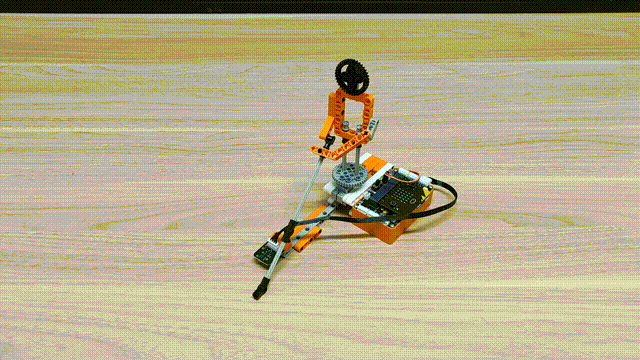

---

### 5.2.6 Unicycle Rider

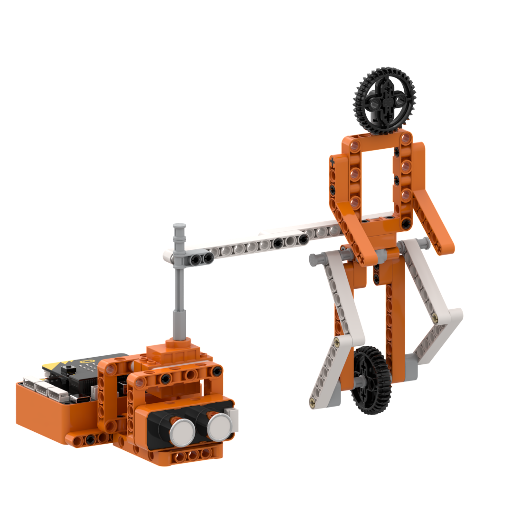

#### 5.2.6.1 Learning Objectives

1. Understand the working principles of the motor and ultrasonic sensor, and master the method of controlling the motor starting, stopping, and counting through buttons on the micro:bit.
2. Understand the control logic of button A starting and button B stopping to achieve unicycle rotation and count display.

#### 5.2.6.2 Assembly Guide

For the building steps of the unicycle rider, refer to the building guide in [6_Assembly_Manual]() for **Unicycle Rider**.

#### 5.2.6.3 Wiring Guide

* Connect the ultrasonic sensor to port P3 on the micro:bit expansion board.

* Connect the block motor to port S1 on the micro:bit expansion board, ensuring the orange signal wire is connected to the white pin of S1.

As shown below:

#### 5.2.6.4 Programming

1. Add the Extension Library:

   - Click **Extensions**.

     

   - Search for **https://github.com/HiwonderK12/DaDabitV2** in **Extensions** and add **dadabitv2**.

     

2. Principles:

   - The micro:bit expansion board sends control signals to operate the motor. The motor drives the unicycle rider structure to rotate, achieving a spinning movement effect.
   - When button A is pressed, the micro:bit sends a start signal, and the motor drives the figure to rotate continuously. When button B is pressed, it sends a stop signal, and the motor stops rotating immediately.

3. Programming:

   - Block Overview

     | Block | Category | Description |
     | :---: | :---: | :---: |
     |  |  | Displays the specified numeric content on the device screen. |
     |  |  | Clears the display content on the device screen. |
     |  |  | Detects the pressed state of button A or button B to trigger actions. |
     |  |  | Reads the distance data from the ultrasonic sensor. |
     |  |  | Controls the specified motor to run in a set direction and speed. |

   - Block Combination

     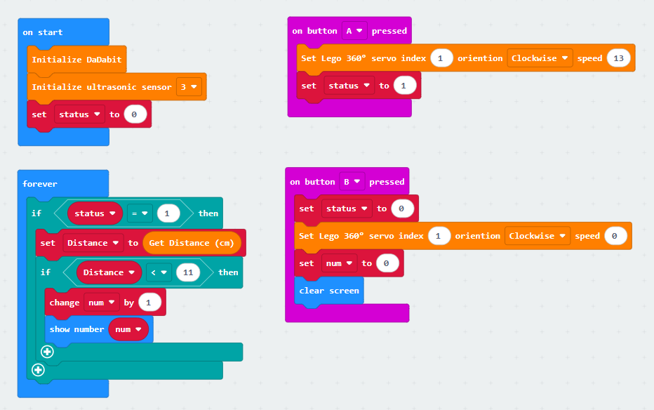

4. Device Pairing and Program Downloading

   1) **Wiring**: Connect the micro:bit board to the computer USB port using a data cable.

   2) **Device Pairing**:

      - When connecting the device for the first time, pair the device. Once connected, the browser will remember the connected device. Click the **...** button next to **Download**, and select **Connect Device** from the options.

        

      - Click **Next** in the pop-up window.

        

      - Click **Pair** and select the device shown in the pop-up window.

        

        

        

   3) **Download**:

      - After the device is successfully connected, click **Download** to download the program. During the download process, the yellow indicator light near the USB port on the micro:bit board will flash rapidly. Do not disconnect or move the data cable at this time to prevent download failure.

        

      - Once the download is complete, the indicator light will stop flashing and remain on, and a completion prompt will appear on the main programming interface.

        

   4) **Powering On**: The micro:bit automatically runs the program when powered on to test the functionality.

#### 5.2.6.5 Demo

---

### 5.2.7 Jade Rabbit

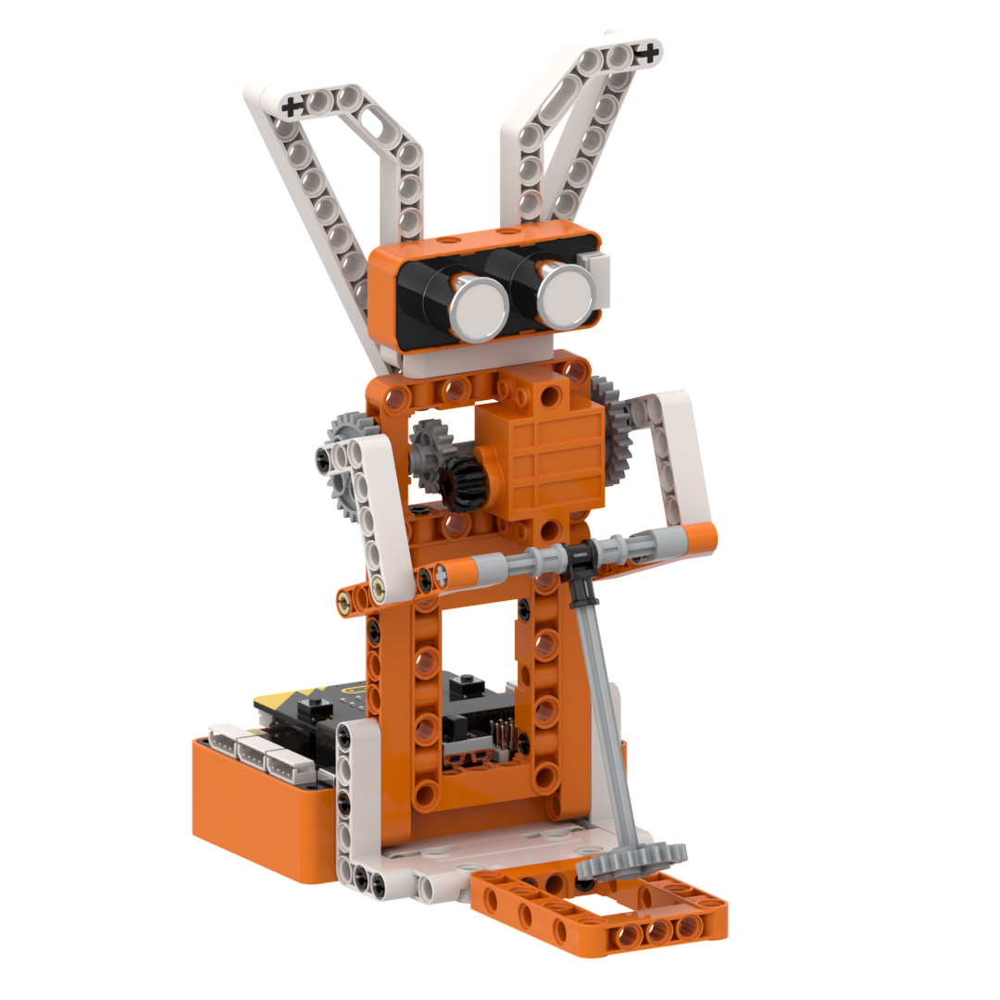

#### 5.2.7.1 Learning Objectives

1. Understand the drive principle of the DC motor and master the method of controlling motor starting and stopping through buttons on the micro:bit.
2. Understand the control logic of button A starting and button B stopping to simulate the pounding motion.

#### 5.2.7.2 Assembly Guide

For the building steps of the Jade Rabbit, refer to the building guide in [6_Assembly_Manual]() for **Jade Rabbit**.

#### 5.2.7.3 Wiring Guide

Connect the block motor to port S1 on the micro:bit expansion board, ensuring the orange signal wire is connected to the white pin of S1.

As shown below:

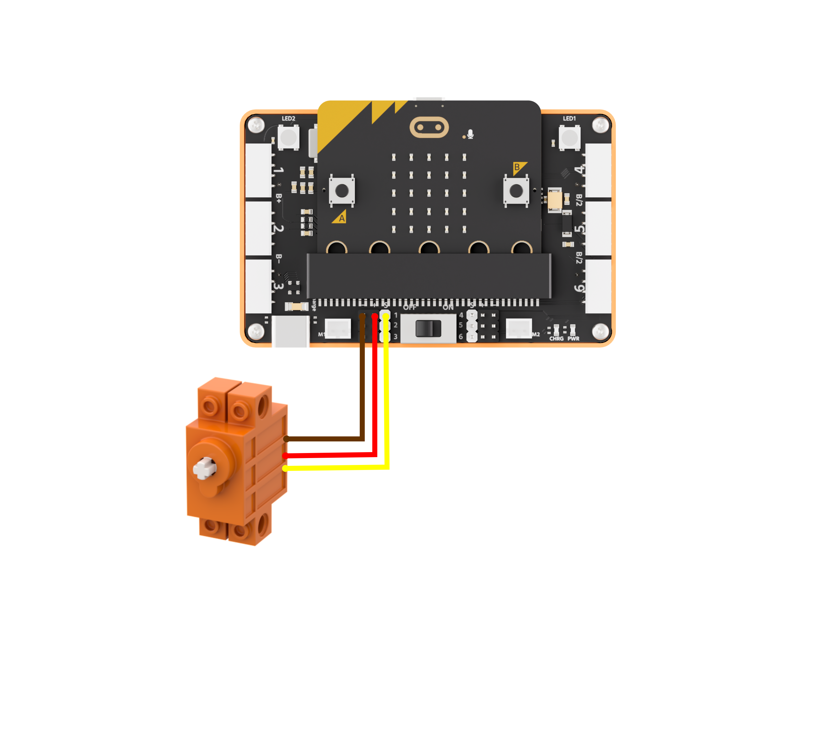

#### 5.2.7.4 Programming

1. Add the Extension Library:

   - Click **Extensions**.

     

   - Search for **https://github.com/HiwonderK12/DaDabitV2** in **Extensions** and add **dadabitv2**.

     

2. Principles:

   - The micro:bit expansion board sends control signals to operate the motor. The motor drives the rabbit pounding structure to move back and forth, simulating the pounding motion.
   - When button A is pressed, the micro:bit sends a start signal, and the motor runs continuously to complete the reciprocating pounding motion. When button B is pressed, it sends a stop signal, and the motor stops working.

3. Programming:

   - Block Overview

     | Block | Category | Description |
     | :---: | :---: | :---: |
     | 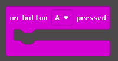 |  | Detects the pressed state of button A or button B to trigger actions. |
     |  |  | Controls the specified motor to rotate continuously in a set direction and speed. |

   - Block Combination

     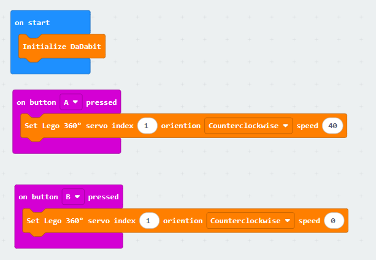

4. Device Pairing and Program Downloading

   1) **Wiring**: Connect the micro:bit board to the computer USB port using a data cable.

   2) **Device Pairing**:

      - When connecting the device for the first time, pair the device. Once connected, the browser will remember the connected device. Click the **...** button next to **Download**, and select **Connect Device** from the options.

        

      - Click **Next** in the pop-up window.

        

      - Click **Pair** and select the device shown in the pop-up window.

        

        

        

   3) **Download**:

      - After the device is successfully connected, click **Download** to download the program. During the download process, the yellow indicator light near the USB port on the micro:bit board will flash rapidly. Do not disconnect or move the data cable at this time to prevent download failure.

        

      - Once the download is complete, the indicator light will stop flashing and remain on, and a completion prompt will appear on the main programming interface.

        

   4) **Powering On**: The micro:bit automatically runs the program when powered on to test the functionality.

#### 5.2.7.5 Demo

---

### 5.2.8 Fluttering Butterfly

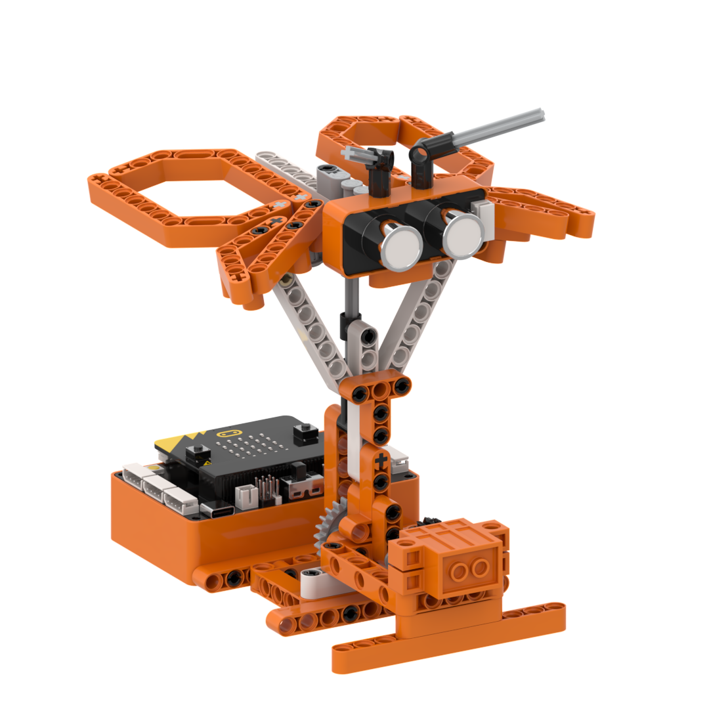

#### 5.2.8.1 Learning Objectives

1. Understand the working principles of the motor and ultrasonic sensor, and master the method of controlling motor movements through sensing on the micro:bit.
2. Understand the control logic of flapping wings when someone approaches to achieve a fluttering butterfly interactive effect.

#### 5.2.8.2 Assembly Guide

For the building steps of the fluttering butterfly, refer to the building guide in [6_Assembly_Manual]() for **Fluttering Butterfly**.

#### 5.2.8.3 Wiring Guide

* Connect the ultrasonic sensor to port P3 on the micro:bit expansion board.

* Connect the block motor to port S1 on the micro:bit expansion board, ensuring the orange signal wire is connected to the white pin of S1.

As shown below:

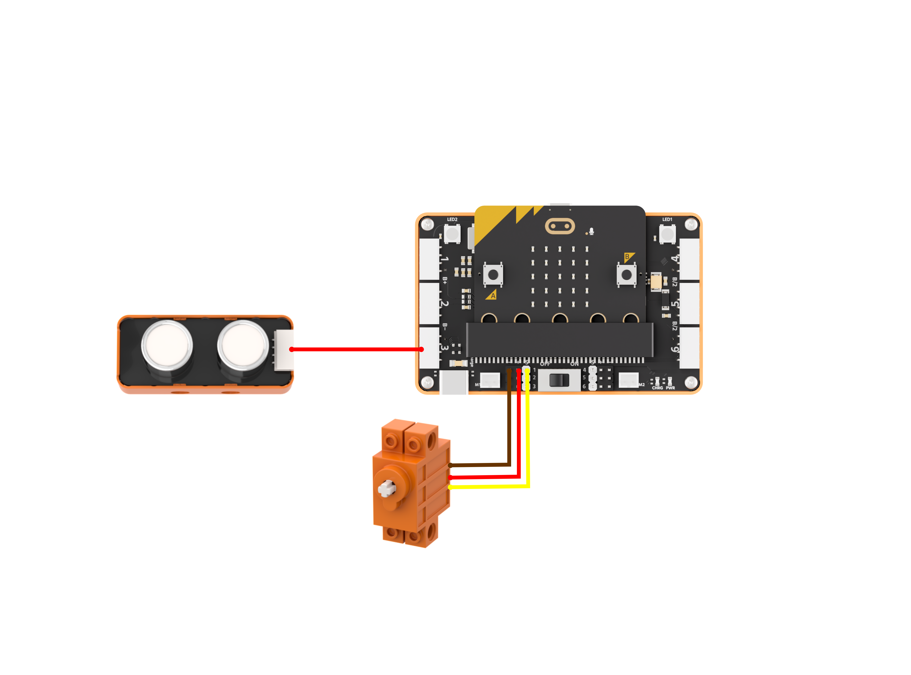

#### 5.2.8.4 Programming

1. Add the Extension Library:

   - Click **Extensions**.

     

   - Search for **https://github.com/HiwonderK12/DaDabitV2** in **Extensions** and add **dadabitv2**.

     

2. Principles:

   - The micro:bit expansion board sends control signals to operate the motor. The motor drives the wing structure of the fluttering butterfly to flap back and forth, simulating flight.
   - When the ultrasonic sensor detects a distance less than 15 cm, the micro:bit sends a start signal, and the motor drives the wings to flap continuously. When the signal disappears, the motor stops running.

3. Programming:

   - Block Overview

     | Block | Category | Description |
     | :---: | :---: | :---: |
     |  |  | Controls the specified motor to run in a set direction and speed. |
     |  |  | Reads the distance data collected by the ultrasonic sensor in centimeters. |

   - Block Combination

     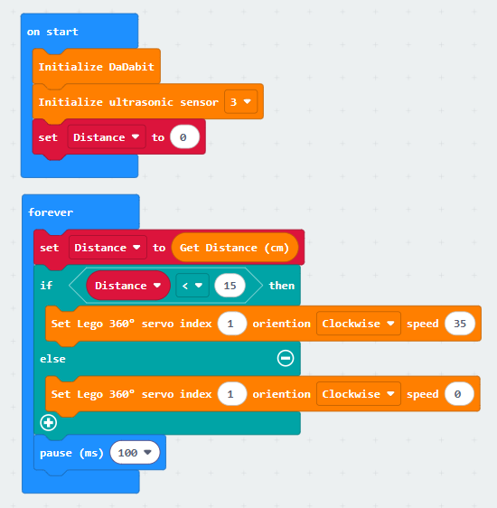

4. Device Pairing and Program Downloading

   1) **Wiring**: Connect the micro:bit board to the computer USB port using a data cable.

   2) **Device Pairing**:

      - When connecting the device for the first time, pair the device. Once connected, the browser will remember the connected device. Click the **...** button next to **Download**, and select **Connect Device** from the options.

        

      - Click **Next** in the pop-up window.

        

      - Click **Pair** and select the device shown in the pop-up window.

        

        

        

   3) **Download**:

      - After the device is successfully connected, click **Download** to download the program. During the download process, the yellow indicator light near the USB port on the micro:bit board will flash rapidly. Do not disconnect or move the data cable at this time to prevent download failure.

        

      - Once the download is complete, the indicator light will stop flashing and remain on, and a completion prompt will appear on the main programming interface.

        

   4) **Powering On**: The micro:bit automatically runs the program when powered on to test the functionality.

#### 5.2.8.5 Demo

---

### 5.2.9 Multi-Legged Bot

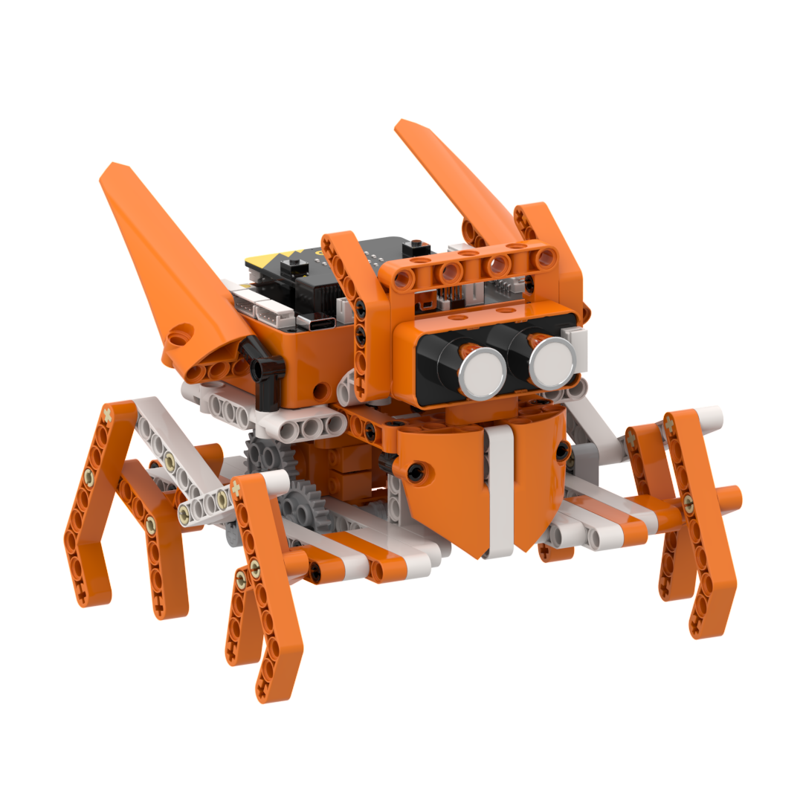

#### 5.2.9.1 Learning Objectives

1. Understand the working principles of dual motors and the ultrasonic sensor, and master the method of automatic obstacle avoidance walking on the micro:bit.
2. Understand the control logic of turning left when encountering obstacles and moving forward when there are no obstacles to achieve automatic walking.

#### 5.2.9.2 Assembly Guide

For the building steps of the multi-legged bot, refer to the building guide in [6_Assembly_Manual]() for **Multi-Legged Bot**.

#### 5.2.9.3 Wiring Guide

* Connect the ultrasonic sensor to port P6 on the micro:bit expansion board.

* Connect the left block motor to port S1 on the micro:bit expansion board, and the right block motor to port S2 on the micro:bit expansion board, ensuring the orange signal wires are connected to the white pins of S1 and S2, respectively.

As shown below:

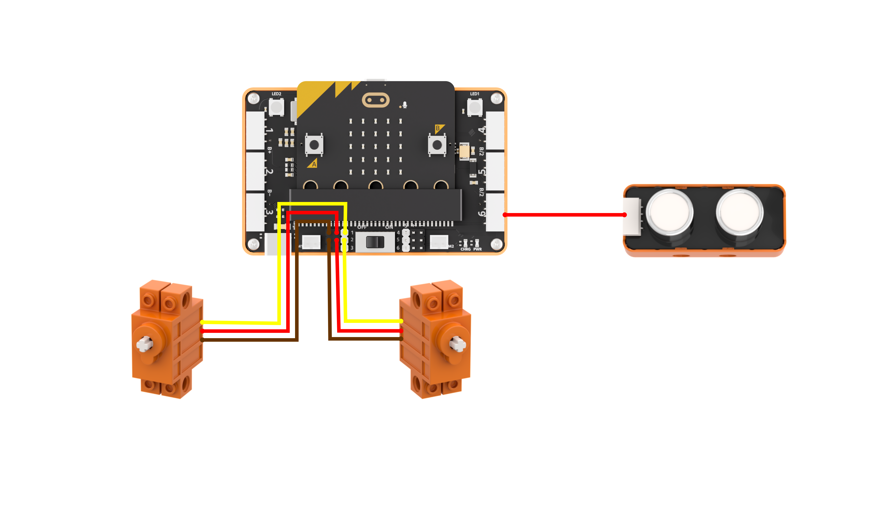

#### 5.2.9.4 Programming

1. Add the Extension Library:

   - Click **Extensions**.

     

   - Search for **https://github.com/HiwonderK12/DaDabitV2** in **Extensions** and add **dadabitv2**.

     

2. Principles:

   - The micro:bit expansion board reads the distance value of the ultrasonic sensor. When the distance is less than 15 cm, the robot turns left to avoid obstacles. When the distance is greater than 15 cm, it moves forward, achieving automatic obstacle avoidance.
   - The initial state is moving forward. When an obstacle is detected at a distance less than 15 cm, the micro:bit sends a turning signal, and the motors adjust to turn left. Once the obstacle is cleared, the motors resume forward rotation.

3. Programming:

   - Block Overview

     | Block | Category | Description |
     | :---: | :---: | :---: |
     |  |  | Conditional judgment block that decides subsequent execution logic based on the distance variable value. |
     |  |  | Reads the distance data from the ultrasonic sensor. |
     |  |  | Controls the specified motor to run in a set direction and speed. |

   - Block Combination

     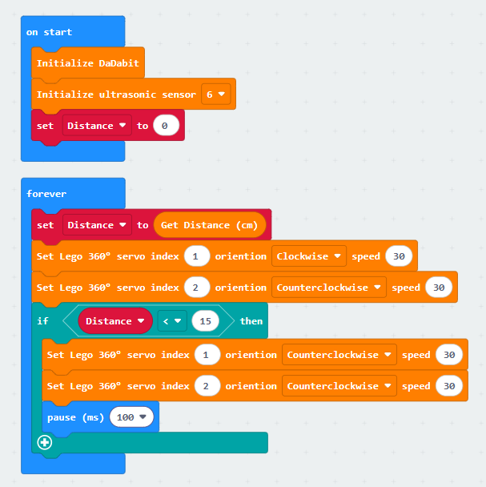

4. Device Pairing and Program Downloading

   1) **Wiring**: Connect the micro:bit board to the computer USB port using a data cable.

   2) **Device Pairing**:

      - When connecting the device for the first time, pair the device. Once connected, the browser will remember the connected device. Click the **...** button next to **Download**, and select **Connect Device** from the options.

        

      - Click **Next** in the pop-up window.

        

      - Click **Pair** and select the device shown in the pop-up window.

        

        

        

   3) **Download**:

      - After the device is successfully connected, click **Download** to download the program. During the download process, the yellow indicator light near the USB port on the micro:bit board will flash rapidly. Do not disconnect or move the data cable at this time to prevent download failure.

        

      - Once the download is complete, the indicator light will stop flashing and remain on, and a completion prompt will appear on the main programming interface.

        

   4) **Powering On**: The micro:bit automatically runs the program when powered on to test the functionality.

#### 5.2.9.5 Demo

---

### 5.2.10 F1 Race Car

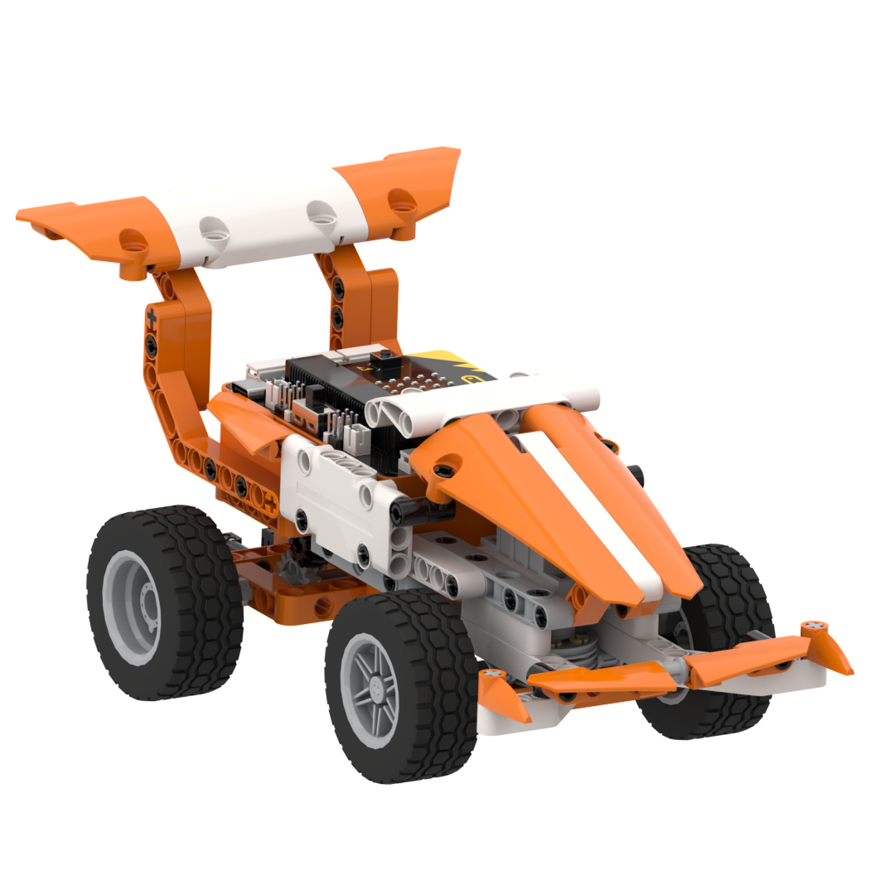

#### 5.2.10.1 Learning Objectives

1. Understand the working principles of the motor, servo, and line follower sensor, and master the method of automatic line-following control on the micro:bit.
2. Understand the control logic of reversing into a parking space along a path to achieve an automatic parking effect.

#### 5.2.10.2 Assembly Guide

For the building steps of the F1 Race Car, refer to the building guide in [6_Assembly_Manual]() for **F1 Race Car**.

#### 5.2.10.3 Wiring Guide

* Connect the 4-channel line follower sensor to port P3 on the micro:bit expansion board.

* Connect the block motor to port S1 on the micro:bit expansion board, ensuring the orange signal wire is connected to the white pin of S1.

* Connect the block servo to port S2 on the micro:bit expansion board, ensuring the orange signal wire is connected to the white pin of S2.

As shown below:

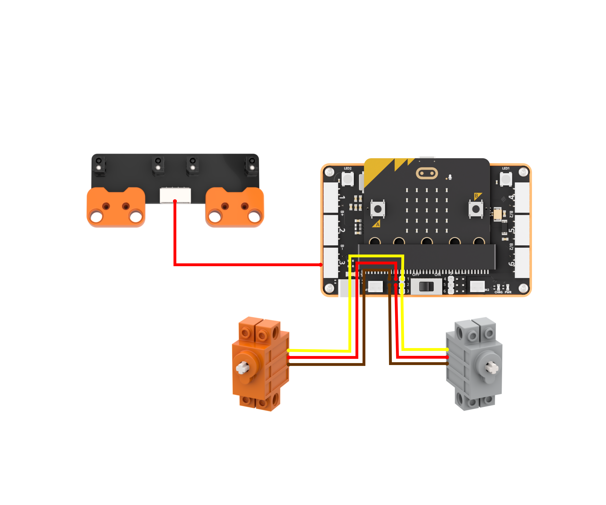

> [!NOTE]
>
> **When conducting a program related to the block servo for the first time, remove the tire from the servo first and upload the program in this section to the micro:bit. Then turn on the power switch of the micro:bit expansion board and wait for the block servo to rotate to the initial position of 0 degrees before reinstalling the wheels. This step can be skipped if the servo reset program has been used before.**

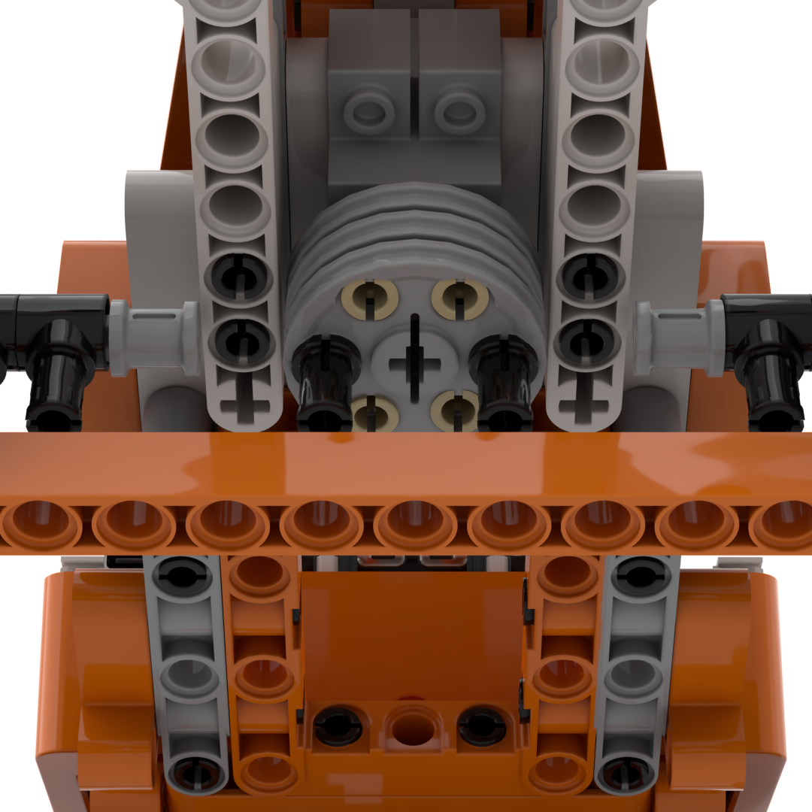

#### 5.2.10.4 Programming

1. Add the Extension Library:

   - Click **Extensions**.

     

   - Search for **https://github.com/HiwonderK12/DaDabitV2** in **Extensions** and add **dadabitv2**.

     

2. Principles:

   - The micro:bit expansion board sends control signals to coordinate the motor and servo, driving the car and steering it to follow the path.
   - When the line follower sensor detects a change in the track, the micro:bit sends adjustment signals to control the motor speed and servo steering, guiding the racing car to reverse into a parking space.

3. Programming:

   - Block Overview

     | Block | Category | Description |
     | :---: | :---: | :---: |
     |  |  | Detects the pressed state of button A or button B to trigger actions. |
     | 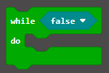 |  | Executes internal program blocks when the specified condition is false. |
     |  |  | Performs a logical NOT operation on the input condition to invert its Boolean value. |
     |  |  | Controls the specified servo to rotate to the target angle within a set time. |
     |  |  | Controls the specified motor to run in a set direction and speed. |
     |  |  | Reads the detection state of the 4-channel line follower sensor. |

   - Block Combination

     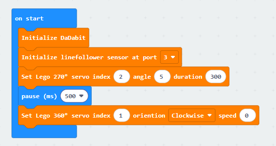

     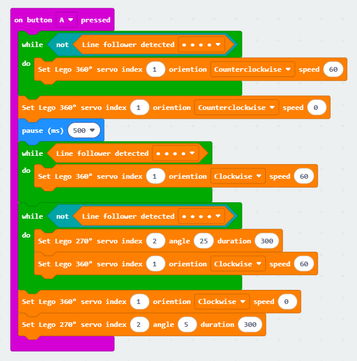

4. Device Pairing and Program Downloading

   1) **Wiring**: Connect the micro:bit board to the computer USB port using a data cable.

   2) **Device Pairing**:

      - When connecting the device for the first time, pair the device. Once connected, the browser will remember the connected device. Click the **...** button next to **Download**, and select **Connect Device** from the options.

        

      - Click **Next** in the pop-up window.

        

      - Click **Pair** and select the device shown in the pop-up window.

        

        

        

   3) **Download**:

      - After the device is successfully connected, click **Download** to download the program. During the download process, the yellow indicator light near the USB port on the micro:bit board will flash rapidly. Do not disconnect or move the data cable at this time to prevent download failure.

        

      - Once the download is complete, the indicator light will stop flashing and remain on, and a completion prompt will appear on the main programming interface.

        

   4) **Powering On**: The micro:bit automatically runs the program when powered on to test the functionality.

#### 5.2.10.5 Demo

---

### 5.2.11 Mecha Master

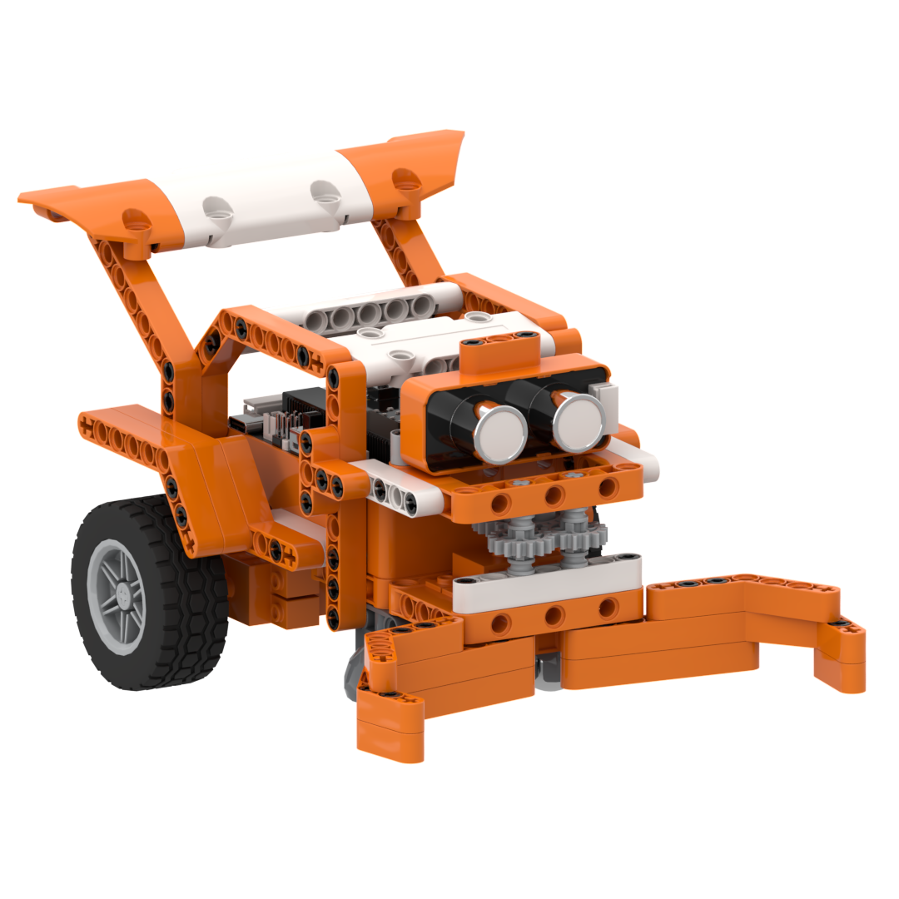

#### 5.2.11.1 Learning Objectives

1. Understand the working principles of the servo, dual motors, and ultrasonic sensor, and master the method of controlling grab movements through distance on the micro:bit.
2. Understand the control logic of automatic grabbing at a close distance to achieve a mecha master grabbing effect.

#### 5.2.11.2 Assembly Guide

For the building steps of the mecha master, refer to the building guide in [6_Assembly_Manual]() for **Mecha Master**.

#### 5.2.11.3 Wiring Guide

* Connect the ultrasonic sensor to port P3 on the micro:bit expansion board.

* Connect the left block motor to port S1 on the micro:bit expansion board, and the right block motor to port S2 on the micro:bit expansion board, ensuring the orange signal wires are connected to the white pins of S1 and S2 respectively.

* Connect the block servo to port S3 on the micro:bit expansion board, ensuring the orange signal wire is connected to the white pin of S3.

As shown below:

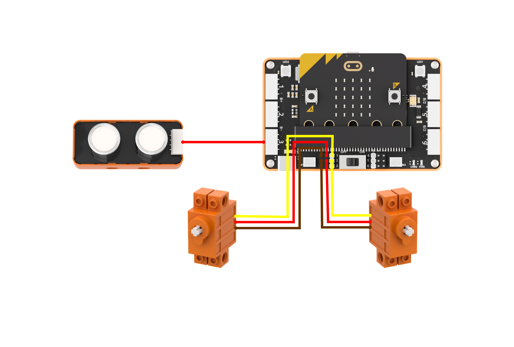

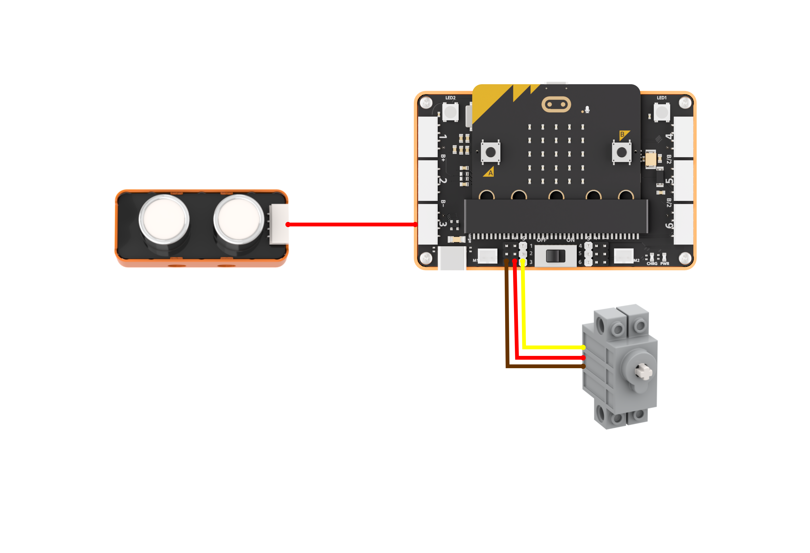

> [!NOTE]
>
> **When conducting a program related to the block servo for the first time, remove the gear from the servo first and upload the program in this section to the micro:bit. Then turn on the power switch of the micro:bit expansion board and wait for the block servo to rotate to the initial position of 0 degrees before reinstalling the servo gear. This step can be skipped if the servo reset program has been used before.**

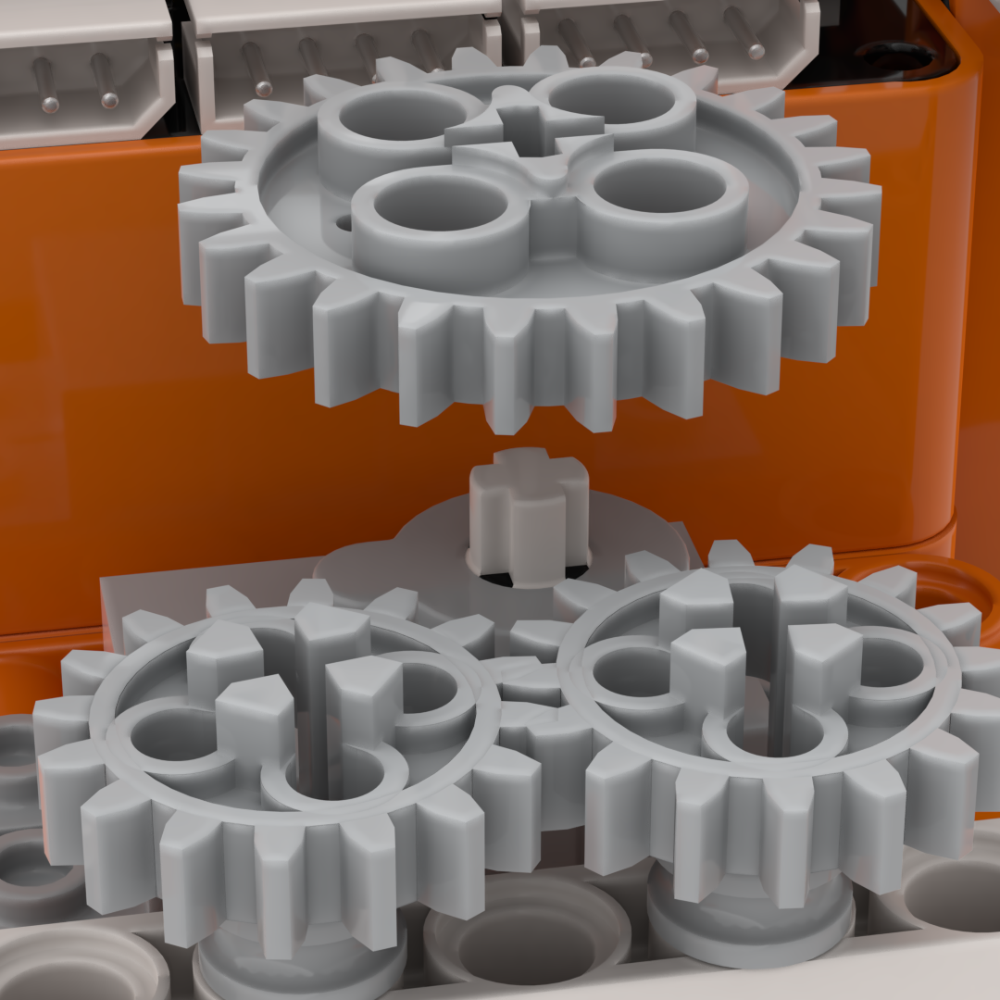

#### 5.2.11.4 Programming

1. Add the Extension Library:

   - Click **Extensions**.

     

   - Search for **https://github.com/HiwonderK12/DaDabitV2** in **Extensions** and add **dadabitv2**.

     

2. Principles:

   - The micro:bit expansion board sends control signals to operate the servo, driving the opening and closing of the mechanical claw to grab and release objects.
   - When the ultrasonic sensor detects a distance between 0 and 5 cm, the micro:bit sends a close signal, and the servo controls the claw to grip the object. When the distance increases, the mechanical claw opens automatically to reset.

3. Programming:

   - Block Overview

     | Block | Category | Description |
     | :---: | :---: | :---: |
     |  |  | A conditional judgment block that executes different program logic branches depending on whether the condition is met. |
     |  |  | Compares two values to check if the first is less than the second, returning a boolean result. |
     |  |  | Controls the specified servo to rotate to the target angle within a set time. |
     | 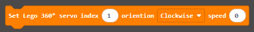 |  | Controls the specified motor to run in a set direction and speed. |

   - Block Combination

     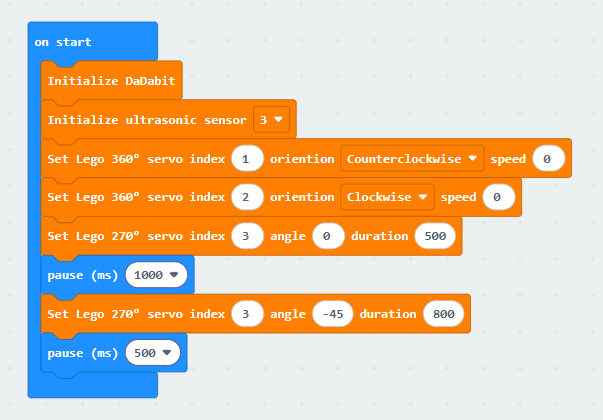

     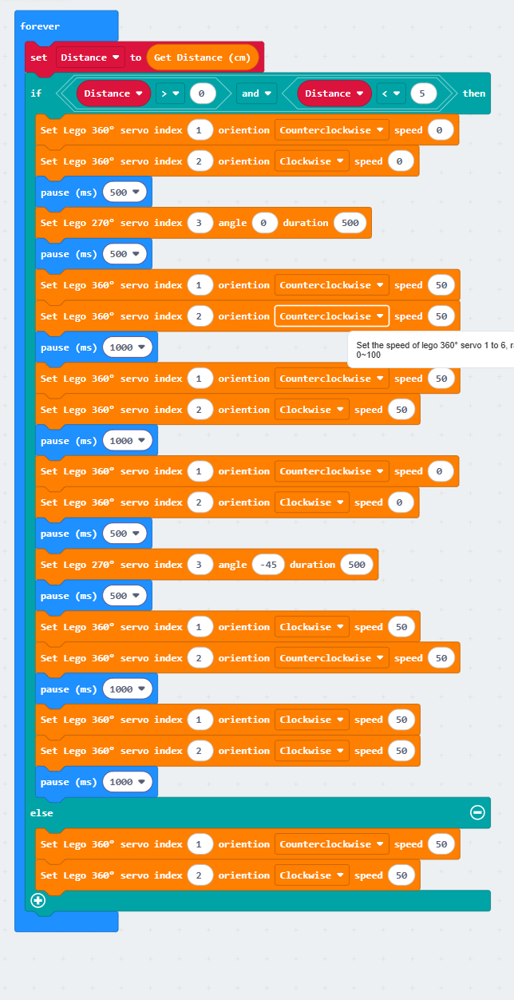

4. Device Pairing and Program Downloading

   1) **Wiring**: Connect the micro:bit board to the computer USB port using a data cable.

   2) **Device Pairing**:

      - When connecting the device for the first time, pair the device. Once connected, the browser will remember the connected device. Click the **...** button next to **Download**, and select **Connect Device** from the options.

        

      - Click **Next** in the pop-up window.

        

      - Click **Pair** and select the device shown in the pop-up window.

        

        

        

   3) **Download**:

      - After the device is successfully connected, click **Download** to download the program. During the download process, the yellow indicator light near the USB port on the micro:bit board will flash rapidly. Do not disconnect or move the data cable at this time to prevent download failure.

        

      - Once the download is complete, the indicator light will stop flashing and remain on, and a completion prompt will appear on the main programming interface.

        

   4) **Powering On**: The micro:bit automatically runs the program when powered on to test the functionality.

#### 5.2.11.5 Demo

---

### 5.2.12 Smart Avoidance Car

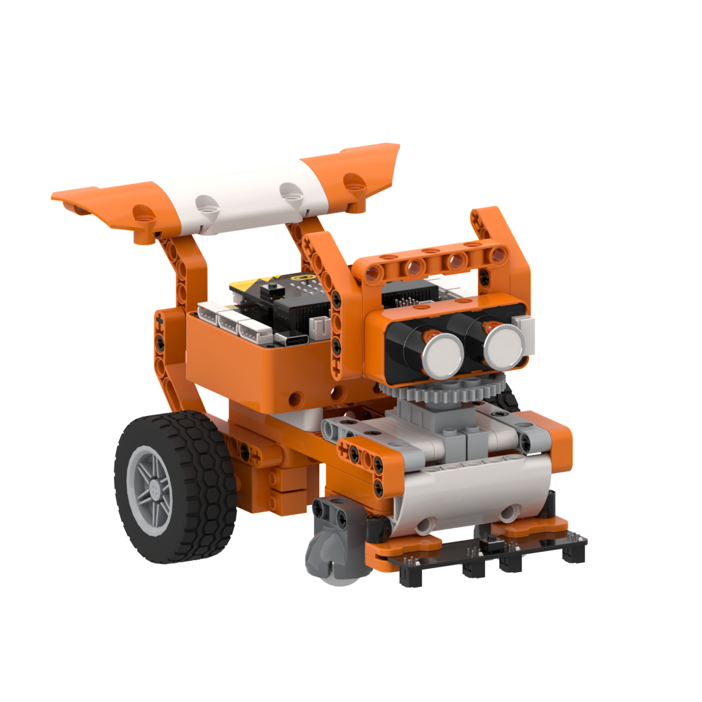

#### 5.2.12.1 Learning Objectives

1. Understand the working principles of dual motors, the servo, the ultrasonic sensor, and the line follower sensor, and master the comprehensive line-following and obstacle-avoidance control method on the micro:bit.
2. Understand the control logic of button A starting, button B stopping, and turning automatically when encountering obstacles to achieve automatic obstacle avoidance.

#### 5.2.12.2 Assembly Guide

For the building steps of the smart avoidance car, refer to the building guide in [6_Assembly_Manual]() for **Smart Avoidance Car**.

#### 5.2.12.3 Wiring Guide

* Connect the ultrasonic sensor to port P4 on the micro:bit expansion board.

* Connect the 4-channel line follower sensor to port P6 on the micro:bit expansion board.

* Connect the left block motor to port S1 on the micro:bit expansion board, and the right block motor to port S2 on the micro:bit expansion board, ensuring the orange signal wires are connected to the white pins of S1 and S2, respectively.

* Connect the block servo to port S3 on the micro:bit expansion board, ensuring the orange signal wire is connected to the white pin of S3.

As shown below:

> [!NOTE]
>
> **When conducting a program related to the block servo for the first time, remove the ultrasonic sensor from the servo first and upload the program in this section to the micro:bit. Then turn on the power switch of the micro:bit expansion board and wait for the block servo to rotate to the initial position of 0 degrees before reinstalling the ultrasonic sensor. This step can be skipped if the servo reset program has been used before.**

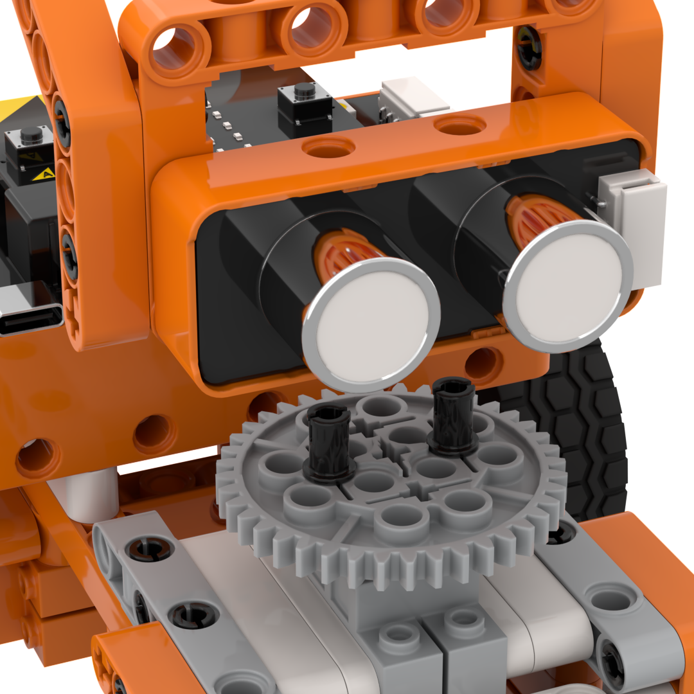

#### 5.2.12.4 Programming

1. Add the Extension Library:

   - Click **Extensions**.

     

   - Search for **https://github.com/HiwonderK12/DaDabitV2** in **Extensions** and add **dadabitv2**.

     

2. Principles:

   - The micro:bit expansion board sends control signals to coordinate the dual motors and the servo. The car moves and shakes its head for detection, achieving line-following and obstacle-avoidance functions.
   - When the ultrasonic sensor detects an obstacle ahead, the micro:bit sends a steering signal to bypass the obstacle automatically. Pressing button A starts the car, and pressing button B stops the operation immediately.

3. Programming:

   - Block Overview

     | Block | Category | Description |
     | :---: | :---: | :---: |
     |  |  | A conditional judgment block that executes different program logic branches depending on whether the condition is met. |
     | 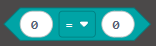 |  | Compares two values to check if the first is less than the second, returning a boolean result. |
     |  |  | Performs a logical OR operation on two boolean conditions, returning true if at least one condition is true. |
     |  |  | Controls the specified servo to rotate to the target angle within a set time. |
     |  |  | Controls the specified motor to run in a set direction and speed. |
     |  |  | Reads the distance data collected by the ultrasonic sensor in centimeters. |

   - Block Combination

     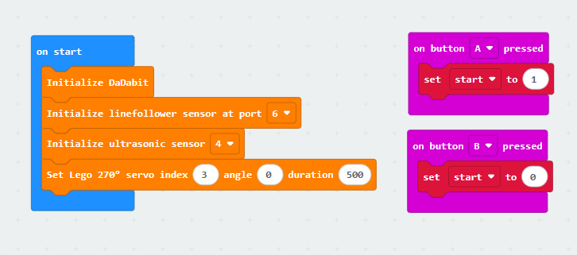

     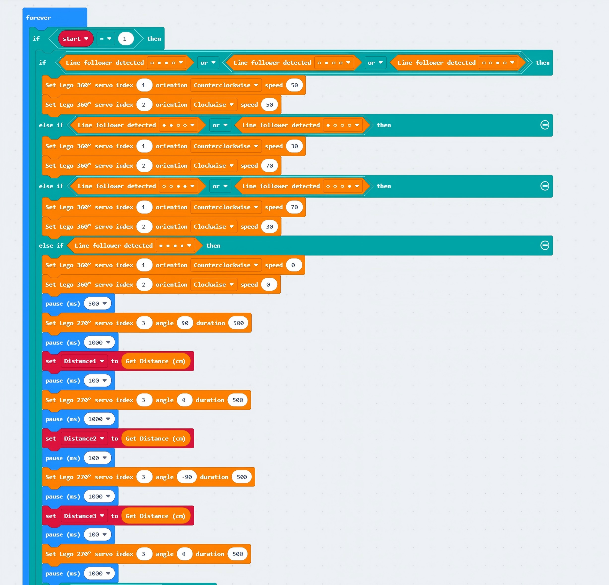

     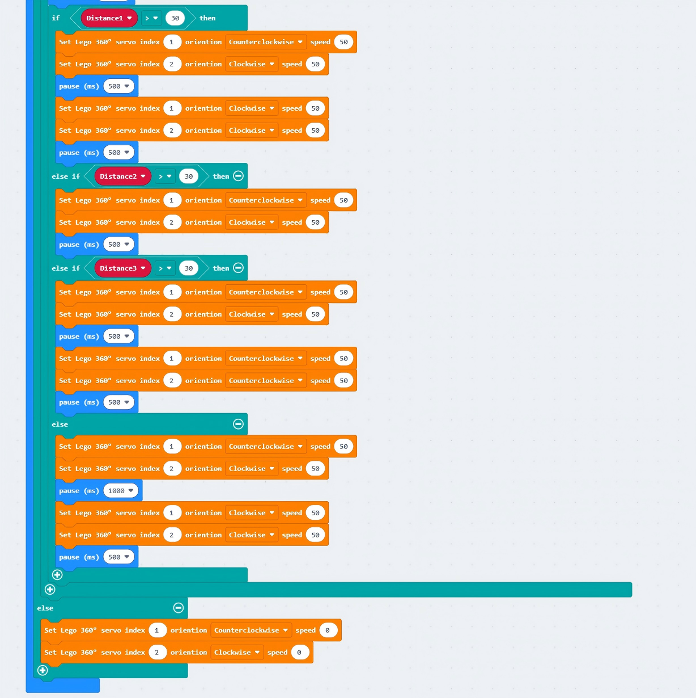

4. Device Pairing and Program Downloading

   1) **Wiring**: Connect the micro:bit board to the computer USB port using a data cable.

   2) **Device Pairing**:

      - When connecting the device for the first time, pair the device. Once connected, the browser will remember the connected device. Click the **...** button next to **Download**, and select **Connect Device** from the options.

        

      - Click **Next** in the pop-up window.

        

      - Click **Pair** and select the device shown in the pop-up window.

        

        

        

   3) **Download**:

      - After the device is successfully connected, click **Download** to download the program. During the download process, the yellow indicator light near the USB port on the micro:bit board will flash rapidly. Do not disconnect or move the data cable at this time to prevent download failure.

        

      - Once the download is complete, the indicator light will stop flashing and remain on, and a completion prompt will appear on the main programming interface.

        

   4) **Powering On**: The micro:bit automatically runs the program when powered on to test the functionality.

#### 5.2.12.5 Demo

